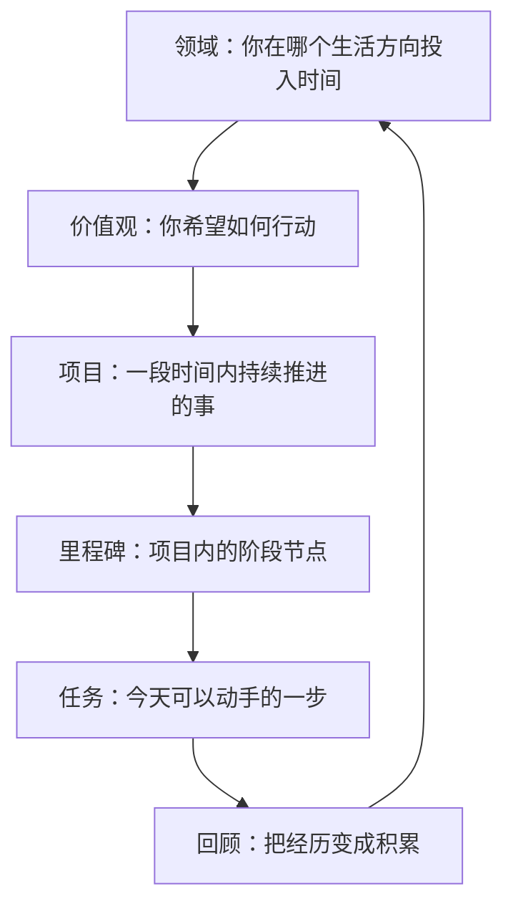

GranoFlow 不只是一个 Todo 清单。

它更像一本"带结构的生活手册"：先看见你长期在意什么方向，再把方向拆成项目和任务，最后通过回顾把每天的行动和大目标重新连起来。

不用担心一开始就搭好所有结构——这套框架可以慢慢长出来。

## 一图看懂：从大到小

这不是一套必须填满的表格，而是一种帮你看清生活方向的语言。

## 领域

领域是你长期在意的生活方向，比如"工作学习""人际关系""身心健康""业余创作"。

领域不是任务分类文件夹，也不是短期目标。它更像是你画的人生地图上的几块区域——项目归属到某个领域，回顾时你能看见自己最近在哪些区域投入了精力。

容易混淆的例子：

| 不是领域 | 更适合做 |
|---------|---------|
| 完成一个 App 版本 | 项目 |
| 每周跑步三次 | 任务或习惯 |
| 工作学习 | ✅ 领域 |
| 身心健康 | ✅ 领域 |

## 价值观

价值观不是目标——目标可以完成，价值观不能被一次性打勾。

> "三个月减重 5 公斤" → 这是目标。
>
> "我希望长期照顾身体，而不是一直透支自己" → 这是价值观。

价值观的作用是在你做选择时提供方向：哪些行动更接近你想成为的人？

不需要写出漂亮的人生宣言。越普通、越真实，越能长期使用。

## 项目

项目是比任务更大、比人生目标更具体的容器，通常需要持续几天到几个月。

判断一件事该不该建项目，问自己：

> 这件事当天就能完成吗？

如果能，写成任务就够。如果它会反复占用注意力、需要拆分和推进，就适合建项目。

## 里程碑

里程碑是项目里的阶段目标，让大项目更容易推进。

比如"完成产品版本"可以拆成：
- 完成核心功能
- 修复主要问题
- 准备发布材料
- 提交审核

有了里程碑，你就知道现在不是在追"整个项目"，而是推进当前阶段。小项目可以没有里程碑。

## 任务

任务是 GranoFlow 的基本行动单位。一个好任务应该能直接开始做。

好任务：写完首页文案、检查登录流程、整理 10 个测试反馈

不太好的任务（太虚、太大）：变得更自律、做好产品、学好英语

如果一个任务让你迟迟无法开始，通常不是你太懒，而是它还不够具体。把它继续拆小，直到变成一个能动手的动作。

## 回顾

回顾把经历变成积累。

任务完成后，如果没有回顾，它只是一个被划掉的清单项。经过回顾，它才能变成经验和判断。

回顾只需要问几个简单问题：

- 今天完成了什么？
- 哪些行动更接近我重视的方向？
- 下一步是什么？

:::tip[不必一开始就搭好全部结构]
最简单的路径：先写任务 → 发现它会持续就建项目 → 项目变大了再拆里程碑 → 回顾时慢慢整理领域和价值观。结构是慢慢长出来的。
:::
