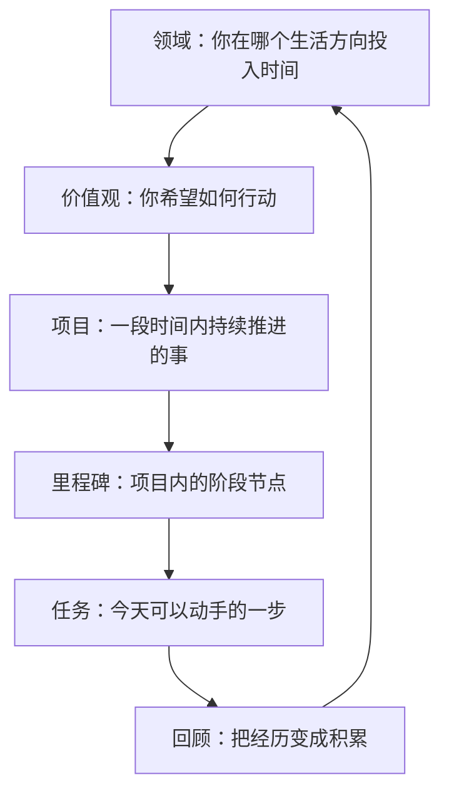

如果你想知道“我该把一个想法放在哪里”，可以先这样判断：长期方向放在领域，做选择的原则放在价值观，需要持续推进的事放在项目，项目里的阶段放在里程碑，今天能动手的一步写成任务，做完后用回顾把经验留下来。

GranoFlow 不只是 Todo 清单。它更像一本带结构的生活手册：先看见你长期在意什么，再把它拆成项目和任务，最后通过回顾，把每天的行动和更大的方向重新连起来。

不用一开始就把所有结构搭好。你可以先从任务开始，之后再慢慢整理出项目、领域和价值观。

## 一图看懂：从大到小

这不是一张必须填满的表格，而是一套帮你把生活方向说清楚的语言。

## 领域

领域是你长期在意的生活方向，比如“工作学习”“人际关系”“身心健康”“业余创作”。

领域不是任务分类文件夹，也不是短期目标。它更像你人生地图上的几块区域。项目可以归属到某个领域，回顾时你也能看见自己最近把精力投向了哪里。

容易混淆的例子：

| 不是领域 | 更适合做 |
|---------|---------|
| 完成一个 App 版本 | 项目 |
| 每周跑步三次 | 任务或习惯 |
| 工作学习 | ✅ 领域 |
| 身心健康 | ✅ 领域 |

## 价值观

价值观不是目标。目标可以完成，价值观不能被一次性打勾。

> “三个月减重 5 公斤” → 这是目标。
>
> “我希望长期照顾身体，而不是一直透支自己” → 这是价值观。

价值观的作用，是在你需要做选择时给你方向：哪些行动更接近你想成为的人？

不需要写成漂亮的人生宣言。越普通、越真实，越容易长期使用。

## 项目

项目是比任务更大、比人生目标更具体的容器，通常会持续几天到几个月。

判断一件事要不要建成项目，可以先问自己：

> 这件事当天就能完成吗？

如果当天能完成，写成任务就够了。如果它会反复占用注意力，需要拆分、推进和继续跟进，就适合建成项目。

## 里程碑

里程碑是项目里的阶段节点。它的作用是把大项目拆成更容易推进的几段。

比如“完成产品版本”可以拆成：

- 完成核心功能
- 修复主要问题
- 准备发布材料
- 提交审核

有了里程碑，你就不是在追赶“整个项目”，而是在推进当前这一段。小项目可以没有里程碑。

## 任务

任务是 GranoFlow 里的基本行动单位。一个好任务应该让你看完就知道怎么开始。

好任务：写完首页文案、检查登录流程、整理 10 个测试反馈

不太好的任务：变得更自律、做好产品、学好英语

如果一个任务让你迟迟无法开始，通常不是你太懒，而是它还不够具体。继续拆小，直到它变成一个能动手的动作。

## 回顾

回顾的作用，是把经历变成积累。

任务完成后，如果没有回顾，它只是一个被划掉的清单项。经过回顾，它才更容易变成经验和判断。

回顾时可以只问几个简单问题：

- 今天完成了什么？
- 哪些行动更接近我重视的方向？
- 下一步是什么？

:::tip[不必一开始就搭好全部结构]
最简单的路径是：先写任务 → 发现它会持续就建项目 → 项目变大了再拆里程碑 → 回顾时慢慢整理领域和价值观。结构是慢慢长出来的。
:::
