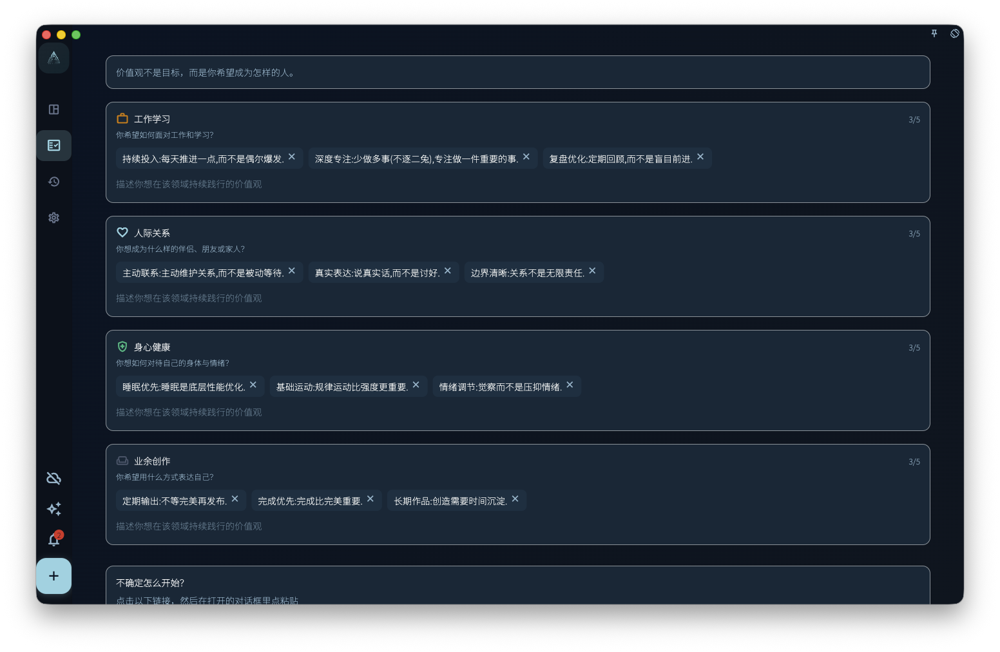

这一章把 ACT（接纳与承诺疗法）和《幸福的陷阱》的思路，落到 GranoFlow 的领域、价值观、项目、里程碑、任务和回顾里。它适合你把长期目标变成今天能做的一步，而不是把自己逼进更焦虑的 TODO 清单。

在 GranoFlow 里，领域和价值观不是必须一开始就填满的设置项。

它们的作用，是帮助你在任务和项目之外，看见自己长期把时间投向哪里，以及这些投入是否接近你真正重视的方向。

如果你刚开始使用，可以先写任务和项目。等你发现某些事情反复出现，再回头整理领域和价值观。

## 领域不是分类文件夹

领域是你长期在意的生活方向。

它不是普通文件夹，也不是为了把任务分门别类而存在。

常见领域包括：

- 工作学习
- 人际关系
- 身心健康
- 业余创作

例如，“准备考试”不是领域，它更适合作为项目。  
“每天跑步”不是领域，它更适合作为任务或习惯安排。  
“写一本小说”也不是领域，它更适合作为项目。

领域更像这些事情背后的长期方向。

准备考试，可能属于工作学习。  
每天跑步，可能属于身心健康。  
写一本小说，可能属于业余创作。

领域的作用，是让你在回顾时看见：最近的时间和注意力，主要流向了哪里。

## 价值观不是目标

目标可以完成。

价值观不能被一次性完成。

例如：

> 三个月减重 5 公斤

这是目标。

> 我希望长期照顾身体，而不是一直透支自己

这是价值观。

再比如：

> 发布一个产品版本

这是目标。

> 我希望自己成为一个可靠、持续交付的人

这是价值观。

目标适合放进项目和里程碑。  
价值观适合放在领域下面，作为你长期选择的方向。

这也接近 ACT（接纳与承诺疗法）里 values 的用法：价值观不是一次完成的目标，而是在不确定、困难或状态不完美时，仍然可以指向行动的方向。更多背景可以读 [ACT 与《幸福的陷阱》](/value-to-action/act-loop/)。

一个目标完成之后，可能就结束了。  
但一个价值观会反复影响你之后的选择。

## 如何写一条可用的价值观

不要一开始就写抽象词。

例如：

> 自律  
> 健康  
> 成长  
> 创造力

这些词本身没有错，但太短，实际使用时不容易指导行动。

更好的写法，是用一句完整的话表达你希望如何行动。

可以从这些句式开始：

> 我希望自己……  
> 我希望在这个领域里……  
> 当事情变难时，我希望自己仍然……  
> 我不希望自己只是……，而是……

例如：

> 我希望自己遇到困难时仍然能继续推进。  
> 我希望长期照顾身体，而不是一直透支自己。  
> 我希望在人际关系中更诚实，也更愿意倾听。  
> 我希望自己不是只消费内容，也能持续表达和创造。  
> 我希望在工作中成为一个可靠、清楚、能交付的人。

一条好的价值观，不一定要漂亮。

它只需要在你犹豫时，能帮你判断下一步更接近哪个方向。

## 每个领域先写 1-3 条

不要一开始写人生宣言。

每个领域先写 1-3 条就够。

太多价值观会变成口号墙，反而不会被使用。你真正需要的是少数几条能反复提醒自己的方向。

例如，身心健康下面可以先写：

> 我希望长期照顾身体，而不是一直透支自己。  
> 我希望自己在状态不好时，也能做一点温和的恢复。

业余创作下面可以先写：

> 我希望自己不是只消费内容，也能持续表达和创造。  
> 我希望先完成小作品，再追求完美。

这已经足够开始。

价值观不是写得越多越好，而是越能影响真实行动越好。

## 在领域页维护价值观

领域页用来维护长期方向和价值观，不是必须一次填完的分类系统。你可以从首页引导、侧栏管理入口或相关设置进入领域管理，逐个领域添加、修改或删除几条价值观。

<!-- manual-screenshot:id=value-domains-management -->

每个领域都有自己的价值观列表。页面会提供对应领域的问题提示，帮助你用一句完整的话写出“我希望如何行动”，而不是只写一个抽象词。达到当前可用数量上限后，需要先整理已有内容，再继续添加。

如果页面提供 AI 辅助入口，它只是把当前价值观和提示词整理成给外部 AI 的请求。AI 可以帮助你探索表达，但不会替你决定人生方向，也不能保证生成的价值观一定准确。最终保存哪些内容，仍以你在领域页中的编辑为准。

## 价值观要连接到行动

价值观如果不能落到行动，就会慢慢失效。

例如，你写下：

> 我希望长期照顾身体，而不是一直透支自己。

它可以连接到项目：

> 建立三个月的基础锻炼节奏

项目可以拆成里程碑：

> 第一周适应  
> 第一个月稳定  
> 三个月形成基本节奏

今天的任务可以是：

> 做 20 分钟低强度训练

这样，价值观就不是一句挂在页面上的话，而是进入了今天能做的一步。

同样，如果你写下：

> 我希望自己成为一个可靠、持续交付的人。

它可以连接到项目：

> 完成当前产品版本

今天的任务可能是：

> 修复登录页的一个阻塞问题

GranoFlow 的结构，就是帮助你把这条线连起来：

> 价值观 → 项目 → 里程碑 → 任务 → 回顾

## 在回顾中慢慢修正

价值观不是一次定稿。

刚开始写下的价值观，可能很粗糙，也可能后来发现不准确。这很正常。

你可以在日回顾或阶段回顾中观察：

- 最近我做的事，是否真的接近这些价值观？
- 哪些价值观只是听上去正确，但我其实并不在意？
- 哪些行动反复出现，说明我真正重视的是别的东西？
- 现在的项目，是否还值得继续投入？

有时候，回顾会让你发现：某条价值观需要改写。

例如：

> 我希望每天都保持高效率。

这句话听上去积极，但可能太压迫。你也许会把它改成：

> 我希望在状态不完美时，也能稳定推进最重要的一步。

这更接近 GranoFlow 的使用方式。

不是追求永远高效，而是在真实生活中保持方向感。

## 不知道怎么写也没关系

如果你暂时写不出价值观，不要卡住。

你可以先继续使用任务、项目和回顾。等你积累了一些真实记录，再回头看：

- 哪些事情让我觉得值得？
- 哪些事情完成后，我会觉得更像自己？
- 哪些事情虽然困难，但我仍然不想放弃？
- 哪些事情看似忙碌，其实只是消耗？

价值观常常不是想出来的，而是在反复行动和回顾中看出来的。

所以，刚开始时可以很简单：

> 我希望自己能稳定推进重要的事。  
> 我希望自己能照顾身体。  
> 我希望自己能认真对待重要关系。  
> 我希望自己能持续创作。

先写下来，之后再改。

## 下一步

当你有了初步的领域和价值观，就可以继续建立项目和里程碑。

项目会把长期方向变成一段时间内可以推进的目标。  
里程碑会把项目拆成阶段。  
任务会把阶段落到今天能做的一步。

下一章可以继续阅读：

> 项目与里程碑：把长期方向拆成阶段目标。
