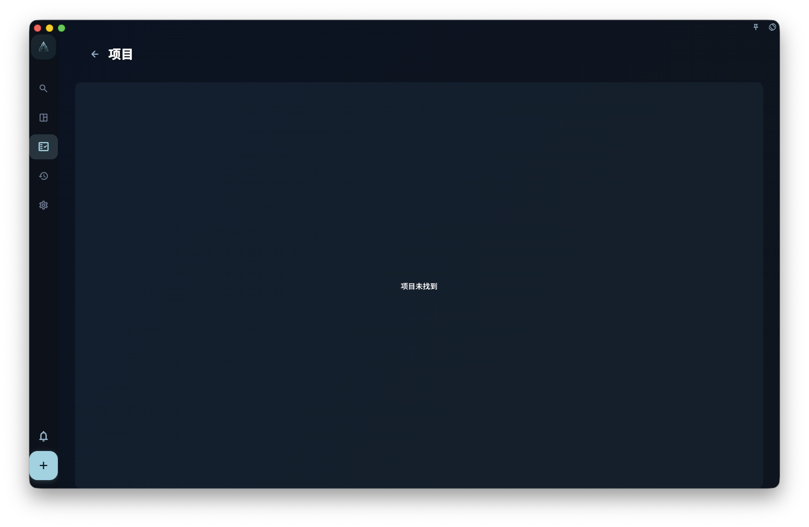

很多人不是没有目标，而是目标太大。

想做的事明明很重要，但一想到它需要花很久、涉及很多步骤、还可能中断几次，大脑就会自然往后退。于是你看上去像是在拖延，实际上常常只是因为：

> 这件事还没有被拆到足够让人开始。

这也是为什么，在有了领域和价值观之后，GranoFlow 不会建议你立刻写一大堆零散任务。
你更需要先问自己：

> 这段时间，我到底想持续推进什么？

这个答案，通常就是项目。
而如果项目还是太大，你还需要里程碑，来帮你看见当前先走哪一段。

## 项目是什么

项目是一段时间内持续推进的目标。
它比任务更大，比人生愿望更具体，也比“我以后要认真做这件事”更清楚。

例如：

- 完成当前产品版本
- 准备一次考试
- 建立三个月锻炼节奏
- 完成第一组漫画
- 搭建个人网站
- 整理一次搬家计划

这些都适合作为项目。

项目不适合写成一句很大的愿望。
例如：

- 变得更自律
- 学好英语
- 改善生活
- 做好产品
- 成为更好的人

这些说法太大、太虚。它们更像价值观、长期方向，或者还需要继续拆分的问题。

一个好的项目，通常能回答这个问题：

> 做到什么程度，才算这一阶段结束？

如果这个问题完全答不上来，这件事往往还不是一个可推进的项目。

<!-- manual-screenshot:id=projects-milestones-detail -->

如果截图没有加载，也不影响理解。你可以把项目页想成一个“持续投入的容器”：上面是这段时间要推进的目标，中间是当前阶段，下面是今天能做的具体任务。它的作用不是让你管理更多东西，而是让你不必每天都面对一个巨大而模糊的目标。

## 为什么不是所有事情都要建项目

不是所有事情都需要项目。

如果一件事今天就能完成，直接写成任务就够了。
例如：

- 回复一封邮件
- 买一件东西
- 改一个按钮文案
- 预约一次体检

这些事情不需要额外再套一层结构。

但如果一件事有下面这些特点，它通常更适合建立项目：

- 需要持续几天或几周
- 需要多个步骤
- 中途可能暂停，之后再回来继续
- 需要整理资料、任务和阶段
- 完成后值得回顾经验

例如，“写一篇文章”可能只是任务。
但“连续写完一个系列文章”更适合成为项目。

“跑步 20 分钟”是任务。
“建立三个月跑步节奏”是项目。

“修一个小 Bug”是任务。
“完成一个版本发布”是项目。

项目的作用，是给一段持续投入一个容器。没有项目，很多真正重要的事就会一直散落在任务列表里，看起来很忙，却没有推进感。

## 里程碑是什么

里程碑是项目里的阶段节点。
它回答的问题不是“这个项目最后会怎样”，而是：

> 当前先完成哪一段？

例如，一个项目叫：

> 完成当前产品版本

它可以拆成这些里程碑：

- 完成核心功能
- 修复主要问题
- 准备发布材料
- 提交审核
- 处理审核反馈

一个项目叫：

> 建立三个月锻炼节奏

它可以拆成：

- 第一周适应
- 第一个月稳定
- 第二个月提高强度
- 第三个月形成固定节奏

里程碑不是为了让项目看起来专业，
也不是为了让系统更复杂。

它的真正作用是：把一个大目标切成几段，让你今天不必面对“整个项目”，只需要面对“现在这一段”。

## 小项目可以没有里程碑

不要为了完整而强行加里程碑。

如果一个项目很小，只有三五个任务，直接用项目管理就够了。比如“整理一次旅行材料”，可能只需要确认机票、整理护照信息、保存酒店订单、检查行李清单。

但如果项目很长、任务很多，或者会持续超过几周，最好加里程碑。否则项目很容易慢慢变成一个越来越重的任务堆。

判断标准很简单：

> 如果你看着这个项目，不知道下一步该从哪里继续，它通常就该拆阶段了。

## 大项目不是靠意志力推进的

很多项目迟迟推不动，不一定是因为你不够自律。
更常见的原因是：它太大了。

例如：

> 改变人生

这不是项目。

> 学好英语

也太大。

你可以把它拆成更具体的项目：

- 完成一本英语教材
- 坚持 30 天口语练习
- 准备一次英语面试
- 看完一门英文课程

再比如：

> 做好 GranoFlow

也太大。

可以拆成：

- 完成新手手册第一版
- 修复图片上传体验
- 准备公测用户邀请
- 完成 App Store 审核材料

项目越具体，越容易推进。
如果一个项目永远没有清楚的结束点，它通常不是项目本身有多伟大，而是它还没有被拆到足够清楚。

## 项目最后一定要落到任务

项目不能只停留在标题上。

无论项目多重要，最后都必须落到今天可以做的一步。否则它就会停留在想法里，看上去雄心勃勃，实际上并没有进入执行。

例如：

项目：

> 完成新手手册第一版

里程碑：

> 写完前 6 章

今天的任务：

> 写完“项目与里程碑”这一章草稿

这样你每天面对的就不是一个模糊的大目标，而是一个清楚的下一步。

如果一个项目下面没有任何任务，通常只有两种可能：

1. 它还只是愿望，没有进入执行阶段
2. 它太模糊，需要先拆成里程碑或任务

GranoFlow 的项目不是用来收藏愿望的。
项目应该帮助你行动。

## 项目完成，不代表一切结束

项目完成，表示这一阶段的目标结束了。

完成不代表它完美，也不代表以后不会继续做相关事情。
例如：

> 完成第一组漫画

这个项目完成后，你以后仍然可以建立新项目：

> 完成第二组漫画

这样比把所有创作都塞进一个永远不会结束的“漫画项目”更清楚。

项目完成后，也值得做一次简短回顾：

- 哪些任务真正推进了项目？
- 哪些阶段比预期困难？
- 哪些经验可以保留到下一个项目？
- 这个项目是否接近我的价值观？

完成项目，不只是关闭一个容器，也是把一段时间的投入变成经验。

## 项目也可以归档，甚至放弃

不是所有项目都必须完成。

有些项目会过期。
有些项目会失去意义。
有些项目开始后，你才发现它并不重要。
有些项目只是当时需要，现在已经不需要了。

这时可以归档，或者放弃。

放弃不是失败。
真正重要的问题不是：

> 我有没有完成所有项目？

而是：

> 我有没有看清，它为什么不再值得继续？

例如：

> 我原本想做这个课程，但现在发现它和当前方向关系不大。先归档，之后不再占用注意力。

这就是有效的回顾。

GranoFlow 不要求你把每一个开始过的项目都做到最后。它更重视的是：你是否能从行动中看见自己的方向，并及时调整。

## 一个完整例子

假设你的领域是：

> 工作事业

你的价值观是：

> 可靠协作：清晰沟通、守住承诺，而不是只顾自己完成。

它可以落成一个项目：

> 完成 GranoFlow 新手手册第一版

这个项目可以拆成里程碑：

> 完成前 3 章
> 完成核心功能说明
> 完成数据安全说明
> 完成发布前校对

而今天的任务可能是：

> 写完“快速开始”
> 修改“把价值变成行动”
> 补充“核心概念”
> 校对术语一致性

最后在回顾里，你可能写下：

> 今天完成了项目与里程碑章节。结构比之前清楚，但任务与收集箱还需要单独写一章。下一步写任务系统。

这样，一条价值观就真正落到了项目、里程碑、任务和回顾里。
你不是只是在完成待办事项，而是在用一段时间的行动，慢慢靠近自己重视的方向。

## 下一步

有了项目和里程碑之后，就可以开始处理每天的具体行动：

- [任务与收集箱：把下一步写下来](/value-to-action/tasks-and-inbox/)：把阶段落到今天能开始的一步。
- [回顾：让经历真正沉淀](/value-to-action/review-reflection/)：在推进项目之后，留下经验而不只是记录。
- [先确定长期方向](/value-to-action/long-term-direction/)：回头检查这个项目是否仍然服务于你重视的方向。
