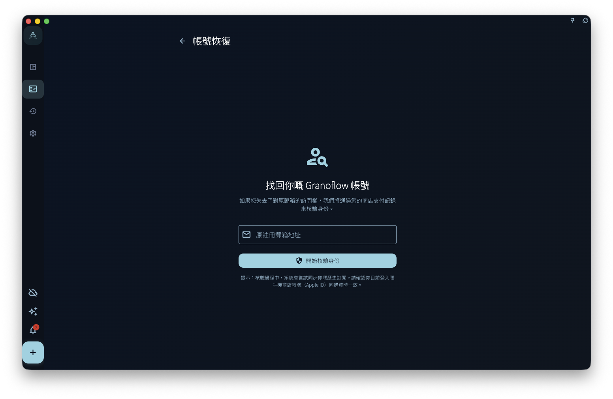

賬號恢復用於一種具體情況：你認為自己曾經通過 App Store、Google Play 或其他商店購買過 GranoFlow 權益，但現在不確定這筆購買連接到了哪個 GranoFlow 賬號。

它不是賬號刪除、退出登入、訂閲恢復購買或數據恢復入口。它只提交一份恢復申請，讓系統根據你聲明的電郵和商店側記錄嘗試核對。

## 從哪裡進入

在登入入口或賬號相關頁面裡，找到賬號恢復連結。頁面會要求你填寫希望找回的電郵，然後開始恢復申請。

<!-- manual-screenshot:id=account-recovery-main -->

開始前確認：

- 這部設備可以訪問購買所在平台的商店賬號。
- 你填寫的是你希望連接 GranoFlow 賬號的電郵。
- 如果你只是要恢復目前平台購買，先看「平台購買與恢復購買」；如果你要找回本地數據，先看「備份與恢復」或「在新設備同步已有雲端數據」。

## 提交後會發生甚麼

點擊開始恢復後，GranoFlow 會先嘗試從目前平台讀取購買記錄，再把商店記錄錨點和你填寫的電郵提交給服務端核對。

你可能看到幾類結果：

- 申請已提交：說明系統收到了恢復申請，後續按提示等待或查看電郵。
- 沒有歷史記錄：說明目前平台或賬號下沒有找到可用於恢復的購買記錄。
- 記錄不匹配：說明商店記錄和你填寫的電郵無法通過目前校驗連接起來。
- 暫時失敗：可能是網絡、商店服務或服務端校驗暫時不可用，可以稍後重試。

## 不能保證甚麼

賬號恢復不能保證一定把購買、賬號、訂閲或數據恢復到你目前使用的賬號。它也不會直接修改本機數據、清空設備、取消賬號刪除申請，或替你找回加密密鑰。

如果你懷疑自己登入了錯誤賬號，先不要刪除本機數據。回到賬號頁確認目前登入電郵，再檢查訂閲頁、設備管理和數據安全頁面。

## 下一步

如果問題是訂閲權益沒有顯示，讀「平台購買與恢復購買」。如果問題是雲端數據或加密密鑰，讀「在新設備同步已有雲端數據」和「加密與恢復密鑰」。
