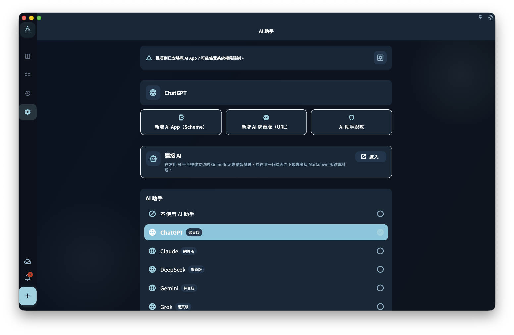

從剪貼板把零散內容整理成任務前，理解預覽、確認和回寫邊界。

## 從哪裡開始

從對應 AI 功能入口開始：標題解析發生在寫任務標題時，剪貼板助手從剪貼板內容整理入口開始，其他頁面用於先理解邊界。

<!-- manual-screenshot:id=ai-clipboard-assistant-settings -->

## 怎麼操作

- 先把要處理的文本放進標題或剪貼板助手，不要一次提供無關的大段內容。
- 查看 AI 給出的識別、整理或改寫建議；涉及任務欄位變化時，必須確認後才會寫入。
- 確認前可以取消、修改或只採用一部分建議。未確認的建議不會替你改變任務。

## 結果和邊界

AI 在 GranoFlow 裡是輔助整理工具，不是自動代理。它可以降低輸入和整理成本，但最終結構、隱私取捨和是否寫入由你決定。

- 普通瀏覽手冊不會把本地任務自動發送給 AI；只有使用 AI 功能時，相關文本才可能進入處理流程。
- AI 結果可能不完整或不適合當前語境，重要任務請以你確認後的欄位為準。

## 下一步

如果你擔心數據範圍，先讀“哪些內容可能會提供給 AI”；如果擔心誤改，讀“為甚麼修改前需要確認”。
