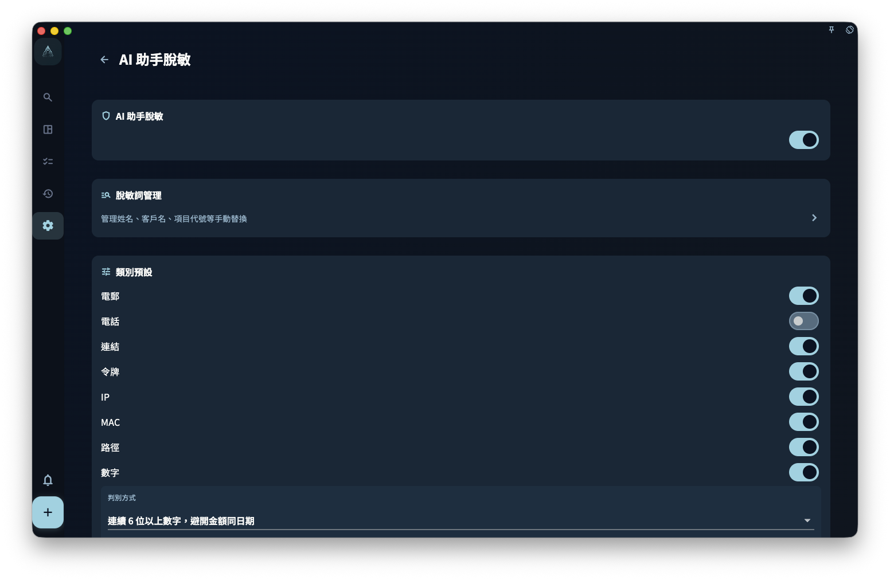

如果你只係瀏覽任務、寫日記、做回顧，GranoFlow 唔會將呢啲內容發送畀 AI。只有當你主動撳咗某個 AI 功能，同今次操作有關嘅文字先可能進入 AI 處理流程。

<!-- manual-screenshot:id=ai-redaction-settings -->

## 不同功能可能會發送咩

| AI 功能 | 可能發送嘅內容 |
| --- | --- |
| 標題解析 | 你而家正在輸入嘅任務標題 |
| 剪貼板助手 | 你複製到剪貼板嘅文字 |
| Helper 提示詞 | 當前頁面嘅說明 + 你設定嘅提示詞 |
| 回顧 AI 整理 | 你今次觸發整理嘅回顧內容 |

## AI 脫敏設定有咩用

AI 脫敏設定只影響內容發送前嘅替換，唔代表 AI 會自動判斷所有敏感資料。

呢度有四個關鍵項：

- **總開關**：關閉後，GranoFlow 唔會執行出站脫敏替換。
- **類別預設策略**：當系統按規則發現電郵、連結、日期、長數字、金額、信用卡、IBAN 等內容時，預設處理為「脫敏」或「允許」；電話預設允許，可以按需要開啟。
- **電話、數字同金額設定**：電話開啟後可以選擇識別地區，地區選擇器支援搜尋地區名、英文名、代碼或電話區號；電話區號只幫你搵到地區，實際識別按你保存嘅地區選擇執行。數字可以設定最少位數，並替換成「數字」或「編號」；金額可以選擇是否識別符號/貨幣代碼同中文大寫金額，並替換成「金額」或「數額」。
- **脫敏詞管理**：維護你手動確認嘅固定「敏感詞 → 代號」規則，例如客戶名、公司名或項目代號。

自動發現只係規則輔助，唔係智能審查。佢可能漏咗特殊寫法，亦可能將普通數字誤判為敏感內容。類別預設策略係「脫敏」時，自動發現值會臨時換成 `EMAIL_1`、`MONEY_1`、`ID_1` 呢類短期代號，並喺 AI 回覆之後嘗試還原；佢唔會自動寫入你嘅長期脫敏詞表。**發送前仍然需要你自己檢查。**

## 脫敏詞會做咩

你喺「脫敏詞管理」入面維護嘅詞表，會喺內容發送前按你設定嘅代號自動替換。具體用法請睇「脫敏詞」頁面。

## 一句話總結

> GranoFlow 嘅 AI 只會喺你主動觸發功能時先涉及資料；唔會喺背景採集，唔會自動上傳，發送範圍只限當前功能需要處理嘅相關文字。
