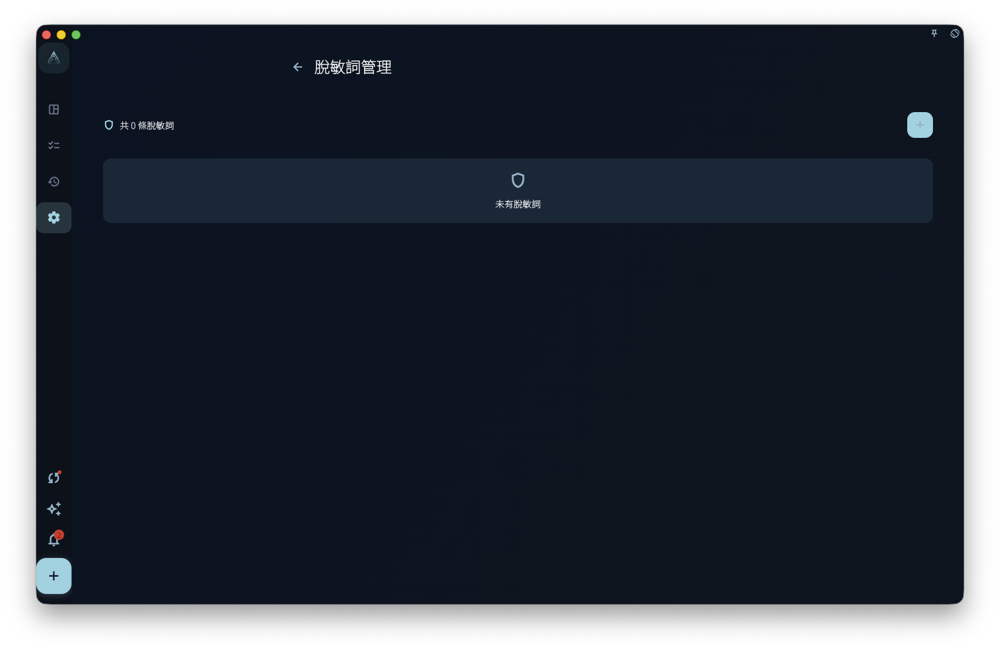

如果你唔想將客戶名、公司名、項目代號等原文直接發俾外部 AI，可以將佢哋加到「脫敏詞」。GranoFlow 會喺發俾外部 AI 之前，按你設定嘅規則將敏感詞換成代號，例如將「客戶A公司」換成 `CLIENT_A`；AI 回覆之後，GranoFlow 會嘗試將代號還原返原文。

呢張表只保存你手動維護嘅固定替換規則。系統按規則自動發現嘅電郵、金額、連結、日期、長數字、信用卡、IBAN、電話等內容，會按 AI 脫敏設定入面嘅類別預設策略臨時換成更易讀嘅短期脫敏值，例如 `13xxxxx4821` 或 `foxxxx3920@1846.com`，唔會自動寫入呢度嘅長期詞表。

<!-- manual-screenshot:id=ai-redaction-terms-settings -->

## 適合添加咩詞

適合添加嘅係你經常會寫入內容入面、但唔想原樣發俾外部 AI 嘅固定詞語：

- 客戶名、公司名
- 項目代號，例如「獵鷹計劃」呢類內部叫法
- 固定電郵、固定地址
- 合同金額、帳號資料
- 其他你認為唔適合直接暴露俾外部 AI 嘅常用詞

## 添加詞條嘅步驟

1. 打開「設定 → AI 脫敏 → 脫敏詞管理」。
2. 新增一條詞條。
3. 喺「敏感詞」填寫原文，例如「客戶A公司」。
4. 喺「代號」填寫替換後嘅佔位符，例如 `CLIENT_A` 或 `PROJECT_X`。
5. 儲存。下次使用 AI 功能並需要發送內容時，呢條規則會自動生效。

即使截圖無法顯示，你只需要記住：一條脫敏詞就係一組「原文 → 代號」規則。

## 脫敏 vs 允許

每個詞條有兩個狀態：

- **脫敏**：發俾外部 AI 之前，GranoFlow 會將敏感詞換成代號；AI 回覆之後，會嘗試將代號還原。
- **允許**：GranoFlow 唔會替換呢個詞。適合你確認呢個詞唔敏感、唔需要脫敏嘅情況。

如果你唔肯定，先用「脫敏」會穩陣啲；如果你確認某個詞可以原樣發送，再設為「允許」。

## 呢個可以保證絕對安全嗎

唔可以。脫敏詞係輔助工具，唔係安全保證。

佢有以下邊界：

- 可能漏咗縮寫、別名、錯字或其他變體寫法。
- 只會處理你已經設定嘅固定詞；規則型自動發現會用短期脫敏值，唔會幫你維護長期詞表。
- 外部 AI 收到脫敏後嘅內容之後，GranoFlow 無法控制外部 AI 點樣處理呢啲內容。

發送重要內容之前，仍然建議你手動檢查一次。

:::tip[會員功能]
脫敏詞係會員專屬功能。非會員可以查看界面，但無法自定義編輯。
:::
