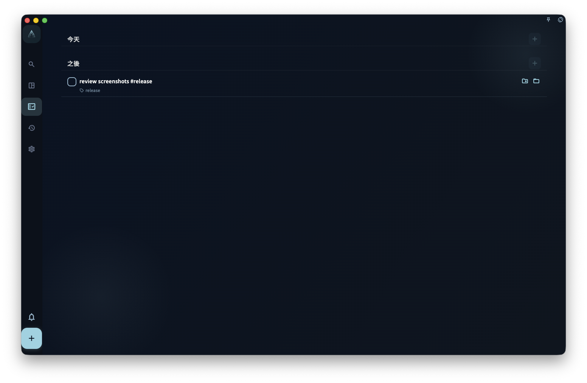

如果你想將「聽日下午三點同張總開會 #工作」呢類標題快速整理成任務資料，可以直接將完整句子輸入標題欄；GranoFlow 會嘗試從標題識別時間、標籤、項目和提醒，再顯示成建議，等你確認後先會套用到任務。

確認並加入之後，任務會按實際欄位出現在收集箱或任務頁。截圖展示的是一個帶 `#release` 的示例任務在任務頁裏的結果狀態。

## 標題解析可以識別甚麼

當你輸入任務標題時，GranoFlow 會嘗試從文字中找出可以整理成任務欄位的資料。它可能識別：

- **時間表達**：今日、聽日、下星期三、3月15日、下午三點……
- **標籤**：#工作 #個人 呢類井號標籤
- **項目提及**：同你已有項目名稱相匹配的文字
- **提醒觸發詞**：提醒我、唔好忘記、記得……呢類表達

## 識別後會發生甚麼

識別結果會先以建議形式顯示，**唔會自動寫入任務**。你可以按實際需要處理：

- ✅ 接受全部建議
- ✅ 只接受其中一部分，例如只加標籤，不加日期
- ✅ 忽略建議，繼續按原本標題輸入

只要你未確認，建議就唔會改變任務內容。

## 識別唔準可以點做

標題解析唔係 100% 準確。如果某個字詞被誤識別，或者建議唔係你想要的結果，可以咁處理：

- 直接忽略呢條建議；唔接受就唔會寫入任務
- 打開任務詳情，手動調整正確欄位

:::note[英文日期表達都可以識別]
標題入面寫 "tomorrow 3pm" 或 "next Monday" 都可以被識別，唔一定要用中文。
:::
