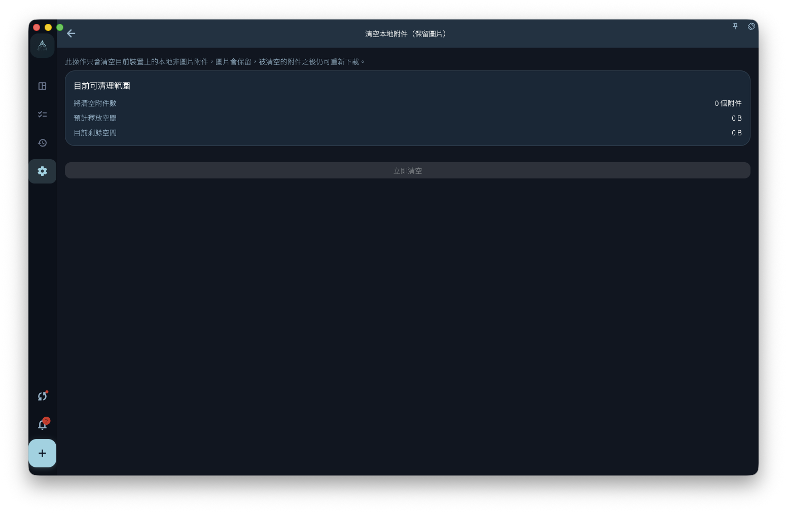

瞭解附件和圖片如何跟隨任務或記錄保存，以及它們在同步、備份和刪除時的邊界。

## 從哪裡開始

從設置裡的數據、安全、同步、備份或賬號相關入口開始。先判斷你要處理的是日常同步、設備遷移、誤刪恢復，還是賬號刪除。

<!-- manual-screenshot:id=data-attachments-clear-detail -->

<!-- manual-screenshot:id=data-attachments-clear-entry -->

## 怎麼操作

- 日常使用先確認本設備數據是否可見，再看是否需要同步到其他設備。
- 涉及加密、恢復密鑰、備份導入或賬號刪除前，先讀完確認信息並保存必要憑證。
- 操作後檢查當前設備和其他設備的狀態；如果需要恢復，優先使用明確的備份文件或恢復入口。

## 結果和邊界

GranoFlow 採用本地優先思路：本地可用是基礎，同步和備份負責擴展到多設備和恢復場景。它們互相補充，但不能彼此替代。

- 同步不是備份；備份也不會保證替你解決所有賬號或密鑰問題。
- 加密和恢復密鑰能保護數據，但忘記密鑰或丟失本地備份時，恢復能力會受到限制。

## 下一步

不確定從哪排查時，先進入“數據與安全總覽”或“同步問題排查”。
