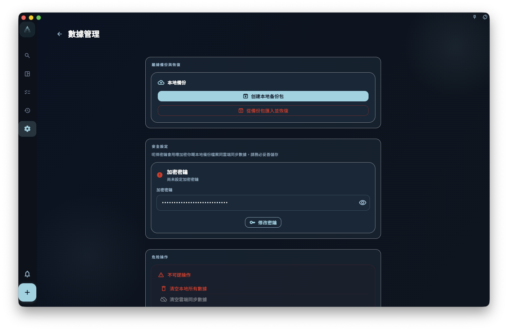

如果你想喺誤刪、換設備或者重裝系統之前保留一份可以回退嘅資料，請喺 GranoFlow 設定入面嘅數據/備份頁手動導出備份文件，並將文件存放喺你自己搵得到、控制得到嘅位置。

<!-- manual-screenshot:id=data-backup-restore-management -->

## 備份同同步有咩分別

備份係「某一個時間點嘅資料副本」。同步係將目前資料同步到雲端或者其他設備。兩者解決嘅問題唔一樣。

<!-- markdownlint-disable MD060 -->
|  | 備份 | 雲端同步 |
| --- | --- | --- |
| 會唔會保留歷史狀態？ | ✅ 係某個時間點嘅快照 | ❌ 只代表目前狀態 |
| 誤刪之後可唔可以返到舊狀態？ | ✅ 可以恢復到建立備份嗰刻嘅狀態 | ❌ 刪除通常都會同步到雲端 |
| 需唔需要你主動操作？ | ✅ 需要手動導出同保存文件 | ✅/❌ 同步會自動進行，但唔會保存歷史版本 |
<!-- markdownlint-enable MD060 -->

## 幾時應該做備份

建議喺以下情況之前先導出一份備份：

- 升級 App 大版本之前
- 換手機、換電腦或者重裝系統之前
- 刪除大量任務或項目之前
- 完成一個重要階段之後，想保留當時嘅記錄

## 卡片盒包同完整備份

數據管理頁以平鋪卡片展示：`本地備份` 卡片匯出 `.flow.grano` 時會用裝置密鑰加密，適合換機或整機恢復；`卡片盒` 卡片處理 `.deck.grano` 卡片盒包，可遷移選定卡片盒、卡片同可打包嘅本地圖片媒體，但唔可以替代完整備份，亦唔會自動同步到雲端。卡片盒卡片亦會顯示目前卡片緩存用量同上限，並提供清空緩存入口。

喺 `卡片盒` 卡片點「匯出目前卡片盒」會進入卡片盒列表，由你喺列表揀頂層卡片盒後再匯出。

## 點樣做備份

1. 打開 GranoFlow 設定。
2. 進入數據管理頁面。
3. 喺「本地備份」卡片選擇「建立本地備份包」。
4. 等待匯出完成，處理期間唔好重複點擊或者關閉頁面。
5. 將匯出嘅備份文件保存到你控制到嘅位置，例如 iCloud、本地文件夾或者電腦。

## 點樣從備份恢復

1. 打開 GranoFlow 設定。
2. 進入數據/備份相關頁面。
3. 選擇導入備份。
4. 搵到之前保存嘅備份文件。
5. 確認導入之後，等待恢復完成，處理期間唔好重複操作。

:::caution[恢復會覆蓋目前數據]
從備份恢復係覆蓋操作。導入之後，目前設備上嘅數據會被備份文件入面嘅數據取代。如果你想保留目前設備嘅最新內容，請先導出一份目前備份，再導入舊備份。
:::
