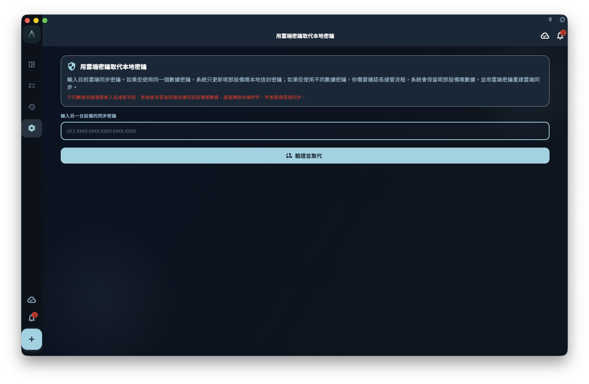

GranoFlow 用加密密鑰保護需要同步或備份的數據。登入賬號只能證明你是誰；加密密鑰決定這部設備能不能打開已有的雲端加密數據。

如果你正在遷移設備、重裝 App、恢復備份，或同步頁提示「雲端同步設置需要處理」，先把目前設備上還可見的重要數據確認一遍，再繼續密鑰恢復或接管。

<!-- manual-screenshot:id=data-encryption-recovery-key -->

## 從哪裡進入

你可能從這些位置進入相關頁面：

- 設置裡的數據、安全、同步或備份入口。
- 同步失敗提示、頂部同步狀態提示，或雲端數據概覽中的恢復提示。
- 數據管理頁裡的「用雲端密鑰替換本地密鑰」。

這些入口的共同點是：目前設備和雲端之間的密鑰、數據來源或同步狀態還未對齊。它們不是普通刷新按鈕。

## 輸入另一部設備的同步密鑰

當頁面要求你輸入另一部設備的同步密鑰時，GranoFlow 會先檢查這把密鑰能不能打開目前雲端數據。檢查完成前，不會保存你輸入的密鑰，不會清空本機數據，也不會開始下載雲端數據。

檢查後可能出現幾種結果：

- 如果雲端和本機使用的是同一份數據密鑰，GranoFlow 只更新這部設備的同步設置，讓它繼續使用同一組雲端數據。
- 如果雲端和本機不是同一份數據，頁面會讓你選擇保留本機數據、使用雲端數據，或取消。
- 如果密鑰格式不對、密鑰不是這份雲端數據的密鑰，或網絡暫時不可用，恢復不會繼續。

這條路徑不能保證找回你沒有保存的同步密鑰。能恢復到甚麼程度，取決於目前設備、舊設備、雲端數據和本地備份裡還保留了哪些可驗證材料。

## 沒有密鑰時檢查這部設備

有些情況下，即使你忘了雲端同步密鑰，這部設備仍可能保留能驗證雲端數據的本機材料。頁面可能會提供「沒有密鑰，檢查這部設備」這樣的次級入口。

這一步只做檢查。通過檢查後，GranoFlow 還會讓你再次確認是否只修復雲端同步密鑰。確認後，它只修復雲端同步所需的密鑰材料，不會上傳這部設備的業務數據、不會清空雲端，也不會下載雲端數據。

如果檢查失敗、雲端沒有可用檢查記錄，或這部設備已經無法讀取本機加密材料，就需要回到輸入同步密鑰、使用備份，或取消後先找舊設備。

## 用雲端密鑰替換本地密鑰

「用雲端密鑰替換本地密鑰」用於目前設備還有本地數據，但你決定讓這部設備改用雲端同步密鑰的場景。它通常從數據管理頁或密鑰不匹配提示進入。

操作前先確認兩件事：

1. 你輸入的是目前雲端同步數據對應的完整密鑰。
2. 你知道這部設備上的本地數據和附件是否仍需要保留。

如果本機和雲端實際使用同一份數據密鑰，GranoFlow 只更新這部設備的保護方式。如果它們不同，頁面會要求你確認一次更長的接管流程：保留這部設備的數據，用雲端密鑰保護，並在可行時處理本機附件，隨後重建雲端同步。

這個流程可能耗時，尤其是本機附件較多時。不要在不確定數據來源時把它當成普通登入或同步修復。

## 選擇來源時怎樣判斷

- 想保留這部設備的數據：選擇「重建雲端同步」或相近路徑前，確認本機任務、項目、回顧和附件就是你要保留的版本。後續雲端會改用這部設備的數據。
- 想使用雲端數據：選擇「使用雲端數據」或「清空本地數據」前，確認本機新建但未同步的內容可以放棄，或已經另行保存。
- 不確定：取消操作，先檢查舊設備、雲端概覽和本地備份。

同步和密鑰恢復不會替你判斷哪份數據更重要，也不能保證所有未同步附件、舊設備殘留或丟失密鑰後的雲端數據一定可恢復。

## 下一步

如果你是在新設備上恢復已有雲端數據，繼續讀「在新設備同步已有雲端數據」。如果你手上有本地備份文件，繼續讀「備份與恢復」。
