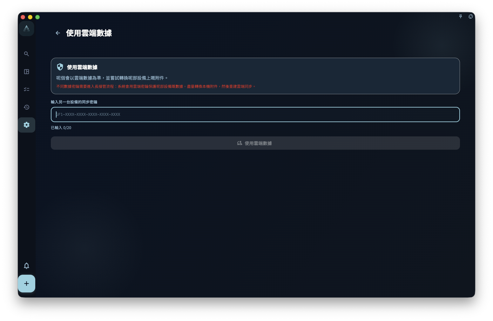

你而家最需要做嘅事係：趁舊設備仲開到 GranoFlow，將雲端同步密鑰儲存到密碼管理器，或者另一個安全地方。之後換設備、重裝 App，或者見到「同步密鑰唔匹配」提示時，GranoFlow 可能會要求你輸入呢把密鑰；冇佢，雲端加密數據可能打唔開。

GranoFlow 的雲端同步數據使用端對端加密。加密密鑰就似保險箱鎖匙：**冇咗佢，連 GranoFlow 自己的伺服器都無法讀取你的數據**。呢件事亦代表：**如果你自己遺失密鑰，GranoFlow 無法幫你重置或搵返。**

## 密鑰 vs 登錄密碼，有什麼區別

| | 登錄密碼（或驗證電郵） | 加密/同步密鑰 |
| --- | --- | --- |
| 用嚟做什麼 | 證明你係邊個 | 打開雲端加密數據 |
| 忘記咗點算 | 重新發送驗證電郵 | **無法找回** |
| 更換咗會點 | 只影響登錄 | 影響是否能夠存取雲端數據 |

## 我的密鑰喺邊度

喺 GranoFlow 設定 → 數據/安全/同步 入面，可以查看同保存目前設備的雲端同步密鑰。

**建議即刻保存：**將密鑰抄低，或者儲存到你的密碼管理器。唔好只係放喺 GranoFlow 入面，因為你需要密鑰嘅時候，通常正正係換咗設備，或者舊環境已經打唔開。

## 喺新設備上幾時需要密鑰

以下情況可能需要輸入舊設備上的雲端同步密鑰：

- 換咗手機或電腦
- 重裝咗 GranoFlow
- 見到「同步密鑰唔匹配」提示

輸入正確密鑰之後，新設備先有機會存取雲端已有的加密數據。

## 輸入密鑰後會發生什麼

GranoFlow 會先檢查呢把密鑰能否打開目前雲端數據：

- **密鑰匹配，雲端同本地係同一份數據** → 直接連接同步
- **密鑰匹配，但本地有新數據** → 顯示選擇界面，讓你決定保留哪份數據
- **密鑰唔啱** → 唔會改變任何數據，讓你重新輸入

## 忘記咗密鑰點算

按呢個次序檢查：

1. **舊設備仲用唔用到？** → 喺舊設備上打開 GranoFlow，搵到密鑰並複製
2. **密碼管理器入面有冇？** → 檢查你平時用開的密碼管理器
3. **舊設備仲喺度，但 App 打唔開？** → 聯絡 GranoFlow 支援，說明舊設備同目前情況

如果以上方法都唔得，雲端加密數據可能無法恢復。本地備份（如果有的話）仍然可以使用。

## 「用雲端密鑰替換本地密鑰」係什麼意思

呢個選項用於：目前設備有一份本地數據，但你決定讓呢部設備改用雲端數據的加密方案。

操作之前，先確認兩件事：

- 你有目前雲端數據對應的完整密鑰
- 你清楚本機數據同雲端數據，邊一份更重要

:::caution[密鑰唔係密碼，唔可以重置]
加密密鑰遺失後，GranoFlow 無法幫你重置或找回。而家就去保存你的密鑰，唔好等到要用嘅時候先後悔。
:::
