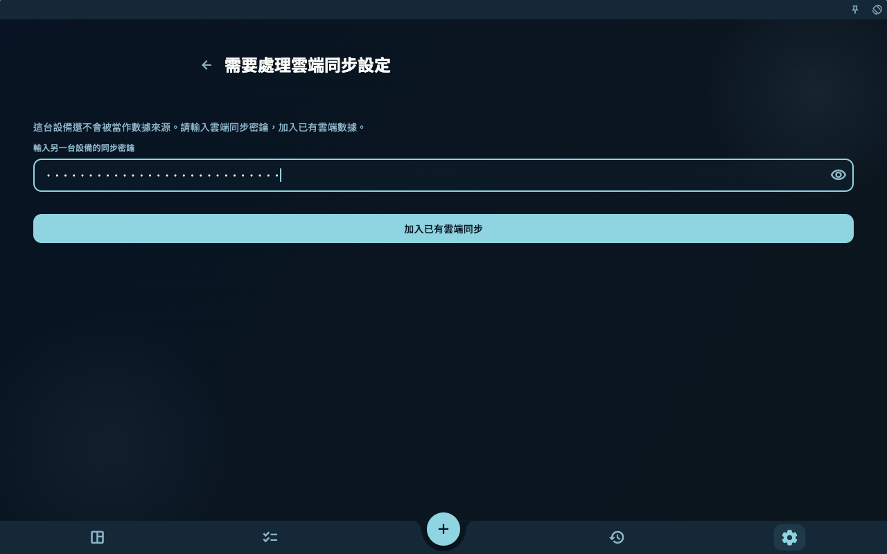
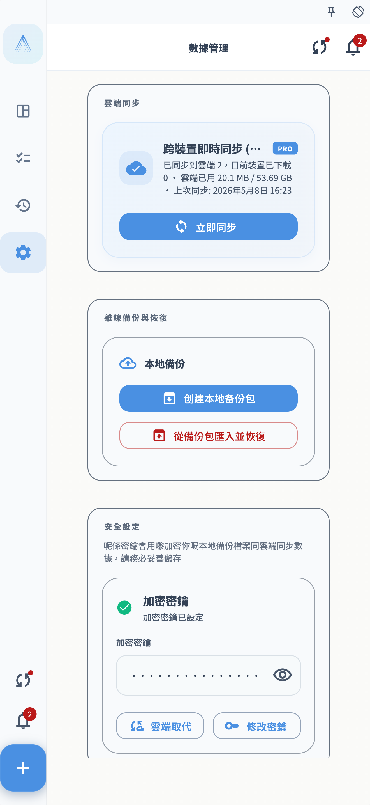
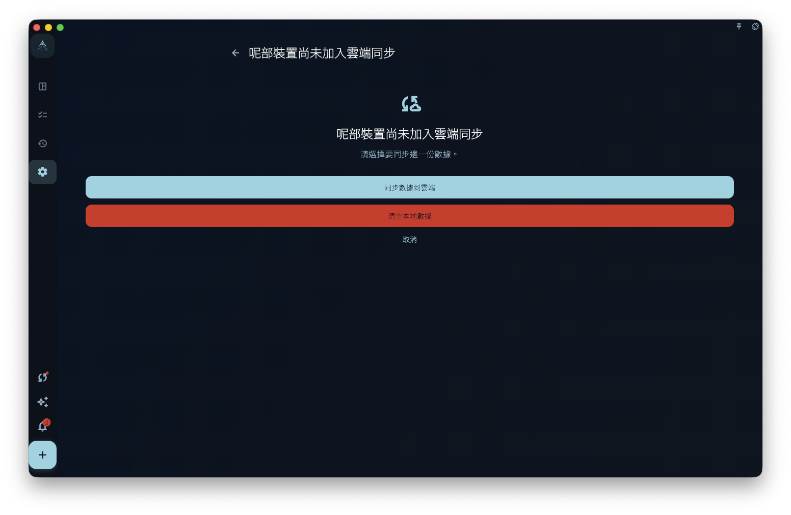
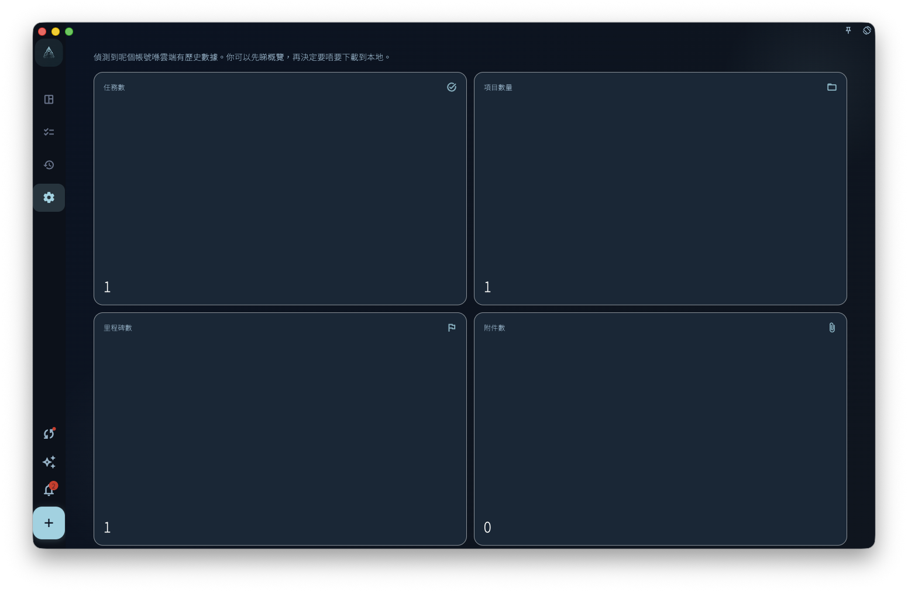
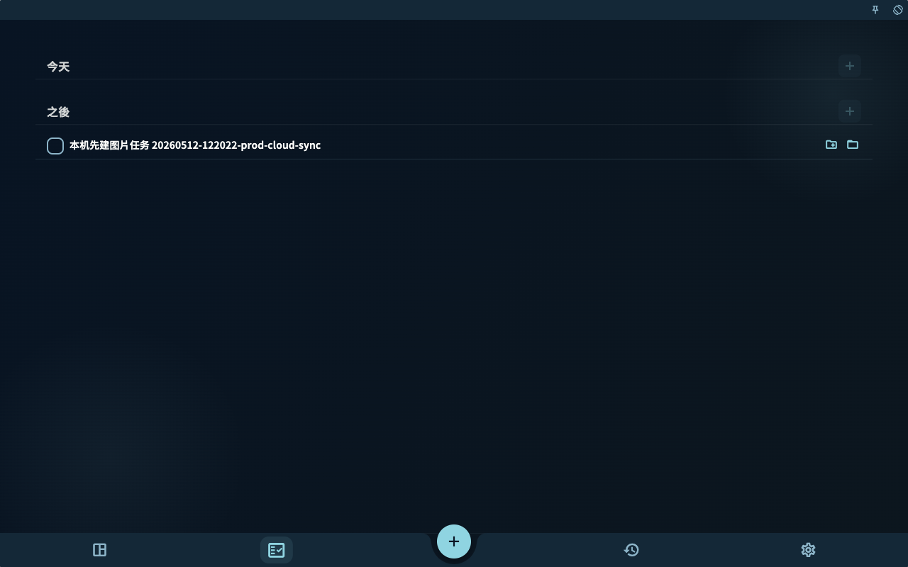
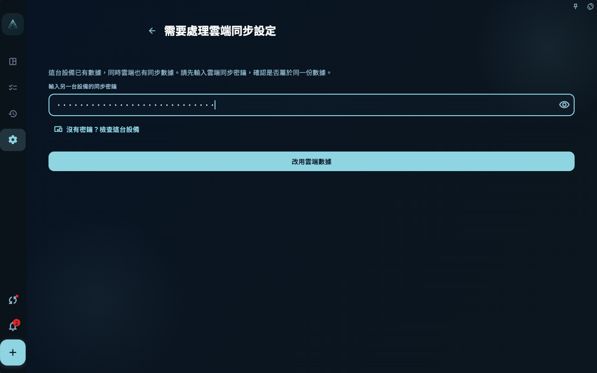

如果你換了新手機、新電腦，或者剛重裝 GranoFlow，想取回之前已經同步到雲端的數據：先在舊設備或你保存的記錄入面找到雲端同步密鑰，再在新設備登入同一個賬號，輸入這把密鑰並選擇加入已有雲端同步。

如果新設備還沒有新增任務、項目、回顧或圖片，按下面的「空設備同步」做。如果新設備已經有你新建的內容，先看「本地已經有數據時」，不要直接當空設備處理。

## 開始前準備

先確認 4 件事：

- 舊設備曾經成功同步過，或者你之前保存過雲端同步密鑰。
- 新設備登入的是同一個 GranoFlow 賬號。
- 新設備可以上網，而且賬號狀態允許讀取雲端同步數據。
- 你拿到的是雲端同步密鑰。它不是登入密碼，而是用來打開雲端加密數據的密鑰。

最穩妥的順序是：先在舊設備確認數據還在，再複製或記錄同步密鑰，最後操作新設備。

<!-- manual-screenshot:id=data-new-device-sync-old-device-key -->

## 空設備同步

這裡的空設備，指剛安裝、剛重裝，或還未錄入真實數據的設備。即使 GranoFlow 已經在這部設備上產生了本地密鑰，只要你還未新增真實內容，它仍然會按空設備處理，不會用空設備覆蓋雲端數據。

1. 在舊設備打開 GranoFlow，進入保存或查看同步密鑰的頁面。
2. 複製或記錄目前雲端同步密鑰。不要只記登入密碼，登入密碼不能代替同步密鑰。
3. 在新設備安裝並打開 GranoFlow。
4. 用同一個賬號登入。
5. 進入同步入口。如果頁面要求「輸入另一台設備的同步密鑰」，填入舊設備上的雲端同步密鑰。
6. 點擊「加入已有雲端同步」，等待驗證和下載完成。
7. 回到任務、項目、回顧等頁面，確認雲端數據已經出現在新設備上。

<!-- manual-screenshot:id=data-new-device-sync-enter-key -->

<!-- manual-screenshot:id=data-new-device-sync-join-existing -->

<!-- manual-screenshot:id=data-new-device-sync-restored-data -->

完成後，這部設備就加入了原來的雲端同步。之後你在任何一部設備上產生的新變化，會按一般多端同步繼續上傳和下載。

## 空設備不會做什麼

空設備同步的目的，是把已有雲端數據下載到新設備，不是用新設備重新建立雲端數據。

- 不會因為新設備產生了新的本地密鑰，就替換雲端同步密鑰。
- 不會預設讓你用這部新設備覆蓋雲端數據。
- 不會把一部沒有真實數據的新設備當作數據來源。

如果你看到「同步數據到雲端」「重建雲端同步」「清空本地數據」這類選擇，表示目前情況已經不是最簡單的空設備同步。先停下來，按下一節判斷。

## 這部設備尚未加入雲端同步

有時 GranoFlow 會發現：目前設備登入的是同一個賬號，但這部設備還未加入目前雲端同步。頁面會讓你在「同步數據到雲端」「清空本地數據」和「取消」之間選擇。

<!-- manual-screenshot:id=data-sync-device-join -->

這個頁面通常出現在同步入口、數據管理頁，或頂部同步狀態提示。它不是普通同步按鈕，而是在問你要保留哪一邊的數據。

- 選擇「同步數據到雲端」前，先確認這部設備上的任務、項目、回顧和附件就是你想保留的版本。確認後，雲端會改用這部設備的數據，其他設備後續也會受影響。
- 選擇「清空本地數據」前，先確認雲端數據才是你要保留的版本。確認後，這部設備會清掉本機目前數據和本機同步設定，再從雲端下載。
- 選擇「取消」會停止這次處理。你可以先回到舊設備、雲端概覽或備份頁面核對數據。

無論選哪條路，都不能保證未上傳成功的本機附件、另一部設備上的未同步改動，或沒有密鑰的數據一定能恢復。做選擇前，先確認目前設備和舊設備上最重要的數據還能看到。

## 雲端數據概覽

如果賬號裡已經有雲端歷史數據，GranoFlow 可能會先顯示雲端數據概覽。你可以用它粗略判斷：雲端裡有多少任務、項目、里程碑、附件，最近何時更新過，以及數據覆蓋的大約時間範圍。

<!-- manual-screenshot:id=data-cloud-data-overview -->

這個頁面常見於已登入賬號的同步入口，尤其是目前設備還未啟用上傳能力、但雲端已經有可下載歷史數據時。它的主要動作是「下載雲端數據」。在部分可以上傳、風險更高的場景裡，頁面也可能出現「清空雲端數據」。

- 「下載雲端數據」是一次恢復動作，不等於自動開啟日常雲端同步。下載後，先回到任務、項目和回顧頁面檢查內容。
- 「清空雲端數據」會要求再次確認，並可能要求系統驗證。確認後，雲端同步數據會被清空；不要把它當成刷新或重新載入。
- 如果頁面提示本機和雲端加密狀態不同，先去「加密與恢復密鑰」處理密鑰問題，不要反覆嘗試下載。

雲端概覽只能幫你判斷雲端歷史數據的大致範圍。它不能保證每個附件都已經完整下載到目前設備，也不能替你判斷另一部設備上是否還有未同步內容。

## 本地已經有數據時

如果你已經在新設備上新增過任務、項目、回顧，或者給任務上傳過圖片，再同步已有雲端數據就要更加小心。這時本地和雲端都可能有數據，GranoFlow 需要先確認你想保留哪一份。

<!-- manual-screenshot:id=data-new-device-sync-local-image-task -->

先做這幾件事：

1. 不要連續點擊「同步數據到雲端」或「重建雲端同步」。
2. 先確認舊設備或雲端裡有哪些重要數據。
3. 如果新設備上的新內容也重要，先確認它是否還能在目前設備看到。必要時先導出或截圖留存。
4. 按頁面提示輸入舊設備上的雲端同步密鑰，讓 GranoFlow 先確認這份雲端數據是否能打開。

接下來根據頁面上的選擇判斷：

<!-- manual-screenshot:id=data-new-device-sync-local-data-choice -->

- 如果你只想把雲端數據同步到這部設備，選擇偏向「使用雲端數據」或「清空本地數據」的路徑。這樣會讓這部設備改用雲端數據，本機剛新增但還未同步成功的內容可能不會保留。
- 如果你確實要以這部設備為準，才選擇「同步數據到雲端」或「重建雲端同步」。這類操作會讓雲端改用目前設備的數據，並影響其他設備後續同步，不能當成普通下載按鈕使用。
- 如果你不確定，選擇取消，回到舊設備檢查數據和同步密鑰，再繼續。

有圖片或附件時更要謹慎。圖片需要本地文件、附件記錄和雲端上傳狀態都完成，才算真正穩定。不要因為任務文字已經出現，就以為圖片也一定已經安全同步到雲端。

## 常見問題

**輸入密鑰後提示無法打開雲端同步設定怎麼辦？**
先檢查有沒有複製完整，尤其是開頭、結尾和空格。確認你輸入的是雲端同步密鑰，不是賬號密碼，也不是本地備份文件入面的其他說明文字。

**舊設備不在身邊怎麼辦？**
如果你之前保存過雲端同步密鑰，可以直接使用保存的那一份。如果既沒有舊設備，也沒有密鑰，GranoFlow 可能無法解開已有雲端加密數據。

**新設備上剛建了一個任務，還能按空設備流程走嗎？**
不要按空設備處理。只要這部設備已經有真實本地數據，就按「本地已經有數據時」處理，先弄清楚要保留雲端數據、本機數據，還是先取消操作。

**同步完成後為什麼有些圖片還在載入？**
任務和圖片附件不一定同時完成。一般同步可能先恢復任務和附件記錄，圖片文件再繼續上傳、下載或按需載入。保持網絡可用，等同步完成後再檢查圖片。

## 下一步

同步完成後，去「多端同步」了解日常同步如何繼續運作。如果你擔心密鑰遺失，再去「加密與恢復密鑰」保存必要憑證。
