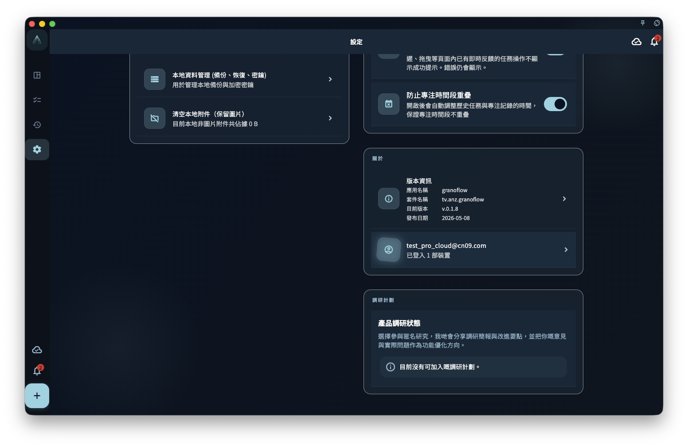

手機丟失、App 重裝、換設備、或者誤刪了重要任務——係呢些時刻，你才會真正意識到「數據安全」有幾重要。

GranoFlow 的數據保護體系有四層：

```
本地存儲 → 雲端同步 → 端對端加密 → 手動備份
```

呢四層**互相配合，但唔能互相替代**。



## 四層各自負責什麼

| 層級 | 負責 | 唔負責 |
|------|------|--------|
| **本地存儲** | 讓 App 離線也能用 | 唔防止設備損壞丟失 |
| **雲端同步** | 跨設備共享數據 | 唔係備份，誤刪後雲端也會刪 |
| **端對端加密** | 保護雲端數據唔被第三方讀取 | 丟咗密鑰自己也打唔開 |
| **手動備份** | 誤刪、遷移時的最後防線 | 唔係實時的，有時效性 |

## 最常見的誤區

- **「我有雲端同步，所以數據安全」**：雲端同步會跟隨你的操作——你刪咗，雲端也刪咗。
- **「退出登錄會清空數據」**：退出登錄只斷開賬號連接，本機數據完整保留。
- **「刪賬號等於清除所有數據」**：賬號刪除的係雲端數據，每台設備上的本地副本唔會自動刪除。

## 遇到問題先從呢度判斷

```
數據還喺設備上？ → 去本地恢復或導出
數據只在雲端？ → 去新設備同步或下載
擔心數據泄露？ → 去加密設定
擔心誤刪？ → 去備份頁面
```

:::tip[最重要的一步]
保存你的加密恢復密鑰。呢係唯一能讓你在密鑰唔匹配時找回雲端數據的憑證。
:::
