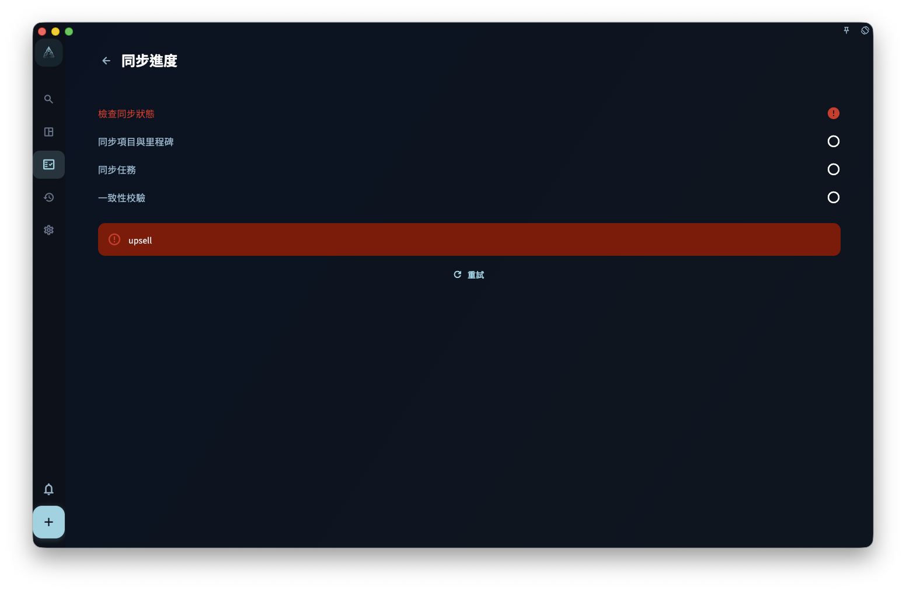

同步把你喺一台設備上的變化，帶到其他登錄咗同一賬號的設備上。

## 同步什麼、唔同步什麼

✅ 同步的內容：

- 任務（標題、截止日期、標籤、狀態……）
- 項目和里程碑
- 回顧記錄
- 圖片和附件（喺網絡允許的情況下）

⚠️ 同步唔係備份：

- **你刪咗，其他設備也會刪** — 同步係雙向的
- **冇版本歷史** — 同步唔記錄「3天前的狀態」
- **圖片可能延遲** — 文字先同步，圖片可能晚一步

## 同步的常見狀態

| 狀態 | 含義 |
|------|------|
| 同步中 | 正在上傳或下載變更 |
| 已同步 | 當前設備數據和雲端一致 |
| 等待中 | 有變更在排隊，通常係網絡問題 |
| 錯誤 | 同步遇到咗問題，需要檢查賬號或密鑰 |

## 新設備加入同步

如果你安裝咗新手機或重裝咗 App，需要用舊設備的**雲端同步密鑰**先能加入已有的雲端數據。

詳細步驟見 → [新設備同步已有雲端數據](/manual/zh-hk/data-security-and-recovery/new-device-sync/)

:::caution[同步唔替代備份]
定期導出本地備份。誤刪的任務唔能靠同步恢復——雲端早就跟著刪咗。
:::
