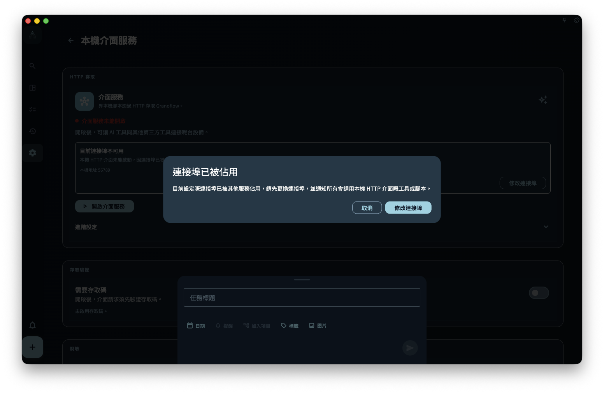

GranoFlow 桌面端面向自動化嘅主入口係本機 HTTP API。佢監聽本機回環地址 `http://127.0.0.1:<port>`，用嚟畀腳本、AI 助手或者命令行客戶端使用 App 已經公開嘅自動化能力。

`granoflow` CLI 係呢個 API 嘅可選客戶端。佢已經用 Rust 重寫，作為獨立包下載，唔會隨 macOS、Windows 或 Linux 桌面安裝包一齊安裝。換句話講，安裝桌面 App 之後，你已經可以喺 App 入面開啟本機 HTTP API；如果仲想喺終端使用 `granoflow` 命令，需要另外安裝 CLI。

本機 HTTP API 默認只綁定 `127.0.0.1`，唔會自動暴露到局域網或者公網。如果需要喺 `granoflow.com` 文檔頁調試本機接口，必須喺 App 入面臨時開啟官方文檔調試，並使用 1 小時訪問碼；文檔頁唔再默認可以訪問業務接口。允許任何設備來源亦必須先開啟訪問碼保護。

## 先睇呢個導航

- 想先理解工作原理：讀 [本機 HTTP API 工作原理](/manual/zh-hk/desktop/cli-how-it-works/)
- 想確認訪問碼、本地訪問、App Lock、密鑰區別：讀 [安全設定與密鑰邊界](/manual/zh-hk/desktop/cli-security-and-settings/)
- 想查 CLI 命令同 HTTP 端點：讀 [命令參考與 HTTP 映射](/manual/zh-hk/desktop/cli-command-reference/)
- 想按真實場景組合調用：讀 [工作流](/manual/zh-hk/desktop/cli-workflows/)
- 想畀腳本或 AI 助手用：讀 [JSON、環境變數與直接調用](/manual/zh-hk/desktop/cli-json-and-scripting/)
- 遇到報錯：讀 [排障](/manual/zh-hk/desktop/cli-troubleshooting/)

## 安裝與首次檢查

先安裝並打開 GranoFlow 桌面版，然後喺設定入面嘅本機接口服務頁開啟本機 HTTP API。呢一步只係開啟 App 入面嘅本機接口，唔會安裝 `granoflow` 終端命令，亦唔會寫入 PATH、MSIX App Execution Alias 或 `/usr/local/bin/granoflow` symlink。

<!-- manual-screenshot:id=desktop-command-line-tool-settings-main -->


如果你只想確認接口是否可達，可以直接用 curl：

```bash
curl -s http://127.0.0.1:56789/v1/health
curl -s http://127.0.0.1:56789/v1/version
```

如果你已經單獨安裝 CLI，可以再檢查 CLI 讀到嘅連接配置：

```bash
granoflow config --json
granoflow health --json
```

默認 API 地址係 `http://127.0.0.1:56789`。如果你喺 App 入面修改咗端口，CLI 亦需要使用同一個地址；可以通過配置文件、`--api-base-url` 或 `GRANOFLOW_API_BASE_URL` 指定。

## 讀者常見誤解

- 桌面 App 唔負責安裝、修復或卸載 CLI。CLI 嘅下載、升級、簽名同 PATH 配置由官網或 release 說明承接。
- CLI 唔會直接讀寫 GranoFlow 數據庫。任務、項目、回顧同卡片等寫操作都會轉發畀運行中嘅本機 HTTP API，由 App 服務層處理。
- `granoflow backup decrypt/encrypt` 係離線備份包轉換工具，唔依賴運行中嘅 App；佢唔等於「建立 App 備份」或「恢復到 App」。
- 公開能力以 OpenAPI 同 CLI help 為準。舊 Dart CLI、App 內置 CLI 安裝器同 `bin/granoflow.dart` 入口已經退役。

## 當前狀態

當前公開 CLI 包按平台獨立發行：

- macOS Apple Silicon：signed/notarized zip
- Linux x64：tar.gz
- Windows x64：先發布 unsigned zip，再由 Windows 簽名設備補 signed zip

唔提供 macOS Intel CLI 包。桌面 App 安裝包亦唔會附帶呢啲 CLI 資產。

## 參考：規則與邊界

呢一節用嚟查邊界，唔影響你完成前面嘅首次檢查。

- 本機 HTTP API 嘅公開端點以 OpenAPI 文檔為準。
- CLI 嘅公開命令以 `granoflow help --json` 同本手冊命令參考為準。
- 桌面三平台安裝包不得寫 PATH、不得注入 MSIX App Execution Alias、不得嵌入 macOS CLI helper，亦不得提供 App 內安裝 CLI 嘅按鈕。
- 訪問受保護端點時，仍然會經過本機接口總開關、來源檢查、App Lock、nonce 同訪問碼保護。

## 下一步

而家你已經分清「本機 HTTP API」同「獨立 CLI」嘅關係。下一頁可以繼續睇佢哋點樣一齊工作，以及點解好多自動化問題要先由本機地址同權限邊界判斷。
