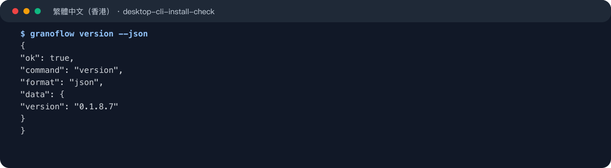
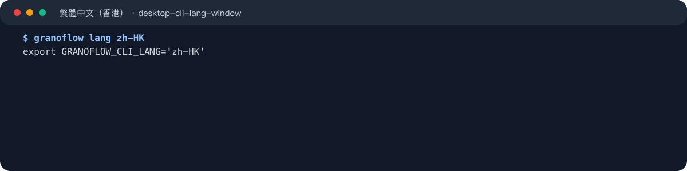
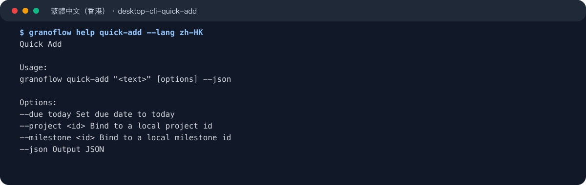
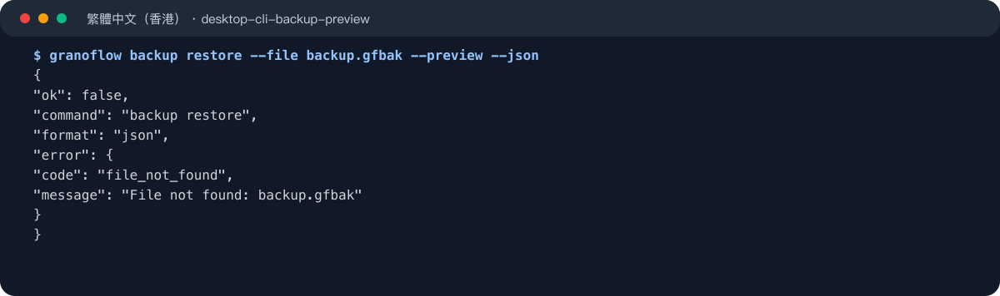
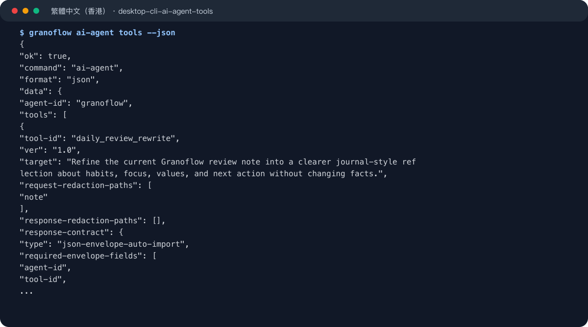

命令行工具適合想由終端機、腳本或自動化流程打開 GranoFlow 的用戶。先確認命令可用，再複製以下示例；截圖用來對照輸出形態，完整命令以程式碼區塊為準。

## 安裝與確認

桌面版安裝後，設置頁的「命令行工具」入口會集中顯示目前平台的安裝或命令別名狀態、系統脫敏和 Token 驗證設置。正式發佈包會分發已編譯好的 `granoflow` 命令，用戶不需要安裝 Dart SDK。

- Windows 安裝包會自動註冊終端機命令，修復時請重新執行安裝包。
- macOS 可以在設置頁安裝或修復 `/usr/local/bin/granoflow`。
- Linux AppImage 需要手動配置命令別名，設置頁會提供可複製命令。
- Android / iOS 不展示命令行工具入口。

```bash
granoflow version --json
```



常用探索命令：

```bash
granoflow
granoflow help
granoflow help version
granoflow version
```

## 輸出語言

`--lang` 只影響單次命令輸出。`granoflow lang <locale>` 會打印一行設定目前終端機視窗語言的命令；執行後只影響這個終端機視窗，關閉視窗後失效，也不會改變 App 內語言設定。

```bash
granoflow --lang zh-HK help version
eval "$(granoflow lang zh-HK)"
granoflow lang zh-HK | Invoke-Expression
```



支援的 locale 是 `en`、`zh-CN`、`zh-HK`、`zh-TW`。

## 基礎命令

所有目前命令都支援 `--json`。JSON 模式只輸出 JSON envelope，不會混入人類提示、進度日誌或 Token 原文。

```bash
granoflow status --json
granoflow open --json
granoflow open today --json
granoflow logout --json
```

`granoflow open` 不帶頁面時會嘗試啟動桌面 App；`status`、`open today` 和 `logout` 需要運行中的 GranoFlow App。App 不可達時，命令會返回穩定錯誤，而不是繞過 App 直接讀取本地數據庫。

## 指令速查

如果你只想判斷該用哪個命令，可以先看這一組：

| 命令 | 用途 | 是否需要運行中的 App |
| --- | --- | --- |
| `help` | 查看整體幫助或某個命令的幫助 | 否 |
| `version` | 查看 CLI 版本 | 否 |
| `lang` | 設定目前終端機視窗的輸出語言 | 否 |
| `open` | 打開首頁、收件箱、今日、項目、回顧、設置等頁面 | 視用法而定 |
| `status` | 輸出運行中 App 的脫敏狀態摘要 | 是 |
| `quick-add` | 把一段文字交給 App 建立任務 | 是 |
| `logout` | 清除本機登入會話 | 是 |
| `export` | 導出用戶數據包 | 是 |
| `import` | 導入用戶數據包 | 是 |
| `backup create` | 建立本地備份包 | 是 |
| `backup restore --preview` | 預覽本地備份包恢復影響 | 是 |
| `backup restore --confirm` | 執行本地備份恢復 | 是 |
| `ai-agent tools` | 查看可用 AI 自動化工具 | 否 |
| `ai-agent system-template` | 輸出某個 AI 工具的系統提示模板 | 否 |
| `ai-agent package` | 生成給外部 AI 使用的受控 JSON 包 | 否 |
| `ai-agent <resource> request` | 從本地上下文生成 AI 請求包 | 視資源而定 |
| `ai-agent <resource> validate` | 校驗 AI 返回 JSON | 否 |
| `ai-agent <resource> apply` | 校驗並套用 AI 返回結果 | 視資源而定 |
| `ai-agent assets cleanup` | 清理 AI 自動化資產引用 | 否 |

AI 自動化資源包括 `task`、`milestone task-draft`、`daily-review rewrite`、`journal daily`、`journal weekly`、`journal monthly`、`domain-values` 和 `work-learning report`。

## 打開與快速添加

`open` 可以打開常用頁面，`quick-add` 可以把一段文字交給運行中的 App 建立任務。

```bash
granoflow open inbox --json
granoflow open today --json
granoflow quick-add "整理每週回顧提綱" --json
granoflow quick-add "今天跟進備份檢查" --due today --json
```



`quick-add` 不會在 App 不可達時直接寫入本地數據庫；失敗時請先打開 GranoFlow 桌面版，再重試命令。

## 數據導入、導出與備份

數據命令同樣通過運行中的 App 執行，用於復用 App 內的導出、導入、備份、同步風險和附件檢查邏輯。

```bash
granoflow export --scope local --out granoflow-export.gflow --json
granoflow import --file granoflow-export.gflow --json
granoflow backup create --out granoflow-backup.gfbak --json
granoflow backup restore --file granoflow-backup.gfbak --preview --json
granoflow backup restore --file granoflow-backup.gfbak --confirm --backup-secret-file backup-secret.txt --json
```



先使用 `--preview` 查看備份包摘要，再用 `--confirm` 執行恢復。備份密鑰只能通過 `--backup-secret-file` 傳入，避免密鑰進入 shell 歷史、進程列表或日誌。

## AI 自動化

`ai-agent` 面向希望把 GranoFlow 數據包交給外部 AI 或自動化流程的用戶。CLI 負責生成、校驗和套用受控 JSON 包；它不會替你調用外部模型，也不會在本地數據不可安全讀取時偽造結果。

```bash
granoflow ai-agent tools --json
granoflow ai-agent diagnostics local-store --json
granoflow ai-agent system-template single_task_ai --json
granoflow ai-agent package single_task_ai --input data.json --json
```



資源化入口使用完整路徑：

```bash
granoflow ai-agent task request --id <task-id> --json
granoflow ai-agent task validate --input reply.json --json
granoflow ai-agent task apply --input reply.json --json
```

## 安全設置與下一步

- 打開設置頁裏的「命令行工具」，確認安裝狀態、系統脫敏和 Token 驗證。
- 需要機器讀取時優先使用 `--json`，需要給人閱讀時使用普通 help。
- 涉及導入、恢復和 AI 套用前，先看預覽或校驗結果，再執行寫入命令。
- 如果命令返回 App 不可達，先啟動 GranoFlow 桌面版，再重試。
