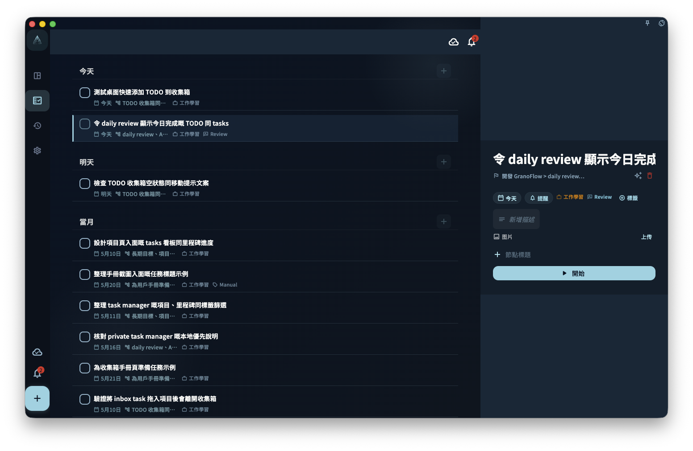

在桌面端搵功能時，先睇左邊切換頁面，再睇中間嘅任務列表或目前頁面；如果視窗夠闊，點開任務之後，詳情通常會喺右邊顯示，唔需要離開目前列表。

## 闊屏佈局的特點

桌面端同手機端最大分別，是屏幕更闊。闊屏時，GranoFlow 可以將導航、列表同任務詳情放喺同一個視窗入面，令你少啲來回切換頁面。

- **左側側邊欄**：呢度係導航區。你可以喺呢度切換唔同視圖，例如收件箱、項目、回顧等。
- **中間內容區**：呢度顯示任務列表，或者你目前打開嘅頁面內容。
- **右側詳情面板**（闊屏時）：點擊一個任務之後，任務詳情會喺右側展開。咁你可以一邊睇列表，一邊查看或處理呢個任務。

如果視窗比較窄，桌面端會將側邊欄摺疊起來，用法會更接近手機版。如果搵唔到左側側邊欄，可以先將視窗拉闊，或者搵摺疊選單入口。

## 鍵盤優先

桌面端適合用鍵盤快速操作。你唔一定要記住所有快捷鍵，先記住最常用嘅幾類就夠。

- **快速添加任務**：通常透過全域快捷鍵打開。呢個快捷鍵可以喺偏好設定入面配置。
- **在列表裡導航**：可以用方向鍵喺任務之間移動。
- **完成任務**：喺任務上按對應快捷鍵即可完成，實際按鍵以界面顯示或你嘅設定為準。

如果快捷鍵同其他應用程式衝突，可以去 GranoFlow 偏好設定改成更順手、亦較難誤按嘅組合。

## 拖放排序

在桌面端，你可以用滑鼠直接拖放任務來調整順序。你亦可以將任務拖到唔同項目或時間段，用來快速重新安排任務位置。

拖放之前，先確認你拖緊嘅係任務本身，而唔係打開詳情、選取文字或點擊其他按鈕。如果拖動後位置冇變，可能係目前視圖唔支援呢種排序方式，或者任務唔可以移到目標位置。

:::tip[快捷鍵配置]
在 GranoFlow 偏好設定裡可以自定義全域呼出快捷鍵。配置好之後，在其他應用程式裡按呢個快捷鍵，就可以打開 GranoFlow。
:::
