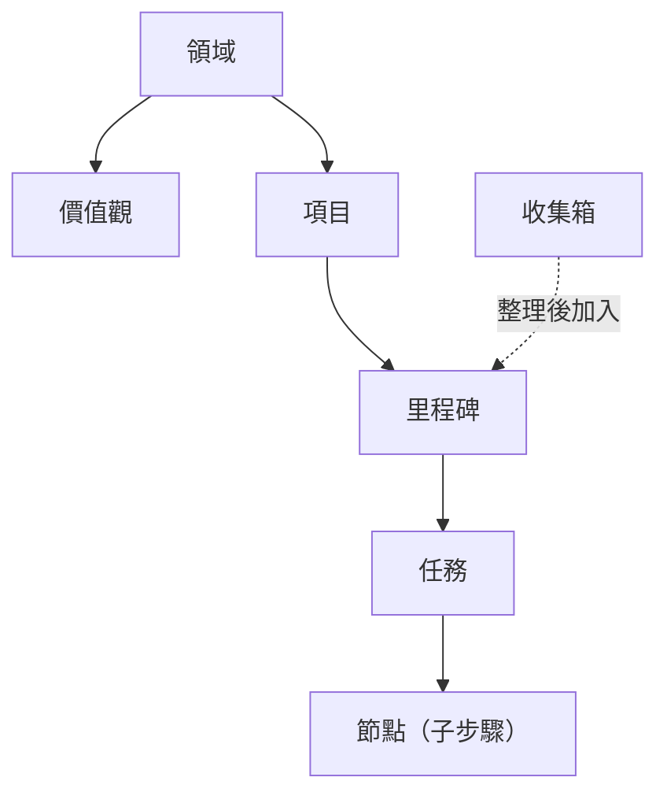

如果你在 GranoFlow 見到一個詞唔明，就用呢頁查：它會講清楚呢個詞是甚麼、在哪裏用、同其他概念有甚麼關係。

GranoFlow 的主要結構可以咁理解：領域下面有價值觀和項目，項目下面有里程碑，里程碑下面有任務，任務入面可以再拆節點；收集箱裏的任務整理後，可以加入項目或里程碑。

---

## 人生結構

### 領域

領域是你生活入面的大方向，例如「工作」「健康」「家庭」「學習」。

它不是任務資料夾，不能直接用來放任務。你可以把它理解成人生地圖上的區域：項目會歸到某個領域，回顧時你就可以看到自己最近把精力放在哪些方向。

### 價值觀

價值觀是你在某個領域裏想長期堅持的標準，例如「工作上只做真正有影響力的事」。

它不是任務，不能完成，也不會自動幫你剔走事情。它的作用是在回顧時提醒你：這段時間做的事，是否符合你自己定下的標準。

### 項目

項目是一個需要持續推進的目標容器，例如「搬屋」「畢業論文」「開發 App v2」。

任務可以歸屬到項目和里程碑；整理到項目時，通常需要選擇具體里程碑。項目或里程碑只說明任務屬於哪裏，不會單獨令一條沒有日期的任務離開收集箱。項目可以歸檔或完成；如果項目裏仍有未處理的任務，系統會先讓你決定這些任務要怎樣處理。

### 里程碑

里程碑是項目裏的階段節點，用來把大項目拆成幾個小階段，例如「初稿完成」「測試通過」「上線」。

每個里程碑下面可以有任務。任務全部完成後，里程碑才算可以關閉。它的用途是讓長項目有清楚的階段感，而不是一直像在做一件沒有盡頭的事。

### 任務

任務是 GranoFlow 裏最基本的行動單位，也就是你要做的那件具體事情。

一個任務可以有標題、截止日期、提醒、標籤、項目、里程碑和描述。任務狀態包括：待辦、進行中、已完成、已歸檔、回收站。任務完成時會記錄完成時間；取消完成時，這個完成時間會被清除。

### 節點

節點是任務裏的子步驟，用來拆解複雜任務。

例如任務是「提交稅務申報」，節點可以是「整理收據」「填寫表格」「提交」。當所有節點都完成時，父任務會自動完成；如果你又新增一個未完成節點，父任務會回到待辦狀態。

### 收集箱

收集箱是暫時放任務的地方，適合放那些「先記低，未諗好點安排」的事。

沒有日期、而且狀態是待辦或進行中的任務，會出現在收集箱。項目和里程碑只是歸屬；如果任務仍然沒有日期，亦可以繼續留在收集箱。一旦你給任務安排了日期，或者完成、歸檔、刪除它，它才會離開收集箱。你可以把收集箱想成口袋裏的便條紙：先放入去，之後再整理。

---

## 使用節奏

### 規劃

規劃就是把一個模糊想法，變成有日期、有項目，或者至少更清楚的可執行任務。

你可以在快速新增、收集箱整理或任務詳情裏做規劃。輸入框裏的 `#` `@` `~` 是快捷方式，但任何真正寫入數據的操作都需要你確認。

### 執行

執行就是開始做任務本身。

你可以配合專注計時、置頂任務或背景音樂使用。任務完成時，GranoFlow 會先把相關的專注會話收尾，再記錄完成時間，這樣回顧數據裏的時間段就不會混亂。

### 完成

完成表示任務已經做完，並且會記錄一個完成時間。

日回顧按任務「實際完成的那一天」統計，不按截止日期統計。每日由 0 點開始算新一日，0 點之後完成的任務會進入新一日的回顧。

### 歸檔

歸檔表示這件事已經封存，不再出現在當前工作視圖裏，但記錄仍然保留，可以之後翻查。

項目、里程碑、任務都可以歸檔。歸檔前如果裏面仍有活躍任務，系統會先讓你決定怎樣處理這些任務。

### 日回顧

日回顧是用來查看「某一天實際完成了甚麼」的頁面。

它按完成時間統計，不按截止日期統計。如果某天沒有完成任務，頁面會顯示安靜的空狀態，不會用空圖表製造壓力。

### 複盤

複盤是回看一段更長時間裏的投入、進展和狀態。

你可以在周回顧、月詳情等視圖裏做複盤。它關注的不是單純完成了多少任務，而是你有沒有在推進真正重要的事，以及精力分布有沒有偏掉。

---

## AI 輔助

### AI 助手

AI 助手指的是你自己選擇的外部 AI 工具，例如 ChatGPT、Codex、Claude、Gemini 或 DeepSeek。

GranoFlow 不內置一個會偷偷替你改數據的黑箱 AI。它會幫你準備提示詞，複製到剪貼板，然後打開你選擇的 AI 工具。

### 提示詞

提示詞是 GranoFlow 交給外部 AI 的說明文字，用來告訴 AI 應該問甚麼、整理甚麼、按甚麼格式輸出。

你可以編輯提示詞模板，但系統會阻止空模板或損壞的模板被儲存。

### 剪貼板回流

剪貼板回流就是把外部 AI 生成的結果複製回 GranoFlow 的流程。

AI 的回覆不會被自動寫入你的任務。你把結果複製回來後，GranoFlow 會先識別格式並彈出確認；只有你同意後，內容才會真正導入。已經拒絕過或已經導入過的內容，不會反覆彈窗。

---

## 數據與安全

### 本地優先

本地優先表示 GranoFlow 的核心數據會先存在你的設備上，不依賴服務器也能正常使用。

離線記任務、整理任務、做回顧都可以。只有當數據要離開設備時，例如備份或雲同步，才會進入加密流程。

### 雲同步

雲同步會把你的本機數據和雲端數據對齊，讓不同設備看到同樣的內容。

同步前，系統會檢查帳戶、會員狀態和加密密鑰是否匹配。如果發現不一致，系統會先暫停並引導你確認，而不是靜默覆蓋數據。

### 端到端加密（E2EE）

端到端加密表示數據離開你的設備之前已經被加密，服務器上保存的是密文。

這代表 GranoFlow 的服務器讀不到你的任務內容。本地搜尋和日常使用優先保證速度；備份和雲端上載才會走加密流程。

### 密鑰

密鑰是解鎖加密備份和雲端數據的關鍵憑證，**不是登入密碼**。

密鑰很重要。丟失密鑰，就解不開舊備份或對應的加密雲端數據。GranoFlow 會多次提醒你保存密鑰，但服務器不能替你找回丟失的密鑰。

### 備份與恢復

備份是把設備上的全部數據導出為 `.flow.grano` 文件，並用密鑰加密保護。

恢復是把這個備份文件重新導入 GranoFlow，需要提供建立備份時使用的密鑰。如果附件在備份時沒有完全下載，備份裏可能不會包含完整附件。

### App 鎖定

App 鎖定會在你打開應用時增加一次本機驗證，例如 Face ID、指紋或 PIN。

它可以降低別人臨時拿到你設備就能翻看內容的風險。但它不是全能防護；如果設備本身已經被破解，它擋不住這種情況。

---

## 帳戶與權益

### 帳戶

帳戶用於登入、同步、訂閱識別和帳戶恢復。

目前主要登入方式是電郵驗證碼。未登入也可以使用本地功能，但進入雲同步時，系統會引導你先登入。

### 會員與權益

會員，包括 Pro 或天使會員，表示你購買了正式權益。

權益由服務端確認，不是客戶端自己判斷。權益會影響雲同步、儲存配額、附件補下載等功能。如果訂閱買在另一個帳戶上，當前帳戶不會自動獲得對應權益。

---

## 界面與設備

### 桌面端 vs 移動端

桌面端，也就是 Windows、macOS、Linux，更適合長時間整理、項目管理和回顧。

移動端，也就是 iOS 和 Android，更適合快速記錄和隨手捕捉。

### 系統托盤

在桌面端，關掉視窗可能只是把 GranoFlow 隱藏到系統托盤，它仍然在後台運行。

這種情況下，專注計時不會中斷。要徹底退出，請從托盤菜單選擇「退出」。

### 側邊欄模式

桌面端可以把 GranoFlow 收成窄視窗，貼在屏幕邊緣使用。

這樣你可以一邊做其他事，一邊查看或勾選任務。
