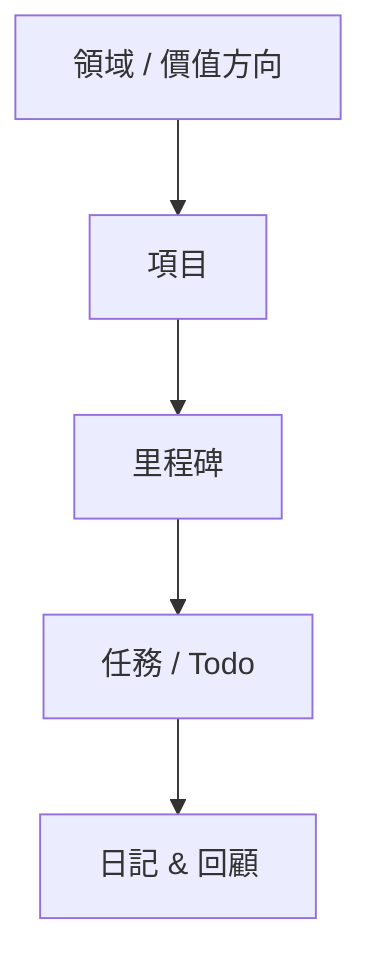
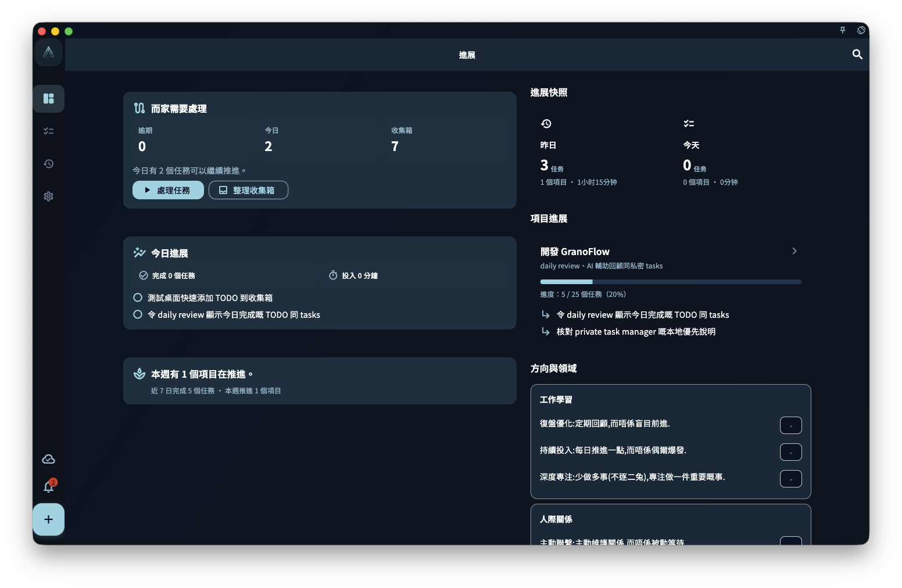

你可以把 GranoFlow 當 Todo 用——快速記事、劃掉、繼續。但它其實更像一本「有結構的生活日記」。

每個任務都能掛在項目上，每個項目都能對應你真正在意的方向（例如「健康」「寫作」「副業」）。每天或每週回顧的時候，你看見的不是一堆劃掉的清單，而是「我最近有沒有朝着想要的方向走？」

這正是它和普通 Todo 工具最大的分別。

## 任務只是入口

想快速記一件事？直接打開，幾秒鐘搞定。

稍後有時間，再決定它屬於哪個項目、甚麼時候做。就像把收據塞進口袋——先收着，回家再整理。GranoFlow 不會催你現在就把每件事安排好。

任務（tasks）是線索，項目是容器，價值觀和領域是方向盤。

## 不只是 Todo 清單

大多數 Todo 工具從「今天」出發，也止於「今天」。GranoFlow 是立體的：

下圖展示了從大目標到每日任務的連接關係：

這樣設計的好處是：即使一週只完成了三件事，你也能看出這三件事是否真的在推進你想要的目標，而不只是「很忙」。

## 回顧不等於打卡

GranoFlow 內置日回顧和每週回顧，但不是那種「今天完成了幾個任務」的打卡計數器。

它更像是幫你寫輕日記的助手——你記錄下發生了甚麼、感受如何、下一步想做甚麼，然後就關掉。沒有羞辱，沒有壓力，沒有非要連續打卡才算成功。

## 你的數據在你手裏

GranoFlow 是本地優先 app，數據先存在你的設備上，斷網也能正常使用。同步、備份和加密都是你能控制的開關，不是系統替你做的暗箱操作。

AI 功能幫你整理回顧筆記，但最終的判斷永遠是你的。

:::note[新手提示]
第一次打開 GranoFlow，只需要知道一件事：見到 **+** 就能加任務。其他功能用到了再慢慢探索。
:::
