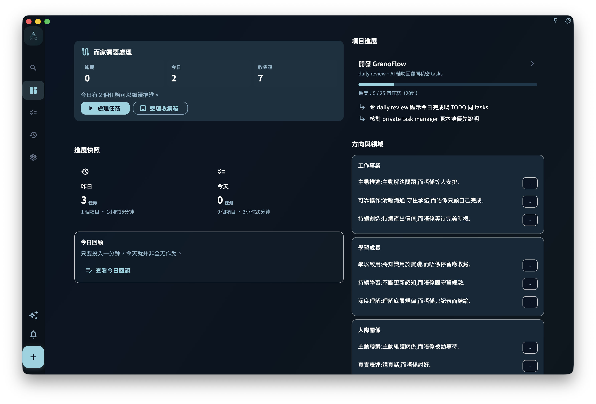

「進展」頁用來讓你一打開 GranoFlow 就知道：現在有什麼需要處理、今天已經推進到什麼狀態、本週和本月有沒有持續行動，以及正在進行的項目現在是什麼狀態。

它不是任務清單，也不是統計報表。你可以把它當成首頁狀態儀表板：先快速看一眼，再決定要繼續做今天的任務，還是回頭覆盤昨天。

## 首頁狀態與今日回顧

頁面上方會先顯示工作佇列和卡片學習入口，幫助你判斷下一步要處理什麼。接下來是「進展快照」，集中顯示昨天和今天的完成數、項目數、投入時間；如果你已經在使用卡片學習，這裡也會補充卡片學習進度、未學習/學習中/已掌握/已內化分佈、今日待複習和近期已複習數量。快照下方是輕量的「今日回顧」卡：有診斷時顯示一條今日投入階段文案、最多兩個行為標籤，以及進入今日回顧的按鈕；沒有診斷但今天可以記錄或已經完成回顧時，也會保留寫入或查看今日回顧的入口。在桌面橫屏中，這些當前狀態會排在左側，右側繼續展示項目、方向與領域、本週本月等長期資訊。

<!-- manual-screenshot:id=interface-home-progress-main -->

「今日回顧」卡只是快速判斷，不會展開完整分析。如果你想看更完整的原因、記錄或覆盤內容，可以點擊「寫今日回顧」或「查看今日回顧」進入回顧頁。

## 卡片學習

如果你已經把回顧中的經驗整理成知識卡片，進展頁會在上方顯示一次「卡片學習」區域。這裡會同時顯示總卡片數和今日待複習數量；點擊總卡片數可以進入「卡片統計」，查看學習狀態、未來複習負荷和近期複習活動。進展快照裡的卡片學習進度和卡片數字只是狀態補充，不是第二個複習入口。

卡片學習狀態分為未學習、學習中、已掌握、已內化。已內化表示一張已掌握卡片已經被帶回真實項目：來自 3 個不同項目的任務與同一張卡片有關聯。它用來提醒你，這條經驗不只是被記住了，也已經在不同項目中用過，可以作為經驗回到未來行動。

在「卡片統計」裡，你可以繼續進入卡片複習，也可以打開「卡片管理」。如果想理解卡片為什麼要和任務、回顧、項目放在一起，閱讀 [卡片：把經驗帶回行動](/manual/zh-hk/review-cards/)；如果想看練習、已內化和歸檔的區別，閱讀 [練習、掌握與內化](/manual/zh-hk/review-cards/study-and-internalize/)。

## 本週與本月狀態

進展頁也會展示本週和本月的推進情況。它的重點不是給你一個壓力很大的排名或分數，而是幫你看見最近一段時間有沒有持續行動。

如果某個領域連續幾天沒有出現，你可以在回顧時想一想：這是正常安排，還是它已經被你忽略了。

## 項目進展卡片

如果你正在推進項目，進展頁會顯示相關項目卡片。這樣你不用逐個打開項目頁面，也能先大致知道哪些項目最近有進展。

## 它適合用來做什麼

進展頁最適合回答這個問題：

> 我最近有沒有穩定地推進我在意的事？

如果你只想快速確認狀態，看進展頁就夠了。如果你想深入分析原因、調整安排，再進入回顧頁。

:::note[進展不替代回顧]
進展頁是快速掃一眼的入口，回顧頁才是深度思考的地方。兩者搭配使用效果更好。
:::
