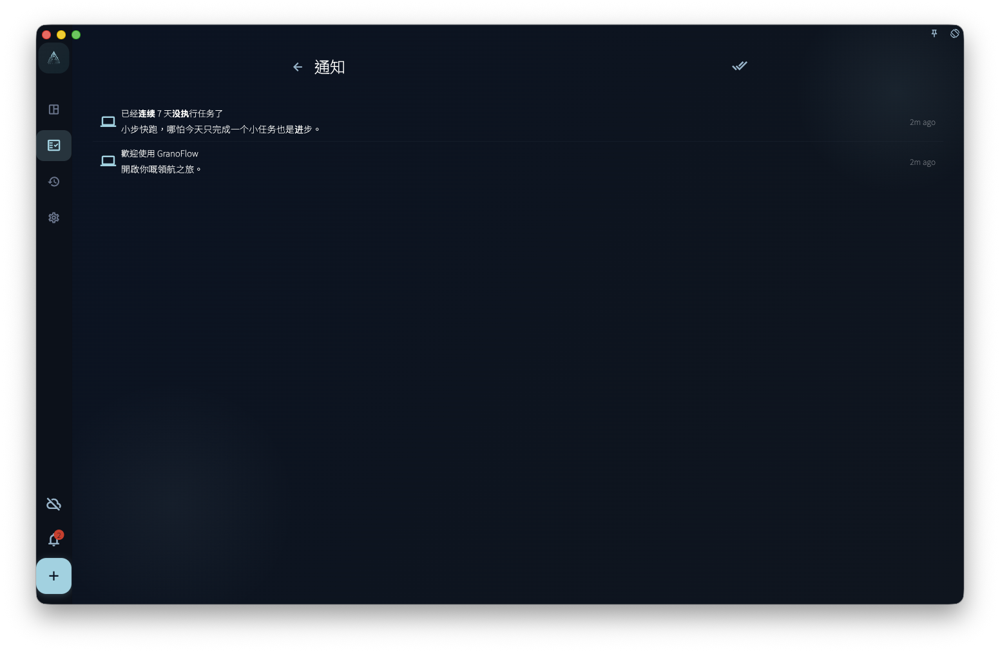

通知頁用於查看 GranoFlow 內的消息和狀態提醒。它可以幫你回看未讀消息、打開通知中的相關入口，或確認最近是否有需要處理的提示。

不要只依賴通知來判斷同步、訂閲、系統提醒或後台狀態是否一定成功。通知列表是消息入口，不是所有狀態的唯一憑據。

## 從哪裏進入

從界面頂部、側欄或系統托盤相關入口進入通知頁。頁面會刷新通知列表，並用未讀狀態提示哪些消息仍未處理。

<!-- manual-screenshot:id=interface-notifications-main -->

有未讀通知時，可以逐條打開，也可以使用「全部標記為已讀」。這只會改變通知的已讀狀態，不代表通知提到的問題已經解決。

## 打開通知後會發生什麼

點開通知時，GranoFlow 會先把未讀通知標記為已讀。如果通知帶有可打開的入口，頁面會嘗試進入對應位置；如果帶有外部連結，可能會打開系統瀏覽器。

如果通知沒有可執行入口，它仍然可以作為消息記錄閱讀。

## 和系統提醒的關係

通知頁顯示的是 App 內消息。系統通知是否彈出，還會受到系統權限、平台後台限制、網絡狀態和桌面端托盤行為影響。

如果你正在檢查任務提醒、同步狀態、訂閲權益或賬號問題，請回到對應功能頁確認目前狀態。通知可以提示你去看，但不能取代那些頁面本身的結果。
