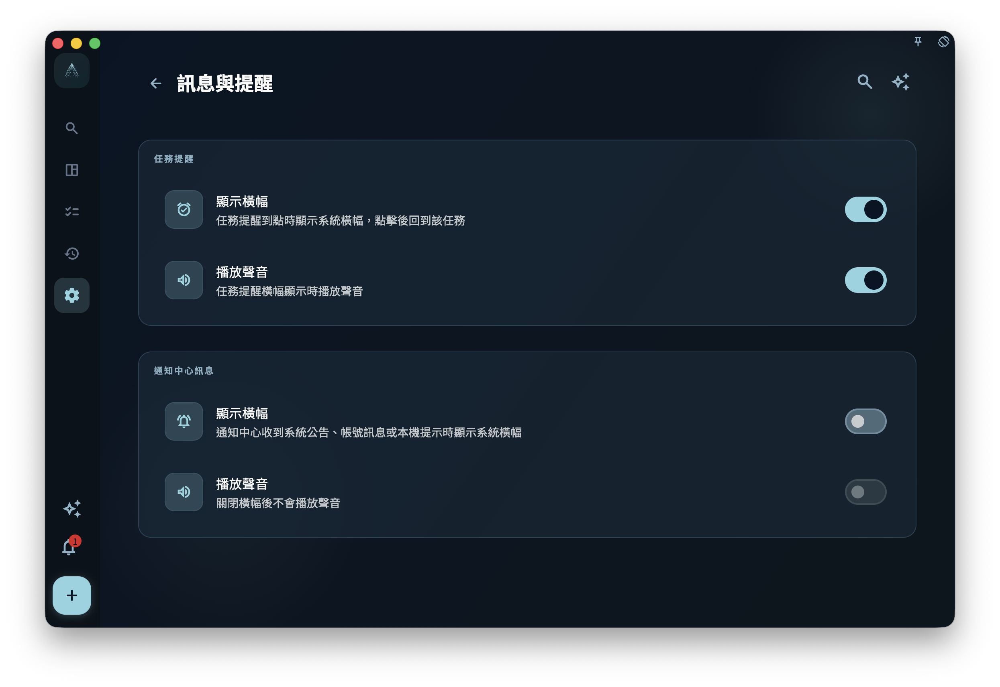

如果你想查看 GranoFlow 發給你的 App 內提醒，請打開通知頁；這裏可以看未讀通知、點進相關位置，也可以把通知標記為已讀。

<!-- manual-screenshot:id=interface-notifications-main -->

## 通知頁能做什麼

你可以在通知頁完成這些操作：

- 查看未讀消息。未讀通知會有未讀標記，方便你先處理還沒看過的內容。
- 點擊一條通知，跳轉到它對應的功能位置。
- 右滑一條通知可以置頂；已置頂通知會帶金色星標，並始終排在普通通知前。對已置頂通知再次右滑可以取消置頂。
- 左滑一條通知可以刪除。刪除前會提示你確認；通知會被直接刪除，不會進入回收站。你也可以在確認框裏勾選「不再提示」。
- 使用「全部標記為已讀」，把當前通知列表裏的未讀狀態改成已讀。

## 注意：通知不等於狀態確認

「全部標記為已讀」只表示你不再把這些通知當作未讀消息。它不會自動解決通知裏提到的問題，也不代表相關狀態已經恢復正常。

如果你正在排查同步、訂閱權益、帳號狀態或任務提醒，請回到對應的功能頁面查看當前狀態。通知頁可以告訴你「有事發生過」，但不能替代功能頁面本身的狀態確認。

## 和系統通知的關係

通知頁顯示的是 **App 內消息**，也就是你打開 GranoFlow 後在 App 裏看到的通知列表。

系統層面的通知橫幅由「設置 > 消息與提醒」控制。任務提醒橫幅默認開啟，聲音可以單獨關閉；通知中心消息默認只留在 App 內，不彈系統橫幅也不播放聲音。你開啟通知中心消息橫幅後，才會在系統層面看到這些 App 內消息的提示；聲音也只有在橫幅開啟後才會生效。

<!-- manual-screenshot:id=message-reminder-settings -->

這個設置頁分成兩組：

- **任務提醒**：控制任務到點提醒是否彈系統橫幅，以及是否播放聲音。
- **通知中心消息**：控制 App 內通知是否也彈系統橫幅，以及是否播放聲音。

聲音開關依賴對應橫幅。比如你關閉任務提醒橫幅後，任務提醒聲音也會變成不可用；你關閉通知中心消息橫幅後，通知中心消息聲音也不會單獨播放。

系統橫幅是否出現還會受到系統通知權限、平台後台限制、網絡狀態和勿擾模式影響。如果任務提醒沒有按時彈出，請同時檢查這台設備的系統通知權限。
