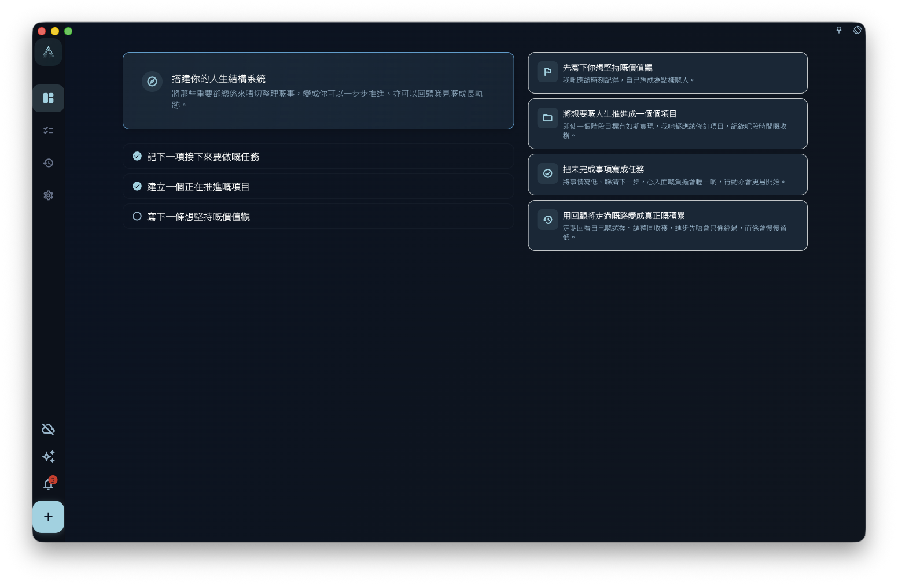

GranoFlow 的主介面圍繞一條使用流程展開：記錄 → 整理 → 推進 → 回顧。

應用啟動後預設進入「進展」頁。你可以在這裏查看目前狀態、近期進展和需要繼續處理的內容。

## 底部（橫屏時為左側）導航

底部導航包含四個主要入口：

<!-- manual-screenshot:id=interface-root-route -->

<!-- manual-screenshot:id=interface-overview-navigation -->

- 進展：查看目前整體狀態和近期動態。
- 任務：查看和推進任務清單。
- 回顧：進入日回顧、週回顧和月曆視圖。
- 設置：管理賬號、同步、數據、AI 輔助、外觀與其他偏好。

底部中間的 `+` 是快速添加入口。點擊後可以寫下一件事，並可進一步設置日期、項目、里程碑和標籤。它不會切換到獨立頁面，而是幫你從目前介面快速收集任務。

## 左上角選單

左上角選單可以打開更多入口：

- 收集箱：臨時存放剛記錄下來的想法和任務，適合先寫下來，稍後再整理。
- 任務清單：集中查看正在推進的任務。
- 已完成：查看已經完成的內容。
- 已歸檔：查看已歸檔的任務或項目內容。
- 垃圾箱：查看被刪除、等待處理的內容。
- 領域管理：管理長期關注的人生領域和價值觀。
- 項目管理：管理項目、里程碑和階段目標。

## 不同屏幕下的佈局

在寬屏或桌面模式下，介面可能顯示為側邊導航和多欄佈局；在窄屏或手機模式下，主要通過底部導航、左上角選單和底部 `+` 按鈕操作。不同平台的視覺細節可能不同，但入口關係保持一致。

## 第一次使用

如果你是第一次使用，可以先點擊底部中間的 `+`，寫下目前最明確的一件事。之後再決定它只是一個普通任務，還是需要放入某個項目、里程碑或長期領域。
