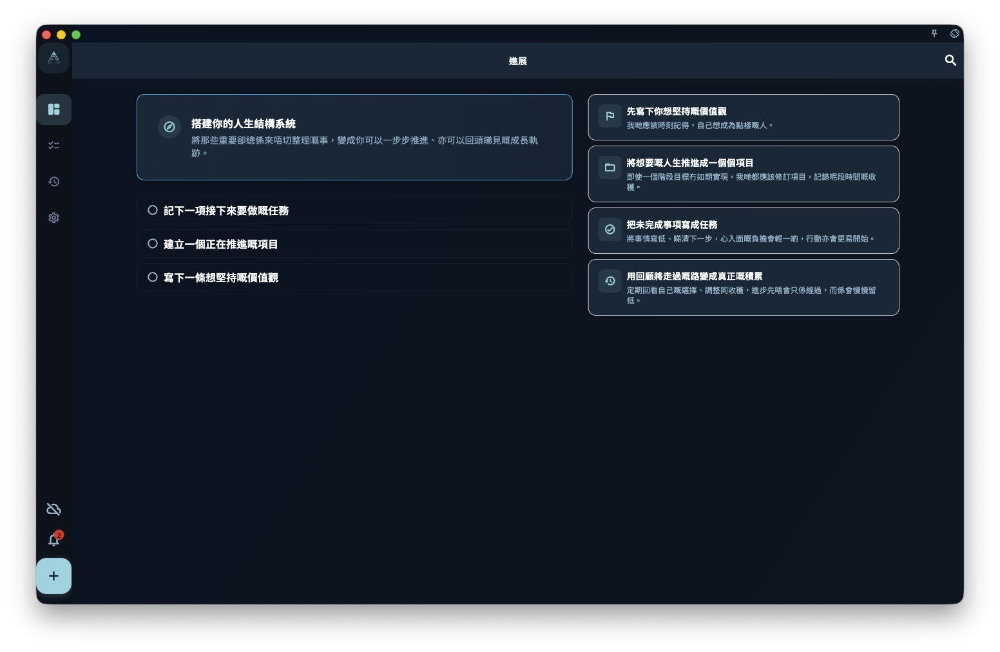

當你第一次打開 GranoFlow，或者本地數據尚未形成任務、項目和價值觀內容時，「進展」頁會先顯示第一次使用引導。

這個狀態不是錯誤，亦不是統計頁載入失敗。它是在告訴你：GranoFlow 還未有足夠內容建立你的個人進展看板，所以先給你一條最短路徑，將重要的事寫下來，再慢慢變成可以回顧的結構。

<!-- manual-screenshot:id=interface-progress-onboarding-cold-start -->

## 你會看到甚麼

橫屏或桌面窗口夠寬時，頁面左側會顯示標題「搭建你的人生結構系統」和三個起步動作：

1. 記下一項接下來要做的任務。
2. 建立一個正在推進的項目。
3. 寫下一條想堅持的價值觀。

右側會顯示四條方法文案，解釋 GranoFlow 希望你怎樣開始：

- 先寫下你想堅持的價值觀。
- 把想要的人生推進成一個個項目。
- 把未完成事項寫成任務。
- 用回顧把走過的路變成真正的積累。

在較窄的窗口或竪屏設備上，這些內容會改成單欄排列，但含義不變。

## 甚麼時候會消失

當你完成起步動作，或應用檢測到已經有任務、項目、註冊賬號、導入歷史或有效同步歷史時，GranoFlow 會旁路這個第一次使用引導。

之後再次進入「進展」頁，你會看到有數據支撐的狀態：目前需要處理甚麼、今天如何繼續、近期項目、價值觀、每週／每月進展和回顧入口。

## 和普通進展頁的分別

第一次使用引導只負責幫你開始。它不會提前顯示工作隊列、今日進展或簡短反饋，因為這些卡片需要真實任務和項目數據才有意義。

如果你已經導入備份或同步過數據，卻仍然看到這個狀態，通常表示本地數據還未完成恢復、導入或刷新。等數據完成載入後，再回到「進展」頁檢查一次。

## 相關頁面

- [進展](/manual/zh-hk/interface/home-progress/)
- [任務系統總覽](/manual/zh-hk/tasks/overview/)
- [項目與里程碑總覽](/manual/zh-hk/projects/overview/)
- [回顧系統總覽](/manual/zh-hk/review/overview/)
