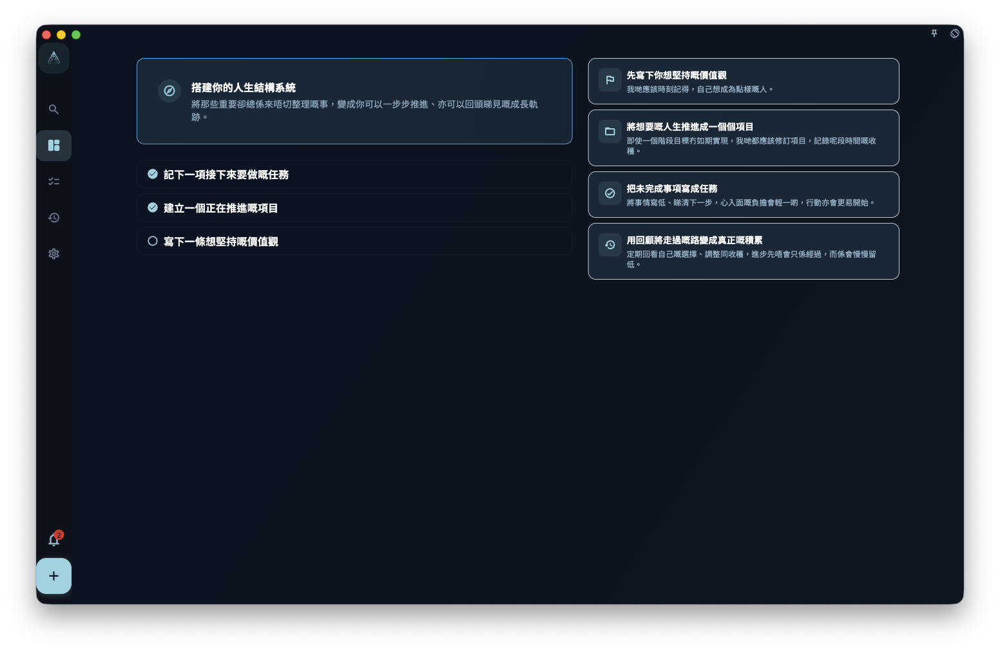

如果你剛打開 GranoFlow，進展頁沒有統計數據，只見到新手引導，這是正常的：你還未加入任務、項目或價值觀，GranoFlow 暫時沒有內容可以建立你的個人看板。

這不是 bug，也不是頁面載入失敗。這個引導是在幫你完成第一步：先寫低一件你現在最清楚的事。

<!-- manual-screenshot:id=interface-progress-onboarding-cold-start -->

## 你會見到甚麼

在寬屏或桌面模式下，進展頁通常會分成兩欄：

- **左側**：三個起步動作
  1. 記下一項接下來要做的任務
  2. 建立一個正在推進的項目
  3. 寫下一條想堅持的價值觀
- **右側**：幾句說明 GranoFlow 的使用方式和思路

如果截圖沒有載入，也可以按上面的文字理解：這頁不是結果頁，而是起步頁。它是在問你想先由任務、項目，還是價值觀開始。

## 應該由哪裏開始

三個起步動作沒有固定次序。揀你現在最容易寫出來的一個就可以：

- 如果你腦中有一件接下來要做的事，先寫任務。
- 如果你已經在推進一件較大的事，先建立項目。
- 如果你想整理長期方向，先寫一條價值觀。

:::tip[不用追求完整]
先寫低一件事就夠了。你不需要第一天就填滿所有任務、項目和價值觀；結構會隨着你繼續使用慢慢長出來。
:::

## 引導甚麼時候消失

一旦你寫了任務、建立了項目，或寫了價值觀，進展頁就會切換到正常的個人看板模式。之後這段新手引導不再顯示。
