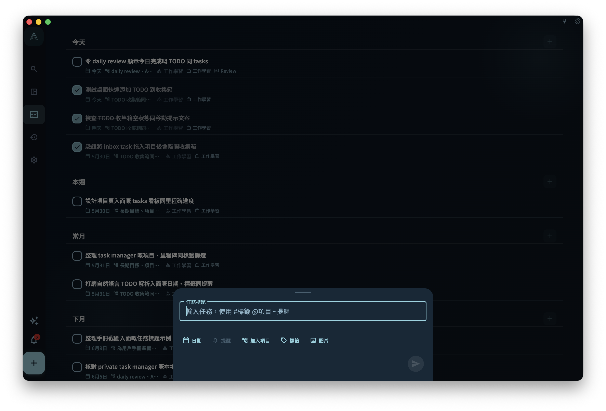

快速添加就是用來即刻記低一件事：點擊底部或側邊的 `+`，輸入任務標題，再提交即可保存。只寫標題也可以；如果沒有設置日期，這項任務會先進入收集箱，之後再整理。項目或里程碑只決定歸屬，不會單獨把沒有日期的任務移出收集箱。

## 直接寫標題

你可以把輸入框當成便條，直接寫一行普通文字。例如：

```text
整理週報
給 Alex 回電郵
檢查發布截圖
```

寫完後點擊提交按鈕。GranoFlow 會把這一行保存為任務標題。

## 在標題裏加欄位

桌面端輸入框會提示 `#標籤 @項目 ~提醒`。這些符號只是快捷入口，不是必填項。

<!-- manual-screenshot:id=interface-quick-add-main -->


- 輸入 `#`，可以搜尋標籤。
- 輸入 `@`，可以搜尋項目或里程碑。
- 輸入 `~`，可以填寫提醒時間。

例如：

```text
檢查訂閱頁文案 @官網改版 #發布 ~明天 8點
```

只有在你選擇候選項，或用 `Enter` / `Tab` 確認後，快捷內容才會寫入任務欄位。未確認的 `#發布` 或 `@官網改版` 會留在標題裏，按普通文字保存。

## 日期和提醒

你也可以直接在標題裏寫日期詞。例如：

```text
週五前檢查發布截圖
```

日期詞會先被高亮，或顯示成待確認的日期提示。點擊日期提示，或在日期詞後輸入空格完成確認後，它才會成為任務日期。沒有確認的日期詞會繼續留在標題裏。

提醒用 `~` 開始。例如：

```text
明天整理截圖 ~8點
給 Alex 回電郵 ~8am
```

提醒是通知時間，不等同於任務日期。如果目前任務還沒有日期，GranoFlow 會根據提醒時間補一個合適的任務日期；你亦可以用輸入框下方的日期按鈕手動選擇。

## 用下方按鈕選擇

如果不想記快捷符號，可以直接用輸入框下方的按鈕：

- 日期
- 提醒
- 加入項目
- 標籤
- 圖片

這些按鈕和 `#`、`@`、`~` 寫入的是同一組任務欄位。已選擇的欄位會顯示成小標籤；你可以再次點擊修改，亦可以移除它。  
圖片按鈕每次最多可加入 5 張，加入後會顯示 `圖片 N/5`。提交任務後，圖片會跟住這項任務上傳；如果因網絡或權限導致部分圖片上傳失敗，任務仍然會保存，介面會提示你「任務已建立，圖片沒有全部上傳」。

## 建議和糾錯

輸入時，GranoFlow 可能會顯示相似任務建議。點擊建議後，GranoFlow 會套用那項任務的標題，以及它最近一次保存的標籤、項目或里程碑，並直接建立一項新任務。

如果系統發現明顯拼寫問題，第一次提交可能會先顯示修正後的文字，而不是立刻保存。檢查修正後的標題後，再次提交即可保存。

## 流動端和桌面端

流動端的輸入提示較短，通常只提示你輸入新任務。桌面端會顯示 `#標籤 @項目 ~提醒`，方便用鍵盤快速補欄位。

不論在哪個端，快捷符號都只是加速方式。你亦可以完全不用它們，只透過下方按鈕設置日期、提醒、項目、里程碑和標籤。
