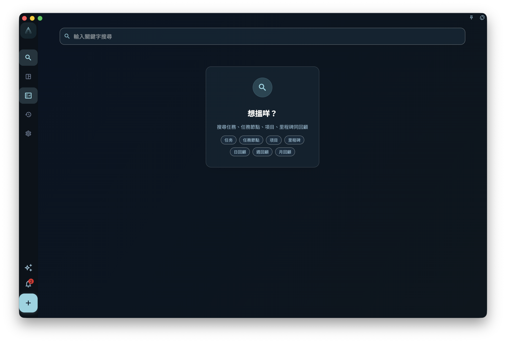

如果你記得任務、任務節點、項目、里程碑、日回顧、週回顧或月回顧內容入面一兩個字詞，但忘記它在哪裏，就用搜尋把它找出來並打開。搜尋的作用是「找已有內容」，不是做完整檢查，也不會替你整理任務或項目。

## 從哪裏進入

從首頁或主界面的搜尋入口進入搜尋頁。打開後，在輸入框輸入比較明確的關鍵字，例如任務標題、任務節點標題、項目說明、里程碑摘要或回顧記錄中的幾個連續字詞，然後查看下面出現的結果列表。

你亦可以在搜尋詞入面加入結構化條件：

- 輸入 `#標籤`，只睇有呢個標籤嘅任務。標籤可以寫系統標籤顯示名稱或已有自訂標籤名稱，例如 `#重要`、`#緊急`、`#Work-Learning`、`#家`。
- 輸入 `@項目`，只睇屬於呢個項目嘅任務。項目名可以寫完整名稱，亦可以寫能夠清楚指向單一項目嘅部分名稱。
- 一般關鍵字可以同結構化條件一齊用，例如 `方案 #重要 @產品優化`。

<!-- manual-screenshot:id=interface-search-main -->

如果只輸入一般關鍵字，關鍵字太短時頁面會提示你繼續輸入。`#標籤` 或 `@項目` 呢類結構化條件可以單獨搜尋，不需要先湊夠三個字。

如果沒有結果，只代表目前可搜尋範圍內沒有匹配項。亦可能係標籤名或項目名未對應到已有物件。這不代表 GranoFlow 已經逐項檢查所有附件內容、已刪除內容或未納入搜尋範圍的歷史數據。

## 如何使用結果

搜尋結果按類型分欄顯示，只會顯示有結果的分欄。分欄順序是任務、項目、里程碑、日回顧、週回顧、月回顧。任務節點命中時，不會另外出現「節點」分欄，而是把所屬任務顯示成一條任務結果，並在任務結果下面列出命中的節點。這樣你可以看見命中原因，也可以即刻知道它屬於哪個任務。

任務結果會展示標題、更新時間和命中的文字。多個節點、任務描述或任務回顧同時命中時，會在同一條任務結果下面顯示簡短命中節選。任務標題本身直接命中時，結果只顯示任務標題和基本資料，不會再展開描述、回顧或節點內容。

打開某條任務結果後，GranoFlow 會按這個任務目前所在位置帶你過去。它可能在收集箱、任務列表、已完成、歸檔或回收站入面。項目或里程碑結果會進入對應項目上下文；回顧結果會進入成就與回顧頁，並盡量定位到對應日期或週。

如果結果屬於某個項目，打開後仍然要回到任務或項目頁面繼續判斷：它屬於哪個階段、和哪個里程碑有關、日期是否仍然合適。

## 什麼時候使用

- 你記得任務、任務節點、項目、里程碑、日回顧、週回顧或月回顧文字的一部分，但忘記它放在哪裏。
- 你想快速打開一個已完成或已歸檔的任務。
- 你在整理收集箱、項目或做回顧前，想先找出某個舊任務。

搜尋不會建立新任務，不會建立新標籤或新項目，不會批量修改搜尋結果，也不會儲存成自動篩選視圖。如果你需要長期按標籤、項目、日期或完成狀態查看任務，請繼續使用對應的列表和項目頁面。
