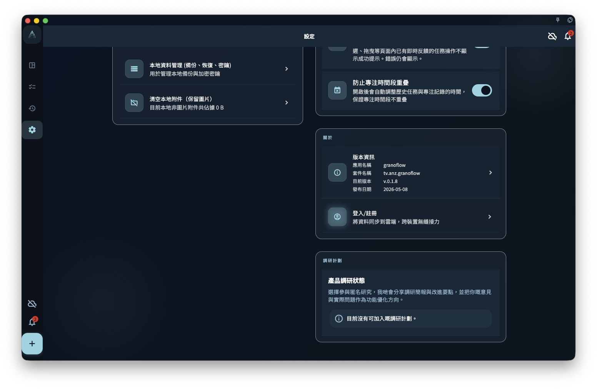

如果你在設置頁見到賬號、同步、數據、訂閱、AI 助手或標籤管理入口，可以把它們當成前往專門設置頁的按鈕：賬號管登入和設備，同步管多設備記錄一致，數據管匯入匯出、備份和恢復，訂閱管 Pro 權益，AI 助手和標籤管理就分別管外部 AI 工具配合方式和任務標籤。

設置相關頁面：

- [設置總覽](/manual/zh-hk/interface/settings-overview/)
- [語言、主題與字體](/manual/zh-hk/interface/settings-language-appearance/)
- [目前設備偏好](/manual/zh-hk/interface/device-preferences/)
- [賬號、同步與數據入口](/manual/zh-hk/interface/settings-account-data-entrypoints/)

這些入口不只是改動目前設置頁上的內容。點進去之後，通常會進入更具體的頁面，而且有各自的規則和限制。

如果某個操作涉及恢復、刪除、同步重置、密鑰、訂閱權益或退出賬號，先讀對應頁面再繼續。截圖只幫你確認入口位置；即使截圖沒有載入，也可以按下面的文字判斷每個入口的用途。

## 賬號入口

賬號入口用來註冊、登入、退出、查看賬號狀態，並把目前設備接入同一個賬號體系。

<!-- manual-screenshot:id=interface-device-preferences-main -->

登入後，你才可以購買或恢復 GranoFlow Pro 權益，啟用需要賬號的雲同步能力，並進入與賬號有關的個人化配置。

如果你想知道賬號到底可以做甚麼，閱讀 [賬號總覽](/manual/zh-hk/account/overview/)。如果你想理解目前設備和其他設備之間的關係，閱讀 [設備管理](/manual/zh-hk/account/device-management/)。

## 同步入口

同步入口用來讓任務、項目、回顧等核心記錄在多台設備之間保持一致。

同步不等於「把本機所有設置都複製到另一台設備」。它主要處理工作記錄的數據流動。語言、主題、字體、應用鎖等目前設備偏好屬於另一個範圍。

如果你想確認哪些內容會同步，或者同步異常時應該先檢查甚麼，閱讀 [多端同步](/manual/zh-hk/data-security-and-recovery/sync/)。

## 數據與恢復入口

數據入口用來匯入、匯出、備份、恢復、查看附件狀態，或清理本地佔用。

這些操作通常比外觀設置和目前設備偏好更敏感。備份是為了在換機、重裝或出現異常時保留重要數據；恢復會把備份或雲端數據帶回目前設備。

數據管理頁以三張平鋪功能卡片呈現日常操作：「本地備份」卡片入面嘅「建立本地備份包」會生成加密嘅 `.flow.grano`，適合整機遷移或恢復；「卡片盒」卡片提供 grano / Anki 匯入，以及跳轉到卡片盒列表嘅「匯出目前卡片盒」；「加密密鑰」卡片管理裝置密鑰。`.deck.grano` 卡片盒包入面嘅卡片正文以明文 JSON 保存，唔會好似本地備份咁用裝置密鑰加密；佢只處理選定卡片盒同其卡片，唔會建立任務本體。破壞性清理入口單獨放喺頁面底部嘅「危險操作」分組。

恢復前，先確認備份來源、賬號狀態、密鑰和版本條件。詳情閱讀 [備份與恢復](/manual/zh-hk/data-security-and-recovery/backup-and-restore/)。

## 訂閱入口

訂閱入口用來查看 GranoFlow Pro 權益、購買狀態、恢復購買說明，以及不同平台購買可能帶來的限制。

Pro 權益可能影響雲同步、附件能力、儲存配額或高級配置的可用範圍。實際價格和是否可以購買，以平台顯示為準。

如果你想理解為甚麼會有訂閱，閱讀 [訂閱總覽](/manual/zh-hk/subscription/overview/)。如果你想看權益邊界，閱讀 [訂閱權益](/manual/zh-hk/subscription/entitlements/)。

## AI 助手與標籤管理

AI 助手入口用來選擇或配置你要配合 GranoFlow 使用的外部 AI 工具，例如把整理好的內容交給 ChatGPT、Codex、Claude、Gemini、DeepSeek 或自訂助手處理。

這個入口不表示 AI 會自動讀取所有本地數據，也不表示 AI 會靜默修改你的記錄。整體邊界閱讀 [AI 輔助](/manual/zh-hk/ai-assistance/overview/)；剪貼板流程閱讀 [AI 助手與剪貼板](/manual/zh-hk/ai-assistance/clipboard-assistant/)。

標籤管理用來建立、重新命名、整理或停用任務標籤。標籤可以幫你按場景、地點、精力或主題橫向整理任務。

標籤會影響任務組織方式，所以不要把它當成單純的外觀設置。閱讀 [標籤](/manual/zh-hk/tasks/tags/) 查看標籤如何幫助整理任務。

## 下一步

- 遇到同步問題，閱讀 [多端同步](/manual/zh-hk/data-security-and-recovery/sync/)。
- 準備備份或恢復，閱讀 [備份與恢復](/manual/zh-hk/data-security-and-recovery/backup-and-restore/)。
- 不確定某個操作是否影響賬號，閱讀 [賬號總覽](/manual/zh-hk/account/overview/)。
