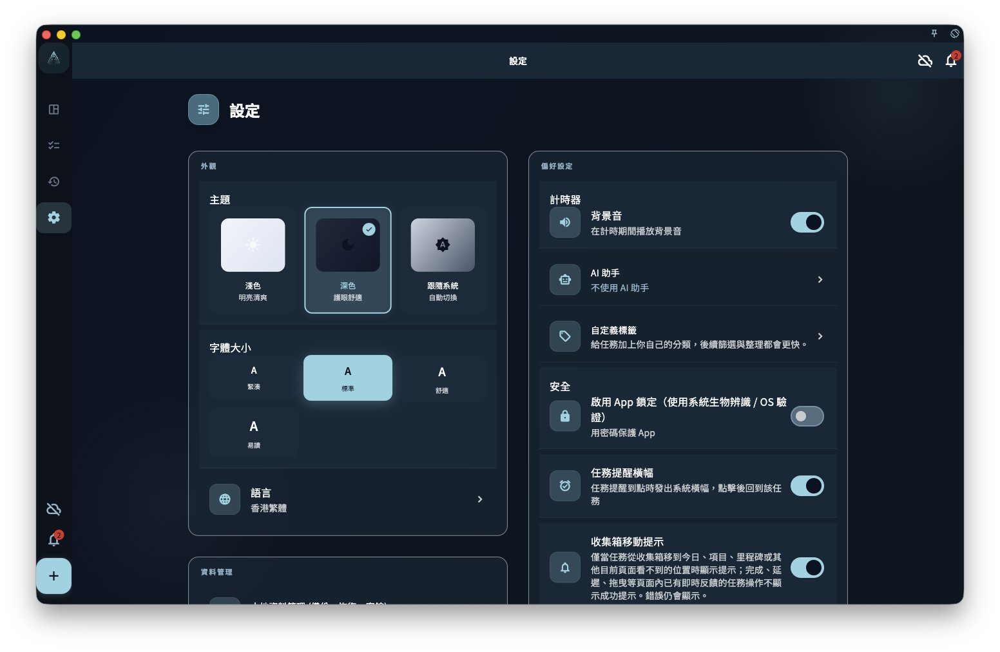

設置相關頁面：

- [設置總覽](/manual/zh-hk/interface/settings-overview/)
- [語言、主題與字體](/manual/zh-hk/interface/settings-language-appearance/)
- [目前設備偏好](/manual/zh-hk/interface/device-preferences/)
- [賬號、同步與數據入口](/manual/zh-hk/interface/settings-account-data-entrypoints/)
- [命令行工具](/manual/zh-hk/interface/settings-overview/#命令行工具)

設置頁是 GranoFlow 的統一入口。它把顯示體驗、目前設備偏好、賬號、同步、數據、訂閱、AI 和關於資訊放在一個地方，但每個入口影響的範圍並不一樣。

這頁先幫助你判斷：某項設置只是改變目前設備的使用體驗，還是會帶你進入賬號、數據或訂閱相關頁面。

## 外觀

外觀通常包含主題、字體大小和語言。

<!-- manual-screenshot:id=interface-settings-overview-main -->

這些設置主要影響你在目前設備上看到的介面。切換語言、改深色模式或調大字體，不會改寫任務、項目、標籤、回顧記錄，也不會改變 [多端同步](/manual/zh-hk/data-security-and-recovery/sync/) 中的數據含義。

如果你只是想調整閱讀和顯示體驗，繼續閱讀 [語言、主題與字體](/manual/zh-hk/interface/settings-language-appearance/)。

## 目前設備

目前設備偏好用於控制這台設備上的操作習慣，例如計時器聲音、應用鎖、任務提醒橫幅、滑動操作通知，以及防止投入時間段重疊。

這些選項更像是「這台設備怎樣提醒我、怎樣保護我、怎樣顯示反饋」。它們不應被理解為賬號級業務數據，也不應被當作跨設備同步承諾。

## 賬號與同步

賬號入口用於登入、退出、查看賬號狀態或進入相關賬號能力。同步入口用於理解目前設備與雲端數據之間的關係。

如果你要處理登入、設備或同步問題，先閱讀 [賬號總覽](/manual/zh-hk/account/overview/) 和 [設備管理](/manual/zh-hk/account/device-management/)。如果你要理解數據如何在多台設備之間流動，閱讀 [多端同步](/manual/zh-hk/data-security-and-recovery/sync/)。

## 創作與回顧

設置頁可能提供 AI 助手、標籤管理、提示詞或回顧相關入口。

這些入口是為了進入具體配置或說明頁面，不代表 AI 會自動修改你的記錄。涉及外部 AI 的流程，應先理解 [AI 輔助](/manual/zh-hk/ai-assistance/overview/) 和 [AI 助手與剪貼板](/manual/zh-hk/ai-assistance/clipboard-assistant/) 的邊界。

## 命令行工具

設置頁提供「命令行工具」入口，用於管理 GranoFlow CLI 的安裝狀態、系統脫敏復用和 Token 驗證。

如果你只是手動使用 `granoflow help`、`granoflow version`、`granoflow status --json` 或 `granoflow open <route> --json`，通常不需要額外設置。需要讓外部腳本或 AI 自動化調用 GranoFlow 時，可以在這個頁面開啟 Token 驗證並建立最多 5 個 CLI Token。Token 原文只會在建立或重新生成時顯示一次，關閉彈窗後不會再次顯示。

「使用系統脫敏功能」預設開啟。開啟後，CLI 輸出以及未來匯出給外部工具的數據會復用 GranoFlow 現有脫敏規則；如需修改脫敏詞條，請從頁面裏的「管理脫敏設置」進入現有脫敏設置頁。

CLI 的 `export`、`import` 和 `backup` 命令也需要執行中的桌面 App 承接。匯入、匯出和備份會讀寫本機數據檔案；備份匯入前應先使用 preview 查看摘要，只有明確 confirm 後才會匯入。

## 數據與恢復

數據與恢復入口用於匯入、匯出、備份、恢復、附件或清理相關操作。

這些操作的影響通常比外觀設置更大。繼續前先閱讀對應頁面，尤其是 [備份與恢復](/manual/zh-hk/data-security-and-recovery/backup-and-restore/) 和 [數據與安全總覽](/manual/zh-hk/data-security-and-recovery/overview/)。

## 關於、訂閱與調研

關於區域通常包含版本資訊、賬號入口和必要的輔助入口。隱藏診斷或測試數據入口不會作為普通用戶預設入口展示。

訂閱入口用於查看權益、購買狀態或恢復購買說明。具體權益和平台規則以 [訂閱總覽](/manual/zh-hk/subscription/overview/) 及實際平台展示為準。

調研計劃屬於低頻入口，用於用戶主動參與反饋或研究，不影響日常任務和數據結構。

## 下一步

- 想調整顯示效果，閱讀 [語言、主題與字體](/manual/zh-hk/interface/settings-language-appearance/)。
- 想理解本機開關，閱讀 [目前設備偏好](/manual/zh-hk/interface/device-preferences/)。
- 想處理賬號、同步或數據入口，閱讀 [賬號、同步與數據入口](/manual/zh-hk/interface/settings-account-data-entrypoints/)。
- 想讓終端、腳本或 AI 自動化調用 GranoFlow，進入設置裏的「命令行工具」。
