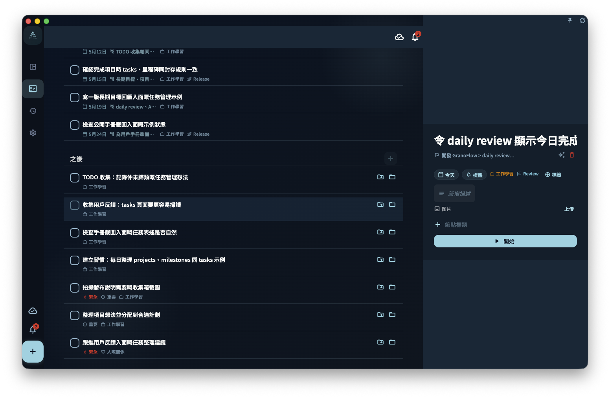

這一章把積極心理學同心流理論，轉成 GranoFlow 入面選擇投入方向、調節任務難度、保留回饋和中斷後回來的方法。它適合想保護心流時間、管理長期目標和減少任務焦慮的人。

知道心流很重要，不等於每天都能進入心流。

真實生活裏，人會拖延、中斷、疲憊，也會被臨時事情打斷。

所以 GranoFlow 不把重點放在「每天都保持完美狀態」上。

它更關心的是：

> 如何讓重要的事更容易開始，如何讓中斷之後更容易回來。

穩定投入不是一直不斷。

穩定投入是停下來以後，還能回到一個清楚的位置。

## 微小行動負責開始

很多長期行動失敗，不是因為目標不重要，而是因為入口太大。

例如：

> 每天運動一小時  
> 寫完一本書  
> 學好英文  
> 整理完整生活結構

這些目標都可能有意義，但它們不適合直接作為今天的入口。

更好的入口是：

> 做 5 分鐘拉伸  
> 寫 100 個字  
> 聽 10 分鐘英文  
> 寫下今天最重要的一件事

微小行動不是目標很小。

它只是把開始變得很容易。

一旦開始，你可以繼續做更多；即使只完成最小動作，也算一次真實行動。

## 任務降低行動阻力

在 GranoFlow 裏，任務是最小行動單位。

一個穩定的任務應該回答：

> 我現在具體做甚麼？

如果任務寫得太大，你會拖延。

如果任務寫得太虛，你會不知道從哪裏開始。

如果任務能在一次專注中推進，心流條件就更容易出現。

<!-- manual-screenshot:id=tasks-breakdown-detail -->

例如：

> 寫完產品手冊

可以先變成：

> 寫完「快速開始」這一節的第一版

> 恢復健康

可以先變成：

> 晚飯後走 10 分鐘

清楚任務會帶來兩個好處：

- 開始前不用反覆思考
- 完成後能馬上獲得反饋

## 項目讓小行動不散掉

微習慣不能孤立存在。

如果每天只做很小的動作，卻不知道它們通向哪裏，人很快會覺得無聊。

所以 GranoFlow 用項目承接長期方向。

例如，「寫 100 個字」本身很小。

但如果它屬於項目：

> 完成第一組文章

它就不只是零散動作，而是在推進一個明確方向。

再往上，它還可以連接到價值觀：

> 我希望自己不是只消費內容，也能持續表達和創造。

這樣，微小行動就和長期意義連起來了。

## 里程碑讓挑戰剛好一點

心流需要適中的挑戰。

任務太簡單，容易無聊。

目標太大，容易焦慮。

里程碑幫你把項目切成階段，讓目前挑戰更接近「需要努力，但不是完全做不到」。

例如：

項目：

> 建立三個月基礎鍛鍊節奏

里程碑：

> 第一周適應  
> 第一個月穩定  
> 第三個月復盤

今天的任務：

> 做 5 分鐘拉伸

你不需要一次面對三個月。

你只需要知道目前階段先做甚麼。

## 回顧讓中斷可以回來

中斷之後，人最容易犯的錯誤是補賬。

三天沒運動，就想一次補三天。

一周沒寫作，就想周末寫完全部。

幾天沒整理任務，就想一次清空所有列表。

這通常會令人更累。

GranoFlow 更建議你問：

> 現在最小的下一步是甚麼？

回顧可以幫你找到這個下一步：

- 我上次停在哪裏？
- 哪個任務阻力太大？
- 哪個項目還值得繼續？
- 哪個動作可以縮小？
- 明天先做哪一步？

回來不需要隆重。

回來只需要一個小動作。

## 從穩定投入到心流

微小行動和心流並不矛盾。

微小行動負責打開入口。

心流可能在行動展開後出現。

例如：

你原本只打算寫 100 個字。

寫着寫着，思路變順，最後寫了 800 個字。

你原本只打算整理一個任務。

整理後發現項目結構清楚了，於是繼續拆完一個里程碑。

你原本只打算運動 5 分鐘。

身體熱起來後，又多走了 20 分鐘。

這就是 GranoFlow 支持心流的現實方式：

它不要求你先有狀態。

它先幫你開始，再讓狀態有機會跟上。

## 一個完整例子

領域：

> 身心健康

價值觀：

> 我希望長期照顧身體，而不是一直透支自己。

項目：

> 建立三個月基礎鍛鍊節奏

里程碑：

> 第一周適應

今天的任務：

> 做 5 分鐘拉伸

回顧：

> 今天只做了 5 分鐘，但沒有中斷。這個動作阻力很低，明天可以繼續。

幾天後，如果狀態更好，任務可以變成：

> 做 15 分鐘低強度訓練

再後來，可能變成：

> 完成一組完整訓練

穩定投入就是這樣發生的。

不是一開始就很強，而是小到能開始、清楚到能推進、中斷後能回來。

## 下一步

理解穩定投入之後，可以繼續閱讀：

- [核心概念：從領域到任務](/zh-hk/positive-psychology-flow/core-concepts/)。
