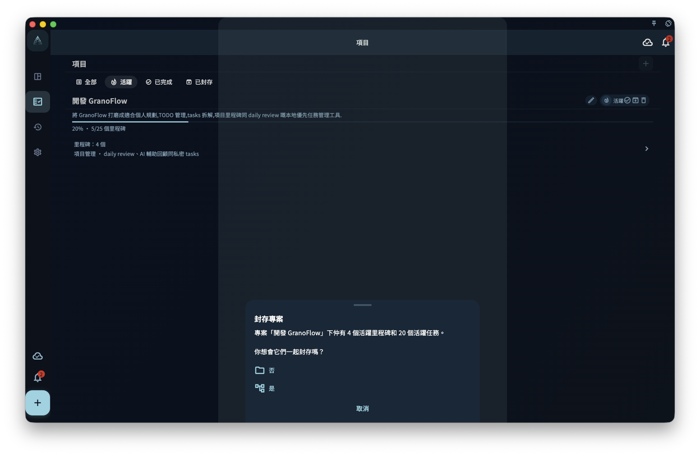

項目做完了，有三種處理方式：完成、歸檔、刪除。

| 操作 | 含義 | 裏面的任務去哪 |
|------|------|--------------|
| **完成** | 標記目標已達成 | 仍然存在，可以查看 |
| **歸檔** | 放進歸檔，不佔當前視圖 | 仍然存在，隨時恢復 |
| **刪除** | 徹底移除項目 | 根據裏面內容決定 |

:::tip[不確定就用歸檔]
歸檔的項目可以隨時恢復，而刪除是不可逆的。
:::
