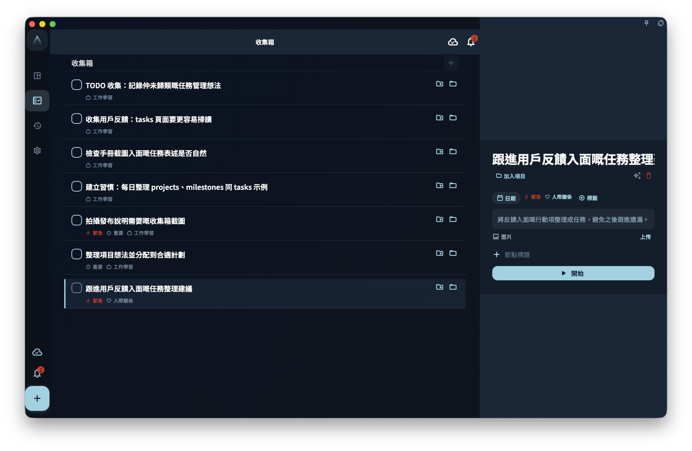

把任務連接到項目之後，它會離開收集箱，並出現在項目入面；如果任務有日期，它仍然可以出現在今日視圖或日曆視圖。項目用來說明這件事屬於哪個項目，里程碑用來說明它屬於項目入面的哪個階段。

## 怎麼連接

你可以用兩種方式把任務連接到項目。

**方法一：在任務詳情裏選擇項目**

打開任務詳情，找到項目欄位，選擇目標項目。需要的話，也可以再選擇這個項目下的某個里程碑。

這是最常用的方式，適合你已經打開任務，想直接幫它分類的時候。

**方法二：在項目頁面拖入任務**

打開項目詳情頁，把現有任務拖到某個里程碑下面。這樣任務就會連接到這個項目，並歸到對應里程碑下。

## 任務連接後出現在哪裏

連接項目之後，同一個任務可能會同時出現在多個地方。它不是被複製了，而是同一個任務在不同視圖裏顯示。

| 視圖 | 說明 |
|------|------|
| 項目頁面 | 出現在對應項目裏；如果選了里程碑，會出現在對應里程碑下 |
| 今日視圖 | 如果任務有今日的日期，仍然出現 |
| 日曆視圖 | 按截止日期顯示 |
| 收集箱 | **不再出現**（掛上項目後會離開收集箱） |

:::note[收集箱的變化]
只有同時滿足「無截止日期」「無項目」「無里程碑」的任務，才會待在收集箱。一旦你把任務掛進項目，它就會自動離開收集箱，這是正常行為。
:::

## 掛到項目和掛到里程碑有甚麼分別

掛到項目，表示這個任務屬於這個項目。

掛到里程碑，表示這個任務不只屬於項目，還屬於項目入面的某個階段。例如一個項目入面有「準備」「執行」「復盤」幾個里程碑，任務可以放到其中一個里程碑下。

如果你還未想好任務屬於哪個階段，只掛到項目也可以。

## 想把一個任務從項目裏移出來

打開任務詳情，把項目欄位清空就可以。

清空後，如果這個任務也沒有截止日期，它會重新出現在收集箱。如果它仍然有截止日期，它仍會按日期出現在今日視圖或日曆視圖。

## 一個任務可以掛多個項目嗎

不可以。每個任務只能屬於一個項目（和一個里程碑）。

如果你發現一個任務好像橫跨兩個項目，通常有兩種處理方式：

1. 選擇它更主要歸屬的那個項目
2. 把它拆成兩個任務，分別掛到各自的項目
