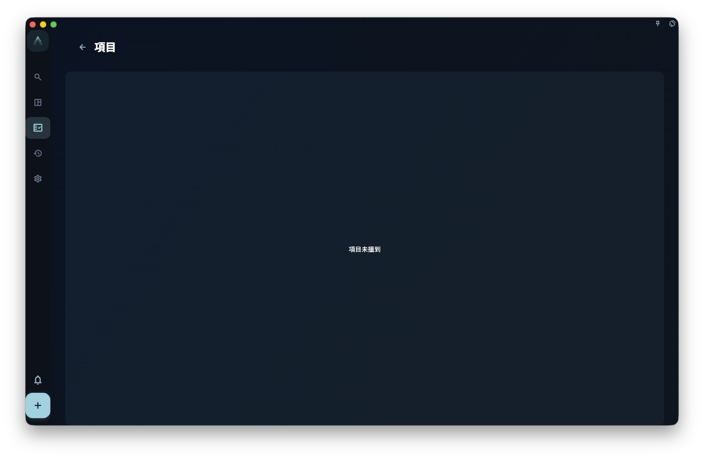

如果你想將一個大型項目分成幾個清楚階段，就可以在項目入面新增里程碑。里程碑會將相關任務歸到同一個階段下面，讓你知道而家做到邊一步、下一步要交付甚麼。

如果一個項目有很多任務，但沒有階段劃分，看起來就會似一長串待辦事項。加上里程碑後，你可以按「初稿完成」「測試通過」「正式上線」這類結果分組，進度會更容易判斷。

## 新增里程碑

在項目詳情頁，點擊「新增里程碑」按鈕，然後輸入里程碑名稱。

名稱建議寫成這個階段要達到的結果，例如「初稿完成」「測試通過」「正式上線」。盡量不要只寫「第一階段」「第二階段」，因為這類名稱看不出這個階段到底要完成甚麼。

## 里程碑的狀態

| 狀態 | 含義 |
| --- | --- |
| 進行中 | 里程碑入面仍有未完成的任務 |
| 已完成 | 里程碑入面的所有任務都完成了 |
| 已歸檔 | 你手動歸檔後，它會從目前視圖收起 |

里程碑完成的條件是：**入面所有任務都標記為完成**。如果你之後又在這個里程碑入面新增一個未完成任務，它會自動回到「進行中」。

## 里程碑的排序

里程碑會按照你在項目詳情頁入面的排列順序顯示。你可以拖曳里程碑來調整次序。

一般建議按時間順序排列：先做的階段放在上面，最後交付的階段放在下面。這樣由上至下看，就是這個項目的執行次序。

## 刪除里程碑時注意

只有空里程碑先會顯示刪除入口。如果入面仍有任務，刪除按鈕唔會顯示；你需要先移動、完成、歸檔或刪除這些任務，再返嚟刪除里程碑。

:::caution[刪除里程碑不會自動刪除任務]
刪除里程碑唔會連帶刪除任務。先處理任務，再刪除空里程碑。
:::
