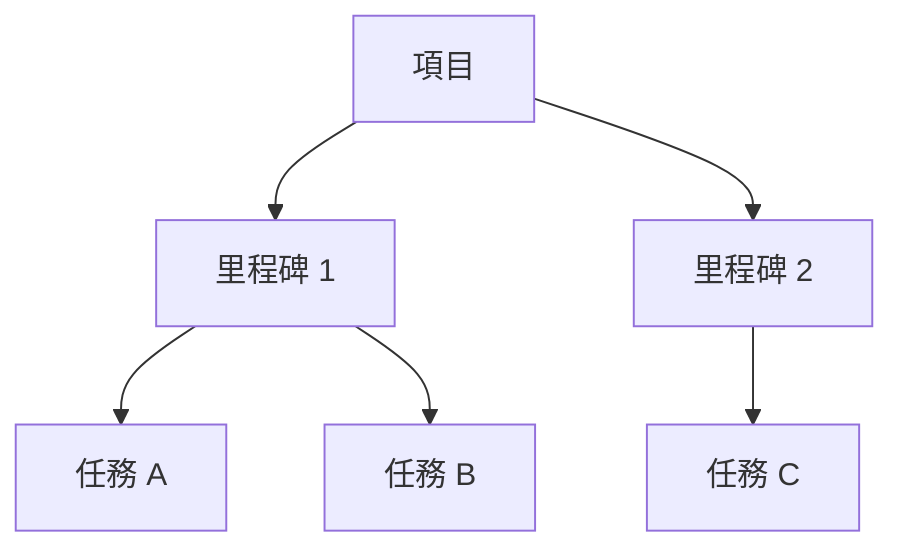

任務是一件具體的事，項目是一個持續的目標。

想象你要搬家：買紙箱、打包廚房、聯絡搬家公司……這些都是任務，而「搬家」這件事本身就是一個項目。

## 項目頁面能看什麼

進入項目詳情後，你能看到里程碑、每個里程碑下的任務，以及整體完成進度。

## 項目三層結構

```mermaid
graph TD
  A[項目] --> B[里程碑 1]
  A --> C[里程碑 2]
  B --> D[任務 A]
  B --> E[任務 B]
  C --> F[任務 C]
```

不複雜的目標可以只用項目 + 任務，不需要里程碑。
