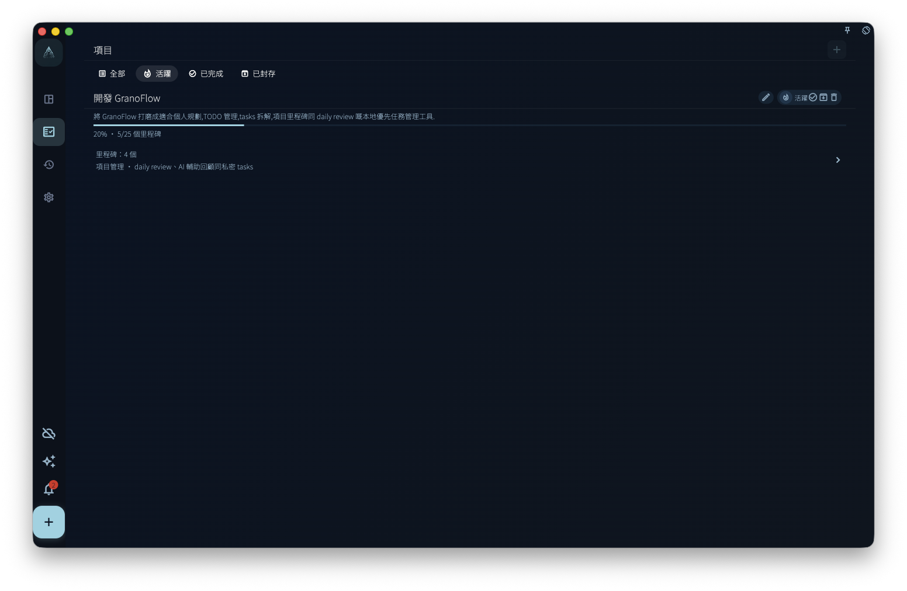
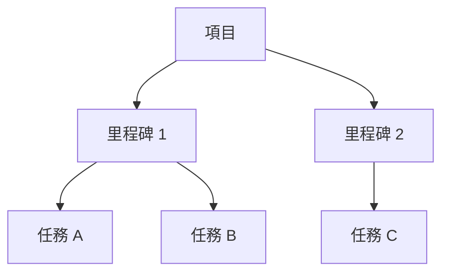

項目用來管理一個會持續一段時間的目標：你可以將相關任務放在同一個項目，用里程碑分階段，再查看整體進度。

任務是一件具體要做的事，項目是一組相關任務背後的目標。例如你要搬屋，買紙箱、執拾廚房、聯絡搬屋公司都是任務；「搬屋」這件事本身就是項目。將這些任務放入同一個項目，你就不用四圍找，也更容易判斷整件事做到哪一步。

## 項目頁面能看甚麼

<!-- manual-screenshot:id=projects-overview-main -->

在項目列表，你可以看到已有項目，以及每個項目目前的進度。即使截圖沒有載入，你也可以將這裡理解成「所有項目的總覽頁」：先找出你要看的項目，再進入詳情。

進入項目詳情後，你可以看到：

- 這個項目裡的所有里程碑，也就是階段目標
- 每個里程碑下面的任務
- 項目整體完成了多少

<!-- manual-screenshot:id=projects-detail-main -->

在寬屏或桌面上，點擊任務後，任務詳情會在右側展開。這樣你可以一邊看項目階段，一邊看某個任務的具體內容，不需要在多個頁面之間來回跳轉。

## 項目能做甚麼、不能做甚麼

項目**能做的**：

- 將相關任務放在一起查看
- 用里程碑將一個大目標拆成幾個階段
- 追蹤項目整體進度

項目**不能取代**：

- 今日安排：哪一天做一件事，仍然要看截止日期
- 標籤篩選：跨項目的橫向分類，仍然要靠標籤
- 每日回顧：每日回顧看的是每天完成了甚麼，不是項目視角

:::tip[甚麼時候應該建立項目]
如果一件事會產生三個以上相關任務，而且會持續超過一星期，就值得建立一個項目。如果只是一兩個任務，直接建立任務就可以，不需要特別建立項目。
:::

## 三層結構快速回顧

項目、里程碑、任務這三層按需要使用。簡單目標可以只用「項目 + 任務」，不一定要建立里程碑。
