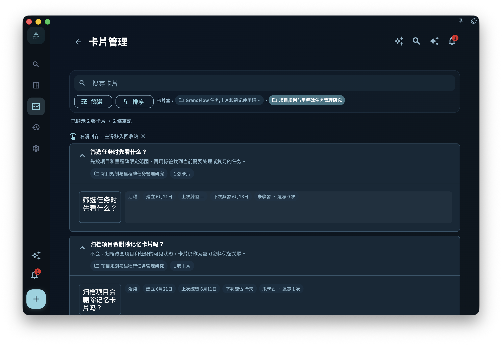

當卡片變多以後，你會自然想整理它們：哪些屬於同一批任務，哪些來自同一個導入包，哪些可以遷移到另一台設備，哪些應該暫時歸檔。

這就是卡片盒存在的原因。卡片盒不是另一個項目系統，也不是完整備份。它更像一個用來管理和遷移卡片範圍的容器。

## 不要把三種文件混在一起

GranoFlow 裏有幾類容易混淆的東西：

- `.flow.grano`：完整本地備份，用來整機遷移或恢復。
- `.deck.grano`：GranoFlow 自有卡片盒包，只處理選定卡片盒和其中卡片。
- Anki/APKG：Anki 的卡片盒格式，和 GranoFlow 的筆記、佈局、任務關聯模型並不相同。

它們看起來都和「導入導出」有關，但解決的問題不同。把 `.deck.grano` 當完整備份，會漏掉任務、項目和回顧。把 Anki 當 GranoFlow 的原生卡片盒，也會誤解字段、媒體、模板和學習記錄的邊界。

## 核心概念：卡片盒處理範圍，不處理整個人生的系統

卡片盒關注的是一組卡片以及它們的卡片盒樹。它可以幫助你遷移某一類知識經驗，比如「論文閱讀方法」「用戶訪談經驗」「產品設計原則」。

但任務本體、項目、里程碑、日回顧、帳號和設備密鑰，不屬於 `.deck.grano` 的職責。它不會創建任務本體，也不能替代完整本地備份。

你可以這樣判斷：

- 想換機或整機恢復，用 `.flow.grano` 本地備份。
- 想遷移或分享某個卡片盒，用 `.deck.grano`。
- 想嘗試把 Anki 卡片帶進來，看 Anki 導入入口和說明，但不要期待無損還原。

## 一個真實任務例子

假設你整理了一組「科研寫作」卡片，裏面有讀論文、寫摘要、準備組會、處理導師反饋的經驗。你想把這組卡片遷移到另一台電腦。

這時不需要導出整個 GranoFlow 備份，也不應該把它理解成 Anki 包。你可以進入卡片盒列表，選擇頂層卡片盒並導出 `.deck.grano`。這個包會包含選定頂層卡片盒、子卡片盒、未刪除卡片和可打包的本地圖片媒體。

需要特別留意：`.deck.grano` 是用來遷移和分享卡片盒的檔案，並非加密備份。它不像 `.flow.grano` 那樣用數據密鑰保護；如果你把卡包發給其他人，對方可能讀取包內的卡片正文和圖片。不要把含有敏感內容的卡包當作保密容器保存或發送。

如果你打開了「包含學習記錄」，學習記錄才會寫入導出包；默認不會包含。導入時也一樣，學習記錄默認不導入，只有你在導入預覽裏明確打開「導入學習記錄」才會合併。

## 從哪裏管理卡片盒

卡片盒級導入、導出與 Anki 導入的主入口在卡片盒列表。

你可以從卡片統計進入卡片盒列表，也可以在卡片管理頁通過卡片盒麵包屑進入。列表頂部提供「導入卡片盒」和一個弱化的「導入 Anki 卡片盒」入口，每個頂層卡片盒行尾有導出按鈕。當前版本裏，Anki 入口只顯示說明和反饋入口，不會讓你選擇 `.apkg` 文件，也不會真正導入 Anki 卡片。

卡片管理頁本身主要用於搜尋、篩選、排序和整理當前範圍的卡片；它不承擔卡片盒級導入導出。這樣分開，是為了避免你在整理單張卡片時誤以為自己正在操作整個卡片盒。

<!-- manual-screenshot:id=review-card-deck-list-main -->

## 只管理某個卡片盒裏的卡片

從某個卡片盒進入「管理卡片」時，GranoFlow 會打開卡片盒範圍內的卡片管理頁。這個頁面仍然提供搜尋、篩選、排序、歸檔和回收站等整理能力，但範圍被限制在當前卡片盒以及它的子卡片盒裏。

這適合做局部整理，例如只檢查「科研寫作」卡片盒裏哪些卡片已經掌握、哪些卡片應該歸檔。它不等同於卡片盒列表，也不提供卡片盒級導入導出；要導出 `.deck.grano`，仍回到卡片盒列表處理。

如果你從普通卡片管理頁進入，看到的是全局範圍；如果從卡片盒行進入，看到的是該卡片盒範圍。排查「為什麼這裏少了幾張卡片」時，先確認自己當前是不是在某個卡片盒範圍內。

<!-- manual-screenshot:id=review-card-deck-scoped-management -->

## 卡片盒列表裏的歸檔與刪除

卡片盒列表會顯示活躍、已歸檔、未學習、學習中、已掌握和已內化等統計。

在卡片盒列表裏：

- 右滑可以歸檔未內化卡片，已內化卡片會保留在主​​動複習裏。
- 左滑只刪除未關聯任務的卡片。
- 卡片盒本身會盡量保留，尤其當裏面還有不能刪除或不應該刪除的卡片時。

這個設計有點保守，但很必要。卡片盒往往包含一整組經驗，誤刪的代價比單張卡更高。已內化卡片尤其值得小心，因為它已經在多個項目中被用過。

## `.deck.grano` 能做什麼

`.deck.grano` 適合在 GranoFlow 之間遷移一個卡片盒。

它會處理：

- 選定頂層卡片盒和子卡片盒
- 未刪除卡片
- 筆記、字段、佈局和可打包的本地圖片媒體
- 可選的學習記錄

它不會處理：

- 任務本體
- 項目和里程碑本體
- 日回顧、周回顧、月回顧正文
- 完整帳號或設備恢復
- 像 `.flow.grano` 一樣的加密備份保護或分享密碼
- 任意 Anki 模板、CSS 或調度歷史的無損還原

導入 `.deck.grano` 前，GranoFlow 會先顯示預覽，再由你確認。導入不會創建任務本體，只會保留這台設備上仍然存在、並且不在回收站裏的任務關聯。缺失任務關聯會在預覽中計數並跳過；沒有有效任務關聯的卡片可能進入已歸檔卡片。

## Anki 入口怎樣理解

Anki/APKG 和 GranoFlow 的卡片格式完全不同。

Anki 更強調卡片模板和字段組合；GranoFlow 還要處理任務關聯、筆記、佈局、媒體邊界、卡片盒來源和複習上下文。所以 Anki 導入不能被理解成「原樣搬進來」。

當前 Anki 入口會顯示說明和限制。確認後，GranoFlow 會打開 `@GranoFlow` 的 X 頁面作為需求反饋入口；它不會進入文件選擇、預檢或導入進度頁。

底層仍保留 Anki/APKG 兼容代碼和防線，但這不代表當前用戶界面已經開放 Anki 導入。即使未來重新開放，也不應期待任意 Anki 模板、CSS、調度歷史和學習記錄都能無損遷移。

更穩妥的方式仍然是：讓 GranoFlow 卡片來自你自己的任務和回顧。Anki 入口可以作為補充，但不應該成為建立經驗系統的主路徑。

## 和完整備份的關係

如果你準備換設備、重裝系統或做大規模刪除，應該先創建完整本地備份 `.flow.grano`。完整備份才是回到某個時間點的主要防線。

數據管理頁裏的「卡片盒」卡片可以處理 `.deck.grano` 導入、Anki 導入說明、導出卡片盒、查看卡片緩存和清空緩存。但這些都不等於完整備份。

一個簡單原則是：

- 擔心整套數據丟失，先備份。
- 只想遷移一組卡片，再導出卡片盒。
- 想導入外部卡片，先讀限制；當前 Anki 入口只收集反饋，`.deck.grano` 才是 GranoFlow 之間遷移卡片盒的主路徑。

## 收束

卡片盒讓卡片系統可以整理、遷移和控制範圍，但它不改變卡片的核心：真正重要的仍然是經驗能不能回到任務裏。導入導出只是搬運方式，卡片是否有價值，最終還要看它是否幫助你在下一次行動中做出更好的判斷。
