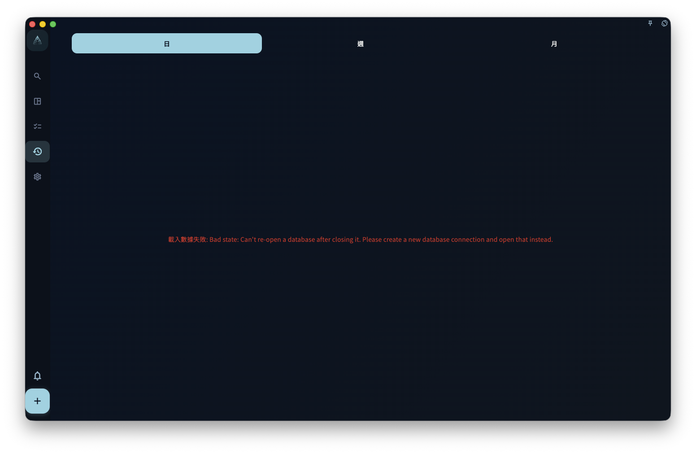

日回顧用來在一天結束時確認自己實際完成了什麼，並寫下幾句記錄。它按任務的**完成時間**統計，不按截止日期；每天從 0 點開始算新的一天。

你可以在日回顧的日期標題旁切換上一天或下一天。豎屏打開詳情時，詳情頁頂部也會顯示當前日期，並繼續使用同一組上一天 / 下一天按鈕；即使某一天沒有完成任務，也可以切過去查看空態。

{/* manual-screenshot:id=review-overview-main */}

## 統計邏輯

日回顧只看任務什麼時候被標記為完成。

這意味着：

- 任務昨天截止，但你今天才完成 → 出現在今天的回顧裏
- 任務昨天 23:58 完成 → 出現在昨天的回顧裏
- 任務今天 1:00 完成 → **出現在今天的回顧裏**

也就是說，日回顧按自然日歸類：0 點以後完成的任務會進入新一天的回顧。

## 怎麼寫日回顧

日回顧沒有固定格式。你可以直接寫下今天值得記住的幾件事，例如：

- 今天完成了什麼，沒完成什麼
- 哪件事做得順，哪件事卡住了
- 明天想先處理什麼
- 今天的狀態怎麼樣

三到五句話通常就夠了。不需要寫成日報，也不需要把每個提示問題都回答一遍。

## 整理今天的任務時間

日回顧右側會顯示「今日投入時間」。這個時間按當天任務時間塊的並集計算：如果兩個任務時間重疊，重疊的部分不會重複相加。

「心流時間」是另一項單獨記錄的時間。它表示你主觀確認的真正專注時間，只能手工輸入，不會從任務開始時間、完成時間或投入時間自動推導。你可以在日回顧裏填寫，也可以從當天已完成任務的詳情裏填寫；同一天的已完成任務看到的是同一個日級心流時間。

<!-- manual-screenshot:id=review-daily-time-overlap-entry -->

時間軸裏的任務塊以任務標題為主。如果任務有關聯項目，而且任務塊空間足夠，標題下方會用小字顯示項目名稱；短任務、重疊後變窄的任務塊，或沒有關聯項目的任務，只顯示任務標題。

如果某個任務的時間不準，先回到這條已完成任務的詳情，點擊「時間記錄」，把開始時間和完成時間改成更接近真實情況的時間段。這樣做會讓日回顧裏的任務時間塊、今日投入時間，以及之後的周回顧、月回顧更接近你真實的一天。完整說明見[完成後先校準時間](../tasks/completion-and-archive#完成後先校準時間)。

如果你想重新梳理當天任務覆盤，可以點「回顧今日任務」，讓 AI 按已記錄的任務時間理解當天脈絡，並整理當天涉及的領域、項目和里程碑推進。任務時間只作為唯讀上下文，真實時間修正需要在任務列表或任務詳情裏手動完成。你把結果複製回 GranoFlow 後，還需要在確認框裏確認，才會寫入任務標題、任務回顧、當天領域日報或可選新任務。完整流程見[回顧今日任務](../ai-assistance/daily-task-review)。

周回顧和月回顧會把每天手工記錄的心流時間累加，用來展示這一周或這一月真正進入專注狀態的總量。

## 沒有完成任務的日期

如果某天沒有完成任何任務，日回顧不會用空圖表或「你今天沒做任何事」之類的話製造壓力。右側仍會保留基礎信息，例如今日投入時間為 0，以及不可回顧時的輕量反饋。

空頁面只是說明：這一天沒有記錄到已完成任務。

:::note[回顧是給你自已看的]
回顧的受眾是未來的你，不是老闆或用戶。怎麼寫讓自己以後看得懂，就怎麼寫。
:::
