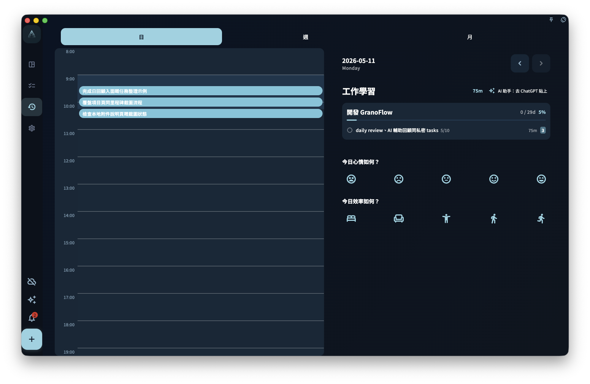

日回顧用來在一日結束時確認自己實際完成了甚麼，並寫低幾句記錄。它按任務的**完成時間**統計，不按截止日期；每日由 0 點開始算新一日。

你可以在日回顧日期標題旁切換上一日或下一日。竪屏打開詳情時，詳情頁頂部亦會顯示當前日期，並保留同一組上一日 / 下一日按鈕；即使某日沒有完成任務，亦可以切過去查看空態。

{/* manual-screenshot:id=review-overview-main */}

## 統計邏輯

日回顧只看任務甚麼時候被標記為完成。

這代表：

- 任務昨天截止，但你今天才完成 → 會出現在今天的回顧
- 任務昨天 23:58 完成 → 會出現在昨天的回顧
- 任務今天 1:00 完成 → **會出現在今天的回顧**

也就是說，日回顧按自然日歸類：0 點之後完成的任務會進入新一日的回顧。

## 點樣寫日回顧

日回顧沒有固定格式。你可以直接寫低今天值得記住的幾件事，例如：

- 今天完成了甚麼，未完成甚麼
- 哪件事做得順，哪件事卡住了
- 明天想先處理甚麼
- 今天的狀態怎樣

三至五句通常已經足夠。不需要寫成工作日報，也不需要把每個提示問題都答一遍。

## 整理今日任務時間

日回顧右側會顯示「今日投入時間」。這個時間按當日任務時間段的聯集計算：如果兩個任務時間重疊，重疊的部分不會重複相加。

時間軸入面的任務塊以任務標題為主。如果任務有關聯項目，而且任務塊空間足夠，標題下方會用細字顯示項目名稱；短任務、重疊後變窄的任務塊，或沒有關聯項目的任務，只會顯示任務標題。

如果你想重新梳理當日任務時間，可以點「回顧今日任務」，讓 AI 幫你按任務順序檢查每個任務用了多久，並整理當日涉及的領域、項目和里程碑推進。AI 只會產生建議；你把結果複製回 GranoFlow 後，仍需要在確認框確認，才會寫入任務開始時間、結束時間、標題、任務回顧或當日領域日報。完整流程見[回顧今日任務](../ai-assistance/daily-task-review)。

## 沒有完成任務的日期

如果某天沒有完成任何任務，日回顧會顯示空態。它不會用空圖表，或者「你今天甚麼都沒有做」之類的字句製造壓力。

空頁面只是代表：這一天沒有記錄到已完成任務。

:::note[回顧是給你自己看的]
回顧的讀者是未來的你，不是老闆或其他用戶。怎樣寫令自己之後看得明白，就怎樣寫。
:::
