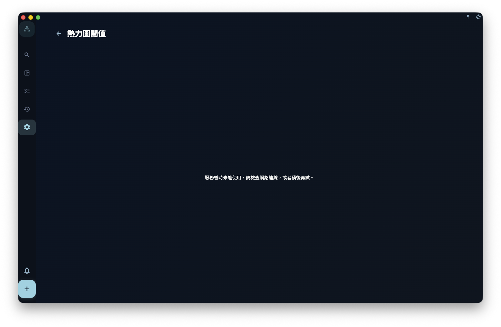
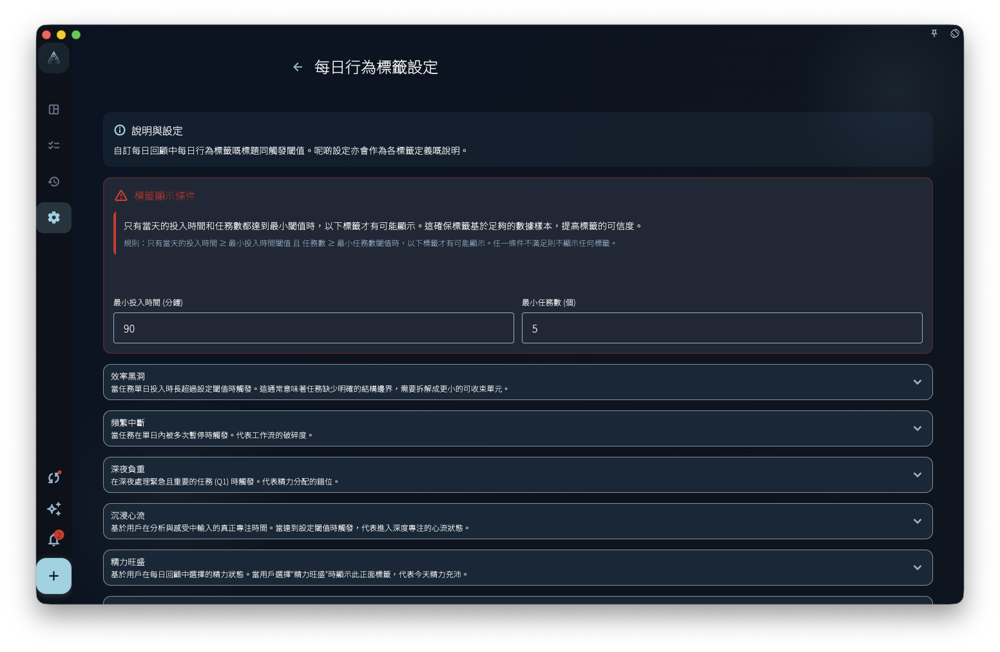

如果你想知道自己的投入時間有沒有規律，可以先看診斷和熱力圖：它們會把你的記錄整理成狀態文字、顏色分層和異常提示，方便你回顧，但不會代你下結論。

## 投入時間階段

GranoFlow 會根據當天記錄的專注時間，顯示不同的階段文字，例如「剛剛開始」「保持節奏」「深度投入」。這些文字的作用，是幫你快速看懂當天大概處於哪個投入階段。

你可以在設定入面調整每個階段的時間點和提示文字。例如你覺得 2 小時才算進入穩定狀態，就可以把對應階段的時間改成 2 小時。這樣改的是回顧展示規則，不會改動你的歷史記錄，也不會判斷你「夠不夠努力」。

## 熱力圖閾值

熱力圖用顏色深淺表示每天的投入時間。顏色越深，通常表示當天記錄的投入時間越多；顏色越淺，表示投入時間較少或沒有記錄。

你可以調整熱力圖的顏色閾值。例如你認為每天 2 小時是「正常活躍」，就可以把這個時間點設成中間色。閾值只會改變顏色如何分層，不會修改已經記錄的時間資料。

## 異常檢測

GranoFlow 可以在回顧資料入面提示一些異常信號，例如某類任務連續多天沒有出現，或者投入時間突然明顯偏離平時。

異常提示不是結論，也不代表「你出問題了」。它只是提醒你回頭看一看：是不是工作節奏變了？是不是某類事情暫時停下來？還是有其他原因需要你自己解釋？

:::note[這些都是參考，不是結論]
診斷和熱力圖只會根據你的記錄生成提示，最終的解釋和判斷永遠是你自己的。它們不是醫療、心理、績效或財務評估。
:::
