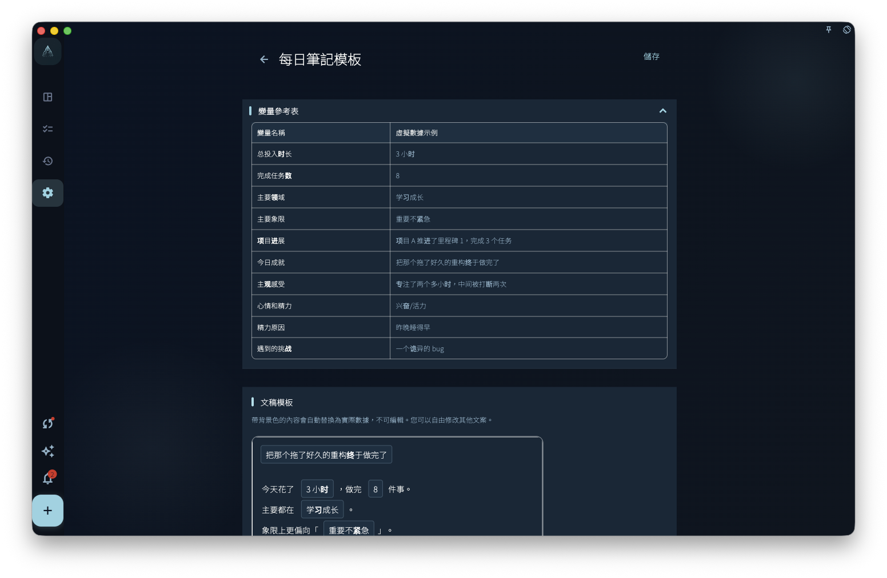
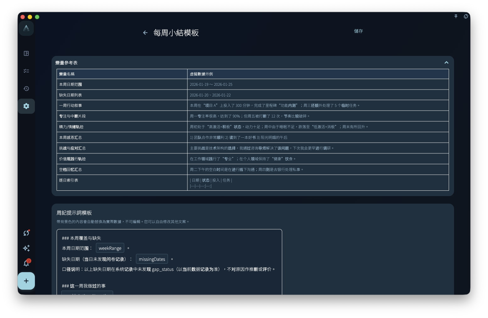

如果你想每日或每週回顧都有固定格式，就可以用記錄模板。模板會先準備好草稿結構，例如日期、完成事項、感受和下一步；你要做的是檢查內容，再補上自己的想法。

## 它會做甚麼

當你打開今日回顧，或打開本週小結時，GranoFlow 會按對應模板生成一份草稿。

這份草稿不是空白頁。它會先放入模板裏的標題、段落和變量。你可以把它當成一張表格：框架已經在，實際內容仍然需要你自己填寫或調整。

## 兩種模板

- **每日筆記模板**：用於每天的日記草稿。
- **每週小結模板**：用於每週的周記草稿。

這兩個模板互不影響。你可以把每日模板寫得仔細一點，把每週模板寫得更像總結；也可以分開編輯，或分開恢復預設。

## 變量是甚麼

變量是模板裏的佔位符。生成草稿時，GranoFlow 會把它們替換成實際數據。

常見變量包括：

- 今日日期
- 當日完成的任務列表
- 本週回顧摘要
- 投入時間統計

例如模板裏放了「今日完成的任務」，打開回顧時，這一段會盡量帶出當日已完成的任務。這樣你不用由零開始，只需要確認哪些內容要保留，再補充感受和下一步。

## 模板不會替你寫內容

模板只負責草稿結構，不會自動分析你的記錄，也不會自動替你生成總結。

如果你想用 AI 幫你整理內容，需要使用 AI 輔助功能。記錄模板和 AI 輔助是兩件不同的事。

:::tip[會員功能]
記錄模板是會員專屬功能。非會員可以查看，但無法自訂編輯。
:::
