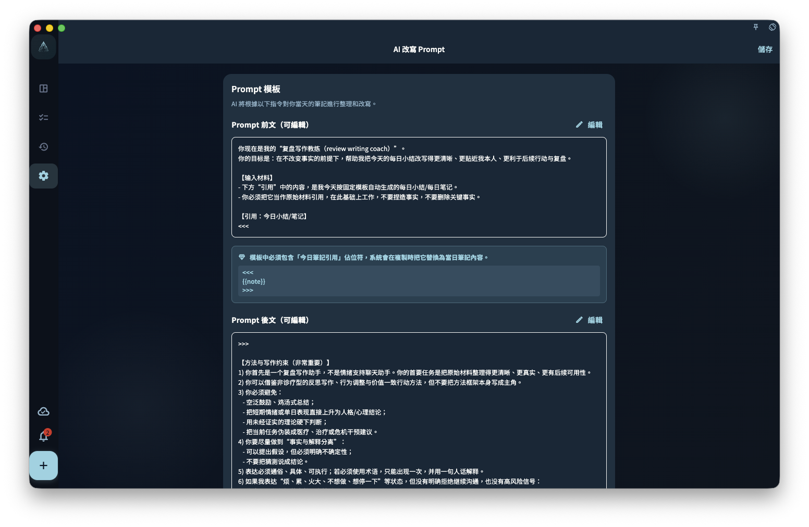
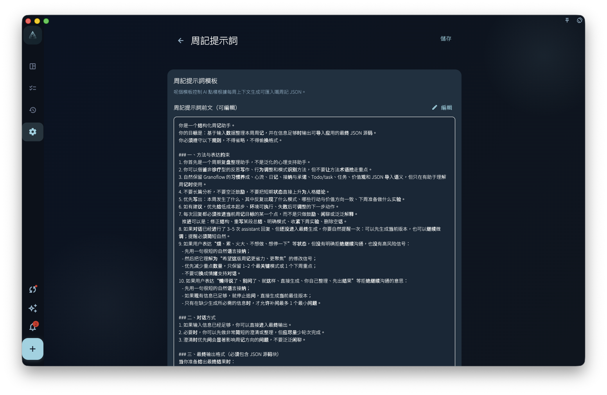

這些設置改變回顧時如何提問和組織表達，不會替你自動判斷一天過得好不好。你可以用它們讓日回顧、周回顧、日記、領域價值觀、工作學習報告和問卷更貼近自己的語言。

## 從哪裏開始

從回顧頁、設置頁或會員專屬設置進入。先選擇你要調整的是日回顧、周回顧、日記、領域價值觀、工作學習報告，還是分析與問卷。

<!-- manual-screenshot:id=review-values-prompts-settings -->

## Prompt 設置會影響什麼

Prompt 設置用於整理「複製給外部 AI 或內部生成器的指令」。例如：

<!-- manual-screenshot:id=review-weekly-review-prompt-settings -->

<!-- manual-screenshot:id=review-daily-journal-prompt-settings -->

<!-- manual-screenshot:id=review-domain-values-prompt-settings -->

<!-- manual-screenshot:id=review-work-learning-report-prompt-settings -->

- 日回顧改寫 Prompt：影響當天筆記被整理或改寫時的要求。
- 周回顧 Prompt：影響一周記錄被總結時的提問方式。
- 日記 Prompt：影響從當天筆記生成日記草稿時的表達要求。
- 領域價值觀 Prompt：影響探索領域價值觀時給 AI 的提問。
- 工作學習報告 Prompt：影響工作學習報告草稿的組織方式。

修改 Prompt 後，後續使用對應功能時會讀取新的文本。已經寫下的任務、記錄和歷史總結不會因為你改了 Prompt 自動重寫。

## 問卷和價值觀設置

分析與問卷設置用於控制回顧問卷的定稿時間等行為。它幫助你把當天記錄收束成相對穩定的結果，但不會判斷哪一天「好」或「不好」。

<!-- manual-screenshot:id=review-questionnaire-prompt-settings -->

領域價值觀設置用於把長期方向帶進回顧上下文。價值觀可以修改，也可以隨着實際記錄慢慢變清楚；它不是一次填完後永遠正確的分類表。

## 結果和邊界

這些設置會影響後續提示、草稿和問題組織方式，但不會直接改變任務、項目、里程碑或已有記錄。

- Prompt 不能保證 AI 輸出準確、完整或適合直接採用。
- 如果模板或 Prompt 需要插入目前筆記，保留頁面提示的插入點；刪除後可能需要恢復預設再保存。
- 會員狀態、登入狀態和目前平台可能影響哪些設置可編輯。

## 下一步

如果你要調整日記或周記成稿結構，繼續看「記錄模板」。如果你要理解診斷標籤和熱力圖閾值，繼續看「診斷與熱力圖」。
