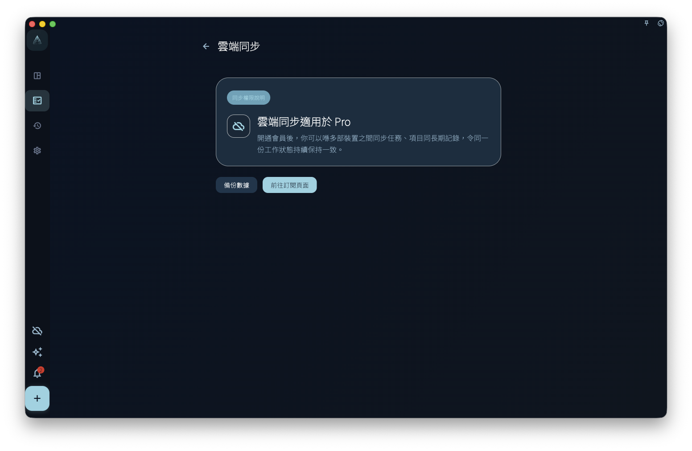

訂閱權益最容易被誤解的地方，是把「能用什麼功能」和「能改哪些設定」混在一起。

在 GranoFlow 裡，會員權益裡最確定、最核心的能力是 **雲端同步**：當你的帳號擁有有效 Pro 權益時，GranoFlow 才會允許你把本地數據同步到雲端，並在多台裝置之間接續使用。至於「Pro 設定」裡的很多選項，它們不是一份永久固定的特權清單，而是產品前期為了處理不確定性，暫時開放給 Pro 用戶調整的高級參數。

換句話說，Pro 設定不是一個必須每天研究的控制台。它更像一個緩衝區：如果你對 GranoFlow 目前的預設設定不滿意，可以在這裡改成更適合自己的版本；如果預設設定已經夠用，就完全可以先不動。為了讓這些調整能跟隨帳號和本地備份一起保留，目前已經納入白名單的 Pro 設定會以明文參與雲端同步和本地備份。

<!-- manual-screenshot:id=subscription-vip-settings -->

## 為什麼有 Pro 設定

一個產品剛開始面對真實用戶時，有些預設值很難一次定準。

例如，熱力圖裡的投入時間閾值應該多高才合理？診斷狀態應該在什麼時候提示你進入疲勞、停滯或異常狀態？桌面端置頂視窗透明到什麼程度才既不遮擋，又還能看清？這些問題沒有一個適合所有人的答案。

如果 GranoFlow 直接把這些參數寫死，習慣不同的用戶會很難用。如果把所有參數都開放給所有人，又會讓剛開始使用的人被設定淹沒。所以目前的處理方式是：核心功能保持簡單，雲端同步作為明確的 Pro 權益；一部分還在驗證中的高級預設值，先放進 Pro 設定，並把其中的帳號級 Pro 設定白名單帶入同步和備份。

## 一個真實場景

假設你每天會在 GranoFlow 裡記錄任務、日回顧和專注時間。用了一段時間後，你發現熱力圖顏色總是太快變深，好像系統把普通工作日也判斷得很重；或者你覺得診斷提示出現得太早，不符合自己的節奏。

這時，你不用把這理解成「必須升級才能正常使用」。普通用戶仍然可以使用核心任務、項目、回顧和本地數據能力。Pro 用戶只是多了一個調整入口：你可以進入 Pro 設定，改熱力圖閾值、診斷階段、診斷異常觸發條件或 AI 研究偏好，讓目前版本更貼近自己的工作方式。

但這裡還有一個很重要的邊界：這些進入白名單的 Pro 設定會以明文同步到伺服器，也會以明文寫入本地備份。它們不是私密筆記、任務正文或加密內容，而是你選擇過的參數值。我們會把這些設定經驗作為後續開發參考，觀察真實用戶更常採用哪些配置。

## 哪些是穩定權益，哪些是高級設定

你可以先用這個判斷方式區分：

| 類型     | 代表內容                                              | 應該如何理解                                                          |
| -------- | ----------------------------------------------------- | --------------------------------------------------------------------- |
| 穩定權益 | 雲端同步、多裝置接續、同步相關能力                    | 這是 Pro 最核心、最確定的解鎖能力                                     |
| 高級設定 | 熱力圖閾值、診斷階段、診斷異常觸發條件、AI 研究偏好等 | 這是給予 Pro 用戶調整預設值的空間，不等於永久承諾每一項都會一直可編輯 |

如果某個預設值經過足夠多真實使用後已經穩定下來，而且普通用戶普遍也能接受，我們可能會把它定稿為新的預設設定。到那時，對應選項可能會從 Pro 設定中移除，不再作為一個可編輯項存在。

這不是收回已經穩定的核心權益，而是把「還在試驗的參數」收斂成「產品預設行為」。

## 非會員狀態下會怎樣

非會員通常也能看到部分 Pro 設定入口。看到入口，不代表目前帳號已經擁有修改權限。

你可能會遇到幾種情況：

- 雲端同步入口提示需要 Pro。
- 某些高級設定可以查看，但不能儲存修改。
- 點擊某個設定後，App 引導你查看訂閱或升級說明。

這樣做是為了讓你知道功能在哪裡，以及訂閱後可能獲得哪些調整空間。它不表示普通用戶的數據會被限制，也不表示本地功能會因為沒有訂閱而停止。

## 修改 Pro 設定前，先想清楚一件事

如果你只是剛開始使用 GranoFlow，不建議一上來就把 Pro 設定全部修改一遍。先使用預設值一段時間，等你真的遇到某個不適合自己的地方，再回到這裡調整。

如果你已經很明確地知道自己想改什麼，可以按下面順序判斷：

1. 這個設定是否影響雲端同步、附件或多裝置使用？
2. 這個設定是否只是改變顯示、閾值、提示語或 AI 輔助偏好？
3. 你是否接受這個參數會以明文同步到伺服器，並以明文進入本地備份，作為後續產品預設值調整的參考？

如果第 3 點不能接受，就不要修改這一項。保持預設值即可。

## 同步權益的特殊說明

雲端同步是 Pro 的核心權益。如果目前帳號沒有可用權益，同步入口會提示你查看或開通會員。

<!-- manual-screenshot:id=subscription-sync-vip-upsell -->

看到同步權益說明頁，**不代表同步已經開始，也不代表你的本地數據已經遺失**。本地數據獨立於同步權益存在。只有當你登入帳號、滿足權益條件，並主動完成同步相關流程後，數據才會進入雲端同步鏈路。

這裡也要區分兩類數據：任務、項目、里程碑、卡片筆記等用戶內容會按 GranoFlow 的加密邊界處理；Pro 設定白名單本身是明文設定值，會隨同步和本地備份保留。普通裝置偏好，例如語言、主題、視窗狀態、目前選中的 AI 助手等，不會因為 Pro 設定同步而變成帳號級同步內容。

:::note[權益以伺服器為準]
App 本地顯示的權益狀態，來自伺服器回傳的帳號資訊。網絡不順時可能暫時顯示不正確，稍後重新整理即可。
:::

理解了權益和高級設定的區別之後，下一步可以繼續閱讀平台購買與恢復購買：它解釋為什麼同一個 Pro 權益，在不同商店平台和不同登入帳號之間可能會出現顯示差異。
