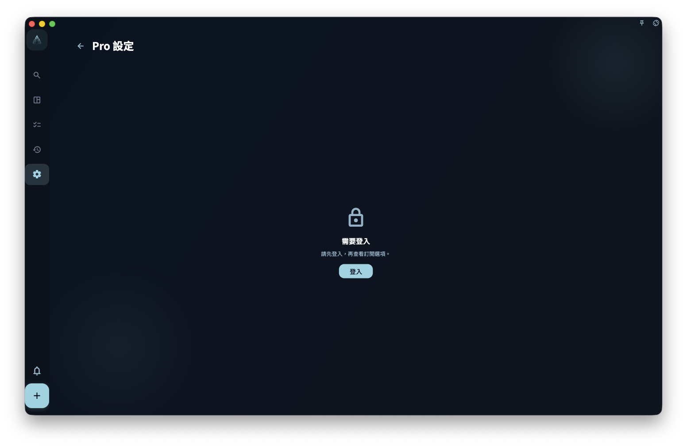

會員權益分散在 GranoFlow 的各個功能入口裡，唔係單獨一個「會員專區」頁面。

## 會員專屬功能

**同步**

- 多設備雲端同步
- 同步歷史與狀態查看

**AI 輔助**

- AI 標題解析（識別日期、標籤、提醒）
- 剪貼板助手
- AI 脫敏詞自定義

**個人化**

- 回顧 Prompt 自定義
- 記錄模板（日記模板）
- Helper 提示詞
- 診斷配置與熱力圖閾值設置

## 非會員狀態下會怎樣

大多數會員專屬入口在非會員狀態下仍然可見，但：

- 點擊後會看到升級提示
- 部分設置項變為只讀（唔能保存修改）

呢個設計係為了讓你知道這個功能存在，等你決定是否訂閱。

## 同步權益的特別說明

同步係會員專屬功能。如果當前帳號沒有可用權益，同步入口會提示你查看或開通會員。

看到同步權益說明頁，**唔代表你的本地數據已經遺失**。本地數據獨立於同步權益存在。

:::note[權益以伺服器為準]
App 本地顯示的權益狀態，來源於伺服器返回的帳號信息。網絡唔好時可能臨時顯示唔正確，稍後刷新即可。
:::
