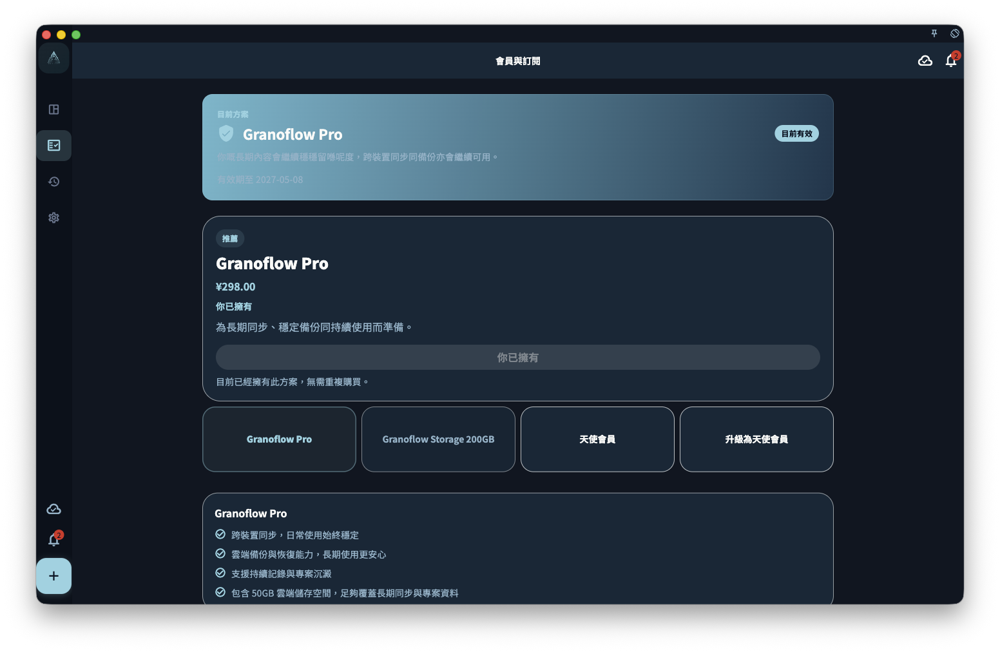

你唔需要先訂閱，都可以用 GranoFlow 嘅核心功能：任務、項目、價值觀、輕日記、回顧、本地數據同備份都可以免費使用。會員主要適合兩種需要：想喺多部設備之間同步，或者想用更多個人化定制。

所以，剛開始用 GranoFlow 時，可以先用免費版整理生活同工作。等你確認佢適合自己節奏之後，再決定要唔要開通會員。

## 免費 vs 會員，有咩分別

| 功能 | 免費 | 會員 |
| ---- | ---- | ---- |
| 任務、項目、價值觀 | ✅ | ✅ |
| 輕日記、回顧、備份 | ✅ | ✅ |
| AI 任務解析同思路梳理 | ✅ | ✅ |
| 多設備雲端同步 | ❌ | ✅ |
| 個人化定制 | ❌ | ✅ |

簡單講：**免費版適合認真試用，亦適合長期只喺一部設備上使用；會員適合需要多設備銜接，或者想界面、主題同使用細節更符合自己習慣嘅人。**

## 訂閱狀態喺邊度睇

打開 GranoFlow 設定，進入賬號／訂閱頁面，就可以查看目前訂閱狀態。未訂閱且商店可用時，頁面會先顯示方案切換器同目前方案詳情；選擇天使會員或升級方案時，詳情卡會直接顯示 2026 年 11 月 22 日截止購買或截止付費升級為天使會員。商店暫不可用或正在載入時，頁面只顯示狀態說明、已包含權益、恢復購買同管理訂閱入口，不會顯示價格或購買按鈕。

如果目前賬號已經擁有天使會員，Pro 方案會顯示為已包含喺天使會員入面，不會再提供 Pro 購買按鈕，避免已經有更高等級權益時重複購買。

**重要**：訂閱狀態來自伺服器，唔係 App 自己決定。如果你已經購買，但權益仲未出現，先等一陣畀狀態刷新；如果仍然冇變化，再檢查網絡同目前登入嘅賬號。

## 最常見嘅問題

**買咗點解冇權益？**
先確認一件事：你而家登入嘅賬號，同購買時用嘅賬號，係咪同一個。

**換手機之後權益去咗邊？**
用同一個賬號登入，權益通常會跟住賬號一齊返嚟。

**不同平台（iOS／Android／macOS）嘅購買可以共用嗎？**
唔一定。請睇[平台購買與恢復購買](/zh-hk/subscription/platforms-and-restore/)。

## 訂閱同數據，邊個更重要

訂閱決定你可以用邊啲功能，但唔決定你嘅數據歸邊個。

就算訂閱過期，你嘅本地任務、項目、價值觀、輕日記同備份數據仍然保留，你亦可以繼續使用所有免費功能。會員只係令呢啲內容更容易跨設備同步，並且畀你更多空間調整界面同體驗。
