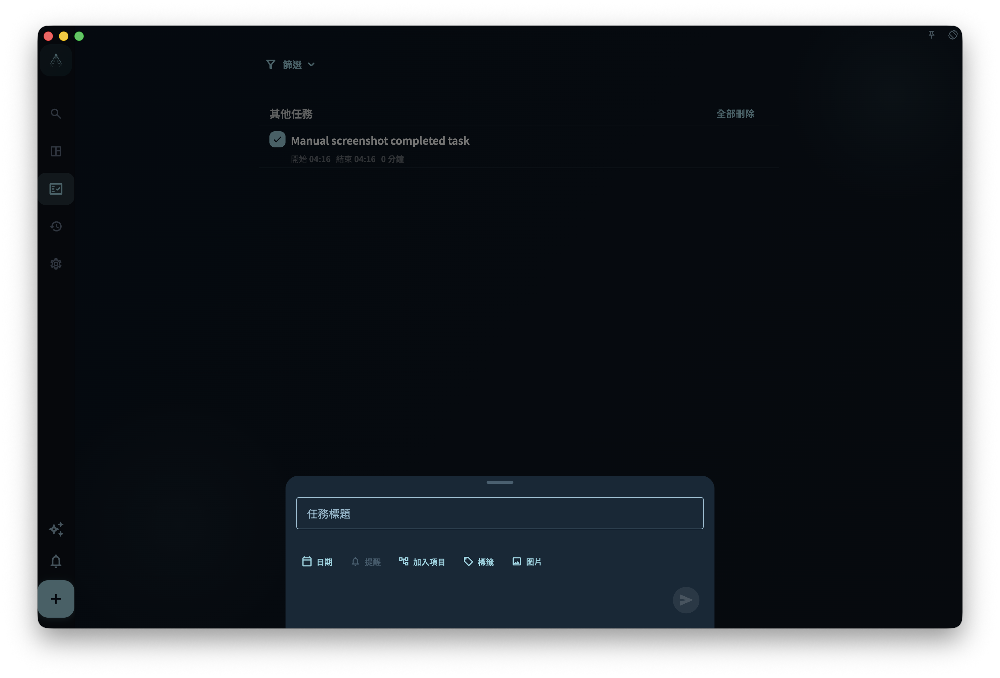
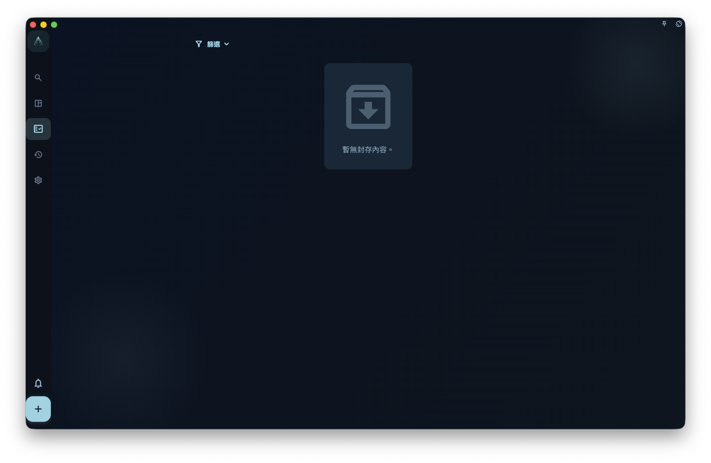
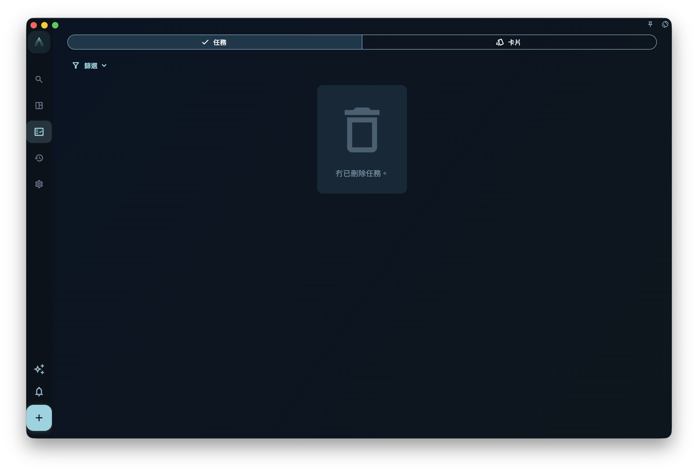
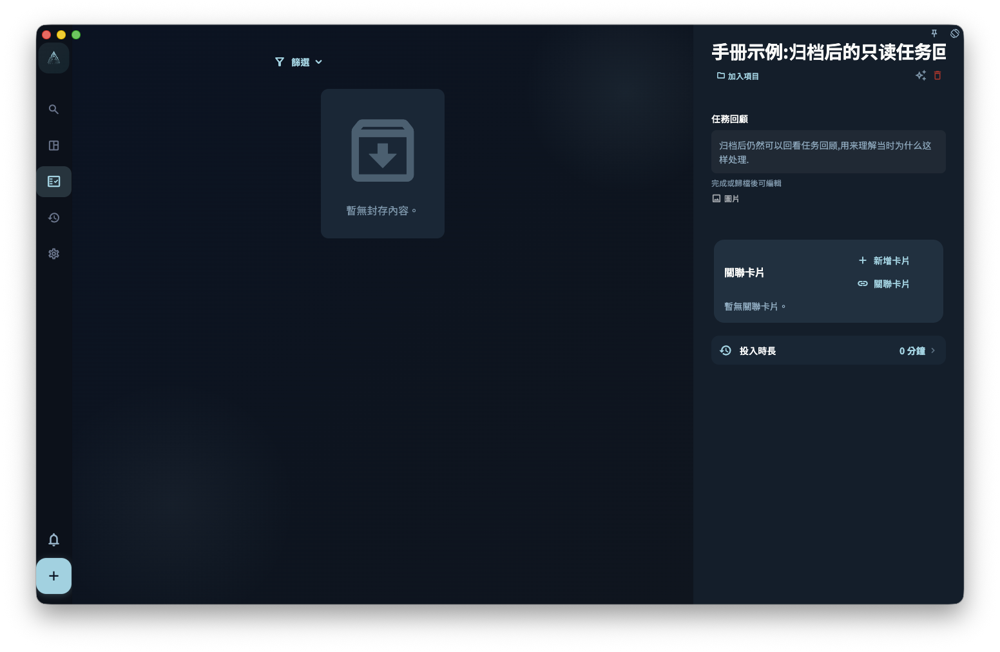

任務從列表裏不見了，先不要以為它已經遺失。最常見的原因是：它被篩選條件藏起來、被安排到某一日、放入了項目、已經完成、被歸檔，或者在回收站裏。

在 GranoFlow 裏，和「任務不見了」最相關的是以下三個狀態：

- **已完成**：事情做完了，會進入完成視圖和日回顧統計
- **已歸檔**：暫時不用看，但保留記錄
- **回收站**：任務已刪除，但回收站尚未清空

## 完成

做完一件事後，可以在任務詳情裏點「完成」，也可以從列表上的完成入口把它標記為完成。完成後，這個任務會：

- 從目前的待辦列表消失
- 記錄一個完成時間
- 出現在「已完成」視圖
- 用於日回顧統計
- 在任務詳情裏隱藏「開始」和「完成」按鈕，避免已經結束的任務再次被當成待辦啟動

<!-- manual-screenshot:id=tasks-completed-archived-trash -->

:::tip[小技巧]
如果你之後還想在日回顧看到完成記錄，不要隨手刪除已完成任務。已完成任務不是垃圾，而是你的完成記錄。
:::

完成後，任務詳情裏會顯示「任務回顧」，並允許編輯。這裏適合記錄確認過的情況、問題和經驗。

已完成任務詳情亦會顯示「心流時間」。它不是由開始時間到完成時間自動計算出來的「投入時間」，而是你手動記錄的真正專注時間；同一日完成的任務會共用這一天的心流時間。任務歸檔後可以繼續編輯任務回顧，但不再顯示可編輯的心流時間入口。

## 歸檔

歸檔適合這類任務：你現在不想每日都看到它，但之後可能仍然需要知道它存在過。

例如：項目裏的舊任務、已經過期但有參考價值的事項、不想放在目前列表但也不想刪除的內容。

<!-- manual-screenshot:id=tasks-archived-list -->

已歸檔視圖的任務篩選下方亦會顯示「卡片」入口。它會進入卡片管理裏的已封存視圖，用來查看不會進入主動複習的卡片，並在需要時取消封存。

歸檔和完成不是同一回事：

- **完成**：表示任務真的做完了，會進入完成統計
- **歸檔**：只是把任務從目前視圖收起來，不代表做完，也不會進入完成統計

## 回收站

刪除任務後，任務會進入回收站。只要回收站尚未清空，你仍然可以去回收站查看它。

回收站頂部有「任務」和「卡片」兩個分段。任務分段處理已刪除任務；卡片分段處理已刪除的回顧經驗卡片。兩個分段不會混在一起，恢復、永久刪除和清空操作只作用於目前分段。

恢復任務時，如果它原本屬於已刪除的項目或里程碑，GranoFlow 會讓你選擇：一併恢復原項目和里程碑，或只把任務恢復到收集箱。選擇只恢復任務時，它會變成沒有項目、沒有里程碑、沒有日期的普通收集箱任務，之後可以再重新整理。

<!-- manual-screenshot:id=tasks-trash-list -->

:::caution[清空前想清楚]
手動清空回收站是不可逆的。如果任務曾經屬於某個項目，或者仍有回顧價值，清空後就不能再靠回收站找回。
:::

## 找不到任務怎麼辦

按這個順序查，通常最快：

1. 看看是不是篩選條件把它隱藏了，例如只顯示「今日」任務。
2. 想想它是不是設定了日期。如果有日期，去那一日的任務列表找。
3. 想想它是不是加進了某個項目。如果有項目，去項目頁面找。
4. 如果它已經做完，去「已完成」視圖找。
5. 如果你不想在目前列表看到它，可能已經把它歸檔了，去「已歸檔」視圖找。
6. 如果你刪除過它，去回收站找。

大多數找不到的任務，都在以上這些地方。

## 重新啟用後的任務回顧

如果你完成任務後寫了任務回顧，之後又取消完成或重新啟用任務，已有回顧不會被清空。未完成時，任務詳情不會顯示任務回顧；任務再次完成或歸檔後，回顧會重新顯示並可以編輯。

<!-- manual-screenshot:id=tasks-detail-review-readonly -->

