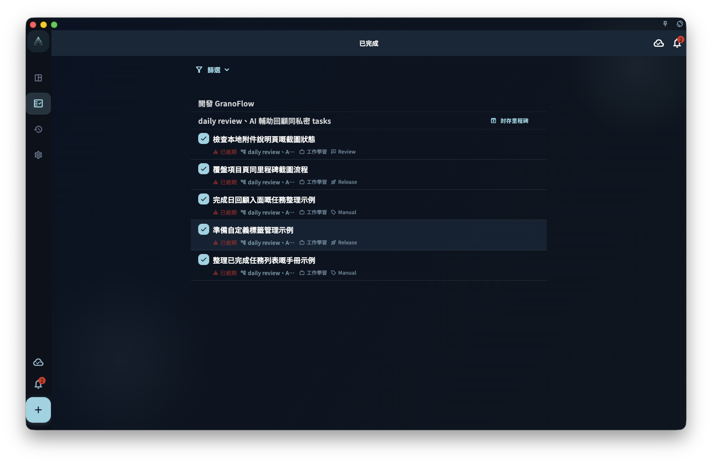
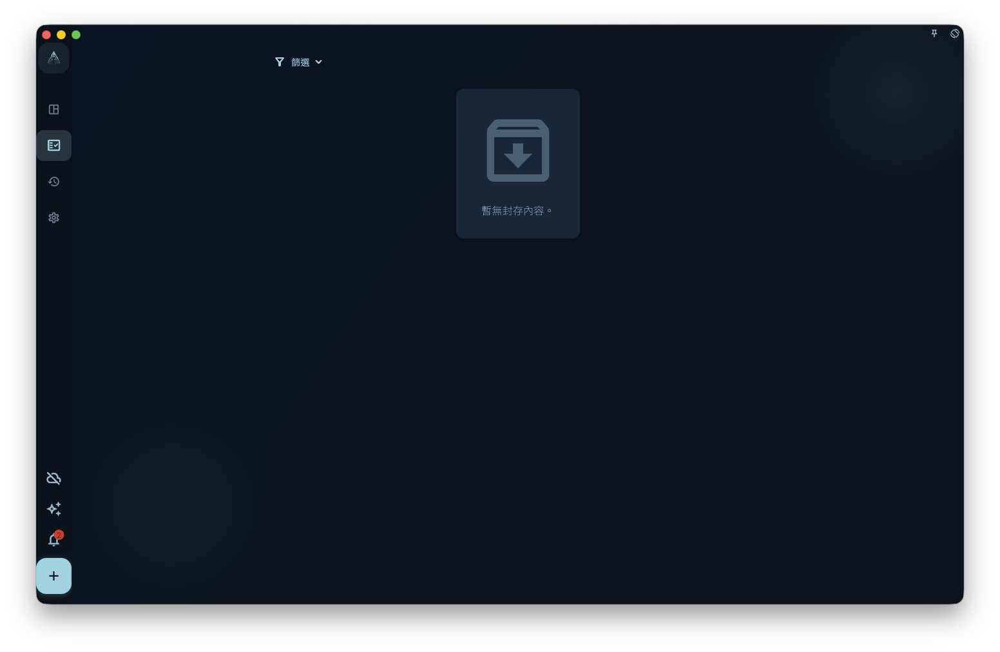
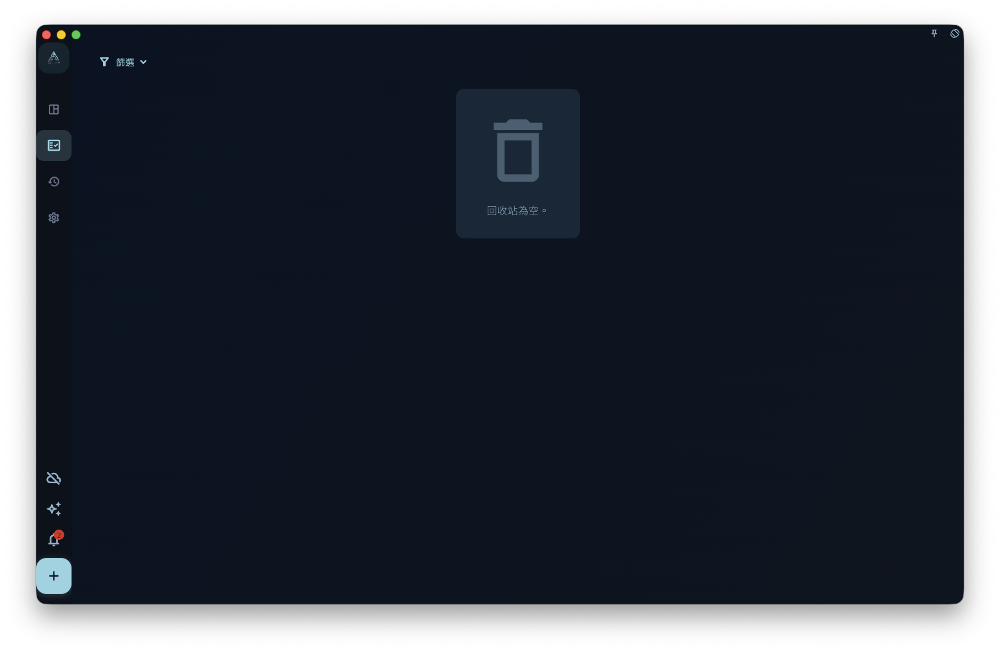

理解任務完成、封存、刪除和恢復的區別，避免把正常的隱藏或保護狀態誤認為數據丟失。

## 從哪裡開始

在任務列表或詳情頁完成任務；在需要整理歷史內容時再使用封存或刪除。

<!-- manual-screenshot:id=tasks-completed-archived-trash -->

## 怎麼操作

- 點擊完成後，任務會從待處理列表中退出，並進入完成相關的統計、回顧或歷史位置。
- 封存用於把不再活躍但仍需要保留的任務從日常視圖中收起。
- 刪除前確認影響範圍；刪除比完成和封存更接近不可逆整理。

<!-- manual-screenshot:id=tasks-archived-list -->

<!-- manual-screenshot:id=tasks-trash-list -->

## 結果和邊界

任務沒有出現在當前列表，不一定代表丟失。它可能已完成、被封存、被篩選條件隱藏，或移動到項目、日期、標籤對應的視圖。

- 已完成任務和已封存任務有不同用途，不要為了清空列表而直接刪除。
- 如果任務涉及回顧、統計或項目歷史，刪除會讓這些上下文變少。

## 下一步

找不到任務時，先檢查篩選、項目、日期、完成狀態和封存狀態。
