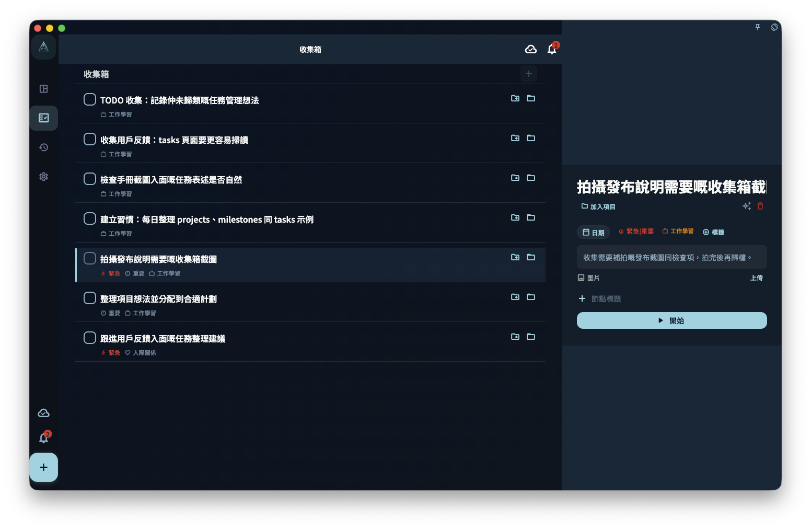

想快速建立任務，只需要輸入一個標題，然後儲存。其他內容可以先不填；之後要安排日期、歸入項目、加標籤，或拆成步驟時，再打開任務補充。

## 從哪裏建立任務

| 入口 | 適合的場景 |
| --- | --- |
| 底部 **+** 按鈕 | 想即時記低一件事 |
| 收集箱頁面內的輸入框 | 正在整理收集箱時順手新增 |
| 項目或里程碑頁面內 | 建立後希望它直接屬於這個項目或階段 |
| 已有任務詳情裏的節點 | 想把一個大任務拆成更小的步驟 |

## 任務編輯界面

建立或編輯任務時，你會看到以下欄位。只有標題必須填寫。

| 欄位 | 是否必填 | 作用 |
| --- | --- | --- |
| 標題 | ✅ 必填 | 任務名稱。寫得越具體，之後越容易執行 |
| 描述 | 可選 | 放背景資料、連結、備註等補充內容 |
| 截止日期 | 可選 | 設定後，任務會出現在對應日期的任務列表裏 |
| 提醒 | 可選 | 到指定時間發通知；提醒時間不能設在過去 |
| 項目 | 可選 | 設定後，任務會從收集箱移到對應項目裏 |
| 里程碑 | 可選 | 讓任務屬於項目中的某個階段 |
| 標籤 | 可選 | 用來篩選任務；一個任務可以有多個標籤 |
| 節點 | 可選 | 把任務拆成更小的步驟 |

:::tip[善用自然語言輸入]
在標題輸入框裏，你可以直接寫 `#標籤名`、`@日期`、`~提醒時間`，GranoFlow 會自動解析。比如輸入 `整理報告 @明天 #工作`，會自動識別出明天的日期和「工作」標籤。詳細規則見[用自然語言寫任務](title-parser)。
:::

## 儲存後任務去哪裏

任務儲存後出現在哪裏，取決於你填了哪些欄位：

- **沒有日期、沒有項目** → 進入收集箱
- **有日期** → 出現在那一天的任務列表裏
- **有項目** → 出現在對應項目裏
- **在項目頁面裏建立** → 直接歸屬到那個項目

修改日期、項目或里程碑，不會建立另一個任務，只是改變同一個任務的位置或歸屬。

## 編輯已有任務

點擊任何任務，就可以打開任務詳情。改完欄位後，離開詳情頁時會自動儲存。

:::caution[注意]
提醒不能設定在已經過去的時間。如果你選擇的提醒時間已經過了，系統會提示你重新選擇。
:::

完成、歸檔和刪除是三種不同操作。填寫或修改欄位，不會讓任務自動變成完成狀態。
