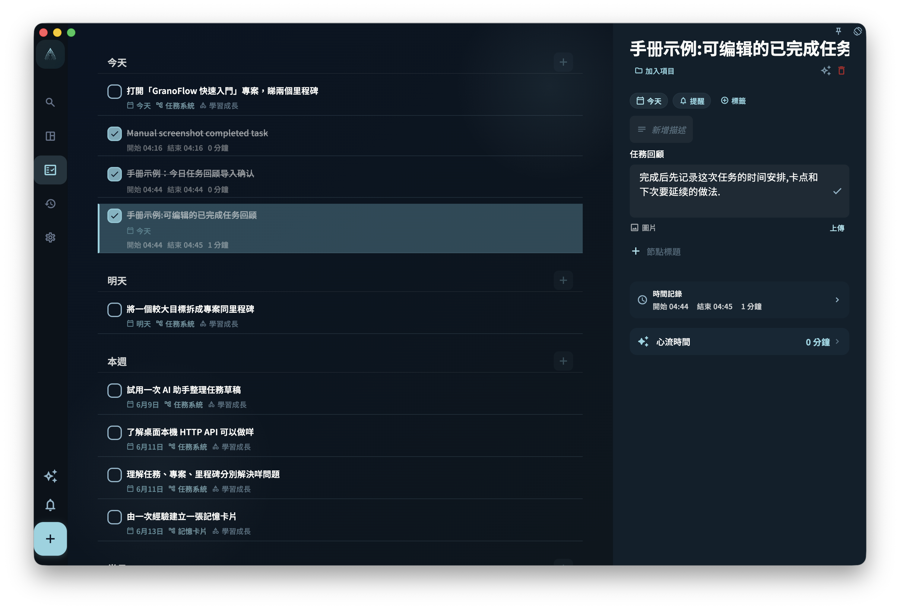

想快速創建任務，只需要輸入一個標題，然後儲存。其他內容都可以先不填；等你要安排日期、歸到項目、加標籤或拆成步驟時，再打開任務補充。

## 從哪裡創建任務

| 入口 | 適合的場景 |
| --- | --- |
| 底部 **+** 按鈕 | 想馬上記下一件事 |
| 收集箱頁面內的輸入框 | 正在整理收集箱時順手添加 |
| 項目或里程碑頁面內 | 創建後希望它直接屬於這個項目或階段 |
| 已有任務詳情裡的節點 | 想把一個大任務拆成更小的步驟 |

## 任務編輯界面

<!-- manual-screenshot:id=tasks-create-edit-dialog -->

創建或編輯任務時，你會看到這些字段。只有標題必須填寫。

| 字段 | 是否必填 | 作用 |
| --- | --- | --- |
| 標題 | ✅ 必填 | 任務名稱。寫得越具體，之後越容易執行 |
| 描述 | 可選 | 放背景資料、連結、備註等補充內容；支援 [豐富文字內容](/manual/interface/markdown-content/) |
| 截止日期 | 可選 | 設定後，任務會出現在對應日期的任務列表裡 |
| 提醒 | 可選 | 到指定時間發通知；提醒時間不能設在過去 |
| 項目 | 可選 | 設定後，任務會從收集箱移到對應項目裡 |
| 里程碑 | 可選 | 讓任務屬於項目中的某個階段 |
| 標籤 | 可選 | 用來篩選任務；一個任務可以有多個標籤 |
| 節點 | 可選 | 把任務拆成更小的步驟 |
| 任務回顧 | 可選 | 記錄完成後的覆盤內容；完成或歸檔後可以編輯 |
| 任務卡片 | 可選 | 在項目任務裡關聯或新建卡片，把這次任務裡的經驗儲存成以後可複習的判斷 |

如果你選擇的自訂標籤帶有模板，並且這條任務還沒有描述和節點，GranoFlow 會在儲存後把模板內容添加到任務描述和根節點裡。任務已經有描述或節點時，模板會跳過，避免覆蓋你已經填寫的內容。同一個標籤模板對同一條任務只會自動添加一次；如果模板添加失敗，標籤選擇會保留，你可以稍後手動補充描述或節點。

:::tip[善用自然語言輸入]
在標題輸入框裡，你可以直接寫 `#標籤名`、`@日期`、`~提醒時間`，GranoFlow 會自動解析。比如輸入 `整理報告 @明天 #工作`，會自動識別出明天的日期和「工作」標籤。詳細規則見[用自然語言寫任務](title-parser)。
:::

## 儲存後任務去哪了

任務儲存後出現在哪裡，取決於你填了哪些字段：

- **沒有日期** → 進入收集箱
- **有日期** → 出現在那一天的任务列表裡
- **有項目或里程碑** → 歸屬到對應項目；如果仍然沒有日期，也會繼續出現在收集箱
- **在項目頁面裡創建** → 直接歸屬到那個項目；是否進入任務列表仍取決於有沒有日期

修改日期、項目或里程碑，不會新建另一個任務，只是改變同一個任務的位置或歸屬。

## 編輯已有任務

點擊任何任務，就可以打開任務詳情。改完字段後，退出詳情頁時會自動儲存。

任務詳情不只是用來改標題。它也是你把一件事從「記下來」推進到「正在做」的地方：

- 頂部可以修改標題，選擇或更換項目、里程碑。
- 屬性區域可以調整截止日期、提醒、標籤，也可以添加圖片。
- 描述區域適合放背景、連結、草稿或需要保留的說明。
- 節點區域用來把任務拆成步驟。
- 底部的「專注」和「完成」決定這條任務接下來進入哪種狀態。

如果任務還沒有開始，詳情底部會同時顯示「專注」和「完成」。點「專注」時，GranoFlow 會把這條任務設為當前正在做的任務，並開始一次專注記錄；點「完成」則直接把它標為完成。如果這條任務已經在專注中，詳情底部只會保留「完成」，因為此時最重要的動作是結束這次專注並完成任務。

這裡容易誤解：專注不是給任務加一個普通標籤，而是告訴 GranoFlow「我現在就在做這件事」。所以同一時間如果已經有另一條任務正在專注中，當前詳情頁會提示你先完成或停止那條任務，再開始新的專注。

<!-- manual-screenshot:id=tasks-detail-review-editable -->

任務完成或歸檔後，詳情裡會顯示「任務回顧」。你可以在這裡補充這件事實際花了多久、後來確認了什麼、下次要注意什麼。如果你先完成任務並寫了回顧，之後又把任務恢復為未完成，已有回顧不會被清空；任務再次完成或歸檔後，回顧會重新顯示並可以編輯。

如果任務屬於項目，詳情裡還會出現「任務卡片」區域。你可以從這裡添加新卡片、關聯已有卡片，或進入這條任務相關卡片的練習。已關聯卡片會按筆記分組展示；同一篇筆記下的多張卡片會放在一起，未歸檔卡片排在已歸檔卡片前面。取消關聯只會解除當前任務和這篇筆記下卡片的關係，不會刪除卡片本身。

任務描述、任務回顧，以及其他支援長文字的字段可以使用豐富文字編輯。需要添加表格、公式、本地圖片、遠程音頻或 YouTube 影片時，閱讀 [豐富文字內容](/manual/interface/markdown-content/)。
:::caution[注意]
提醒不能設在已經過去的時間。如果你選擇的提醒時間已經過了，系統會提示你重新選擇。
:::

完成、歸檔和刪除是三種不同操作。填寫或修改字段，不會讓任務自動變成完成狀態。
